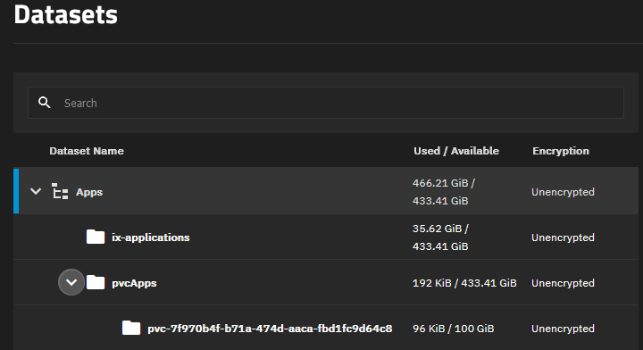

:::danger

TrueNAS SCALE Apps are considered Deprecated. We heavily recommend using a more mature Kubernetes platform such as "TalosOS" instead, and no longer offer an apps/charts catalogue for SCALE users to install. The below docs exist purely as historical references and may be removed at any time.

:::

:::caution[Execute all steps at once]

It's imperative to execute **ALL** steps in this guide in one sitting. If you reboot or take any time away from this task, we cannot guarantee your data and apps stay working.
Please only continue when you have time available to complete the migration.

It's also important to note that the migration to DragonFish **requires** reinstallation of all apps, for which an automated solution is available in the guide as well.
Please read this migration guide carefully _before_ upgrading to DragonFish.

:::

## Important Changes

iX-Systems no longer maintains or supports any form of PVC-based storage for apps. This includes their own "legacy" storage backend. This means that when using the following SCALE features, you will lose some functionality:

    - **SCALE Backup and Restore (unreleased feature available through HeavyScript)** - Will no longer back up PVC storage at all.
    - **SCALE App Rollback** - You will no longer be able to roll back any PVC storage.
    - **SCALE App Pool Migration** - You will no longer be able to migrate PVC storage using the pool migration feature in SCALE.

The above issues exist both for our new in-house TrueCharts OpenEBS storage solution **and** for users using already installed apps that use the legacy storage backend from iX-Systems.

## For Existing Users and Apps

### Pre Cobia-to-DragonFish Upgrade Steps

<Steps>

1. Ensure apps are up-to-date on Cobia

   Prior to updating to TrueNAS SCALE DragonFish, please ensure that TrueNAS SCALE is updated to the latest version of Cobia (23.10.2), and that all of your TrueCharts apps are fully updated, on the [correct trains](/news/train-renames), and running or otherwise working correctly.

2. Create a backup using HeavyScript

   For details on installing and creating a backup with HeavyScript, please see the [HeavyScript GitHub Repo.](https://github.com/Heavybullets8/heavy_script)

</Steps>

:::note[Upgrade to Dragonfish]

    Update to DragonFish as usual through TrueNAS' System Settings > Update page.

:::

### Post Cobia-to-DragonFish Upgrade Steps

import { Steps } from "@astrojs/starlight/components";

<Steps>

1. Wait at least 30 minutes after Cobia-to-Dragonfish upgrade

   Once you have completed updating your TrueNAS SCALE system from Cobia to DragonFish, the first step is to **wait at least 30 minutes after updating and the SCALE WebUI becomes accessible**. This allows time for the update to finish and services to be started. Do not restart the system or otherwise interrupt its operation during this time.

2. Clean up the System

   We now need to clean up some old Cobia objects. Enter the following command in the TrueNAS SCALE shell as root:

   _Replace `TANK` in the command with your pool name that contains the ix-applications dataset_

   ```shell title="Remove Old OpenEBS"
   rm /mnt/TANK/ix-applications/k3s/server/manifests/zfs-operator.yaml && sudo k3s kubectl delete -f https://truecharts.org/openebsrem.yaml && sudo k3s kubectl delete storageClass openebs-zfspv-default
   ```

3. Create Dataset for PVCs and Install OpenEBS

   Continue with the OpenEBS setup section of our TrueNAS SCALE Getting Started [Guide](/deprecated/scale#openebs-setup) and once complete, proceed to next step.

   :::caution[Dataset Location]

   **The dataset you create for OpenEBS usage MUST reside on the same storage pool as the existing ix-applications dataset. Refer to the example apps dataset images at the [end](/deprecated/scale/migrations/cobia-dragonfish/#post-migration-steps) of the guide.**

   :::

4. Migrate Apps to New Storage using TT-Migration Script

   Thanks to great collaboration with HeavyBullets, the TT-Migration tool will automate most of the migration process for existing apps:
   https://github.com/Heavybullets8/TT-Migration

   - Existing apps with PVCs or databases should be reinstalled using the TT-Migration script.
   - System train apps (`cloudnative-pg`, `cert-manager`, etc.) **should _NOT_ be reinstalled**. Apps from all other trains **should** be migrated. You will see a warning in the script if you attempt to migrate a **system** train app.
   - Apps without PVC storage **do** still need to be reinstalled to remove every remnant of old storage backends. You may see a notice in the migration script if you attempt to migrate an app with no PVCs, if this is the case, continue with migrating the app (unless it's on the System train, per above)

   :::danger[Systems Train Apps]

   **NEVER** attempt to delete or reinstall system train apps without direction from the support team. Doing so may result in data loss.

   :::

   Running the below command in the TrueNAS SCALE shell will (1) clone/download Heavy's TT-Migration repo to your SCALE system, (2) enter the path for it and (3) execute the migration script as root:

   ```shell title="Install and Run TT-Migration"
   git clone https://github.com/Heavybullets8/TT-Migration.git && cd TT-Migration && sudo bash migrate.sh
   ```

   If you want to see the steps that it performs, or if you'd like to perform the steps yourself manually using the guide, follow the instructions [here](https://github.com/Heavybullets8/TT-Migration?tab=readme-ov-file#guide).

</Steps>

:::tip

After running the above command for the first time, there's no need to repeatedly clone/download the repo each time after. So after running it the first time, feel free to only run the below each time after:

    ```shell title="Run TT-Migration"
    cd TT-Migration && sudo bash migrate.sh
    ```

:::

### Post Migration Steps

Once you have completed the above, you are finished the migration process. Your apps datasets should now look something like this:



Where you have a top-level dataset for everything related to apps (in the above image this is the "Apps" one), an "ix-applications" dataset which still retains non-PVC data for your apps and should **NOT** be deleted, and the dataset you created for OpenEBS use in an earlier part of this guide or when fresh installing SCALE and following our getting started [guide](/deprecated/scale/). In the above photo, this is the "pvcApps" dataset.

Nested inside "pvcApps" (in the above example) will be the PVC folders for each of your apps that use PVC storage. Taking into account the above example layout, the OpenEBS operator apps' storage options will look like this (obviously adjust based on your naming and dataset layout):


As you can see, I have 1 app using PVC storage, managed by OpenEBS, and whose data resides in the "pvc-7f970..." folder nested under pvcApps. You will have one of these nested folders for each app you have installed that uses PVC storage for application or config data.

Feel free to let the system settle for 30 minutes after completing the process and then reboot it to ensure that app apps come back online correctly.

:::note[OpenEBS]

    The OpenEBS operator now handles all PVC storage functionality for your installed apps, and should **NOT** be removed.

:::

## Known Issues with Migrations

Sometimes, things don't go as smoothly as they should. These are tips to help with any known issues identified as part of the migration process.

### CNPG database cannot be restored via the migration script

For instances where an application's database cannot be restored, the script will prompt you to select a backup (created with HeavyScript) instead. This guide assumes HeavyScript has been installed under the current user's home directory.

1. Navigate to HeavyScript's backup folder for the selected application and list database dumps.

   ```shell title="Check for Backups"
   cd ~/heavy_script/database_dumps/APPNAME && ls
   ```

2. Copy the latest database dump to the migration dataset created by the migration script.

   ```shell title="Copy Database"
   cp APPNAME_TIMESTAMP.sql.gz /mnt/TANK/migration/APPNAME/backup/
   ```

3. Re-run the migration process and select the backup.

   ```shell title="Rerun Migration"
   sudo bash migrate.sh --skip
   ```

   ```txt title="Use the backup copied in the previous step"
   Select your original app name:
   1) APPNAME
   Enter the number associated with the app: 1
   You have chosen TANK/migration/APPNAME

   Since a CNPG pod was found, the script can attempt to automatically create a database dump. Note that this requires the CNPG pod to have the ability to run successfully. If you have a recent CNPG database dump from another source (e.g., HeavyScript), you can provide that instead.
   The default action is to have the script attempt to create a database dump, and should always be used unless your CNPG pod is problematic.

   Would you like to provide your own database dump file? [y/N]
   y
   ```

### "Dataset Busy" error when following the migration process/script

Try the following in these EXACT steps, deviation of any kind can result in data loss:

1. Try to delete the dataset using the command `zfs destroy -r "TANK/ix-applications/releases/APPNAME"`

   ````shell title="ZFS Destroy"
       zfs destroy -r  "TANK/ix-applications/releases/APPNAME"
       ```

   ````

2. If Step 1 fails, note the name of the failed app(s) and continue migrating ALL remaining apps.

:::danger[Complete Migration First]

You **MUST** complete or start the migration of all apps before continuing. If you do not, the migration of any remaining apps not yet completed will no longer be possible.

**YOU HAVE BEEN WARNED**

:::

3. After all apps are migrated, [unset](https://www.truenas.com/docs/scale/scaleuireference/apps/#unset-pool) the apps pool. TrueNAS SCALE GUI -> Applications -> Settings -> Unset Pool

4. Go through your list of failed apps and delete them one by one, for example: `zfs destroy -r "TANK/ix-applications/releases/APPNAME"`

5. After all failed apps datasets are deleted, [re-set](https://www.truenas.com/docs/scale/scaleuireference/apps/#settings) the apps pool the apps pool. TrueNAS SCALE GUI -> Applications -> Settings -> Set Pool

6. Re-run the script with `--skip` flag for all failed apps.

It is very important to attempt all migrations **before** unsetting the applications pool. Unsetting the applications pool, or restarting with applications mid-migration, can result in data loss.

```

```
