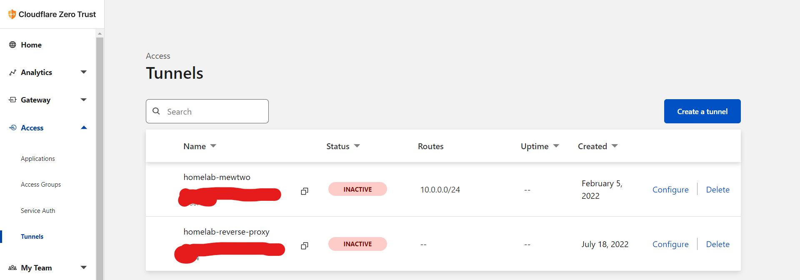
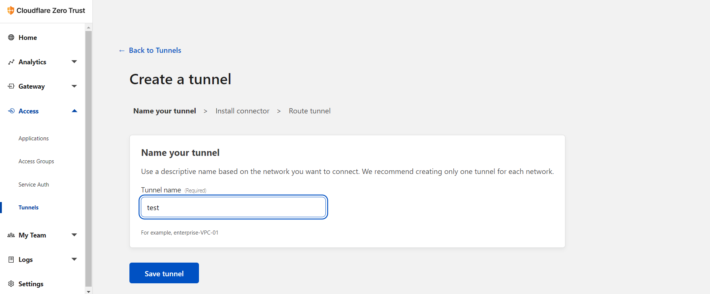

# Installation Notes

- Go to [cloudflare team dash](https://dash.teams.cloudflare.com) and create a tunnel or migrate a current tunnel (this action is not reversible) by going to access and then tunnels tab.

- Create a tunnel like so (or migrate a current one)

- Copy **JUST** the token from tunnel's overview **Install and run a connector** section.

- Set the `token` with **your** tunnel's token. the tunnel ID will **NOT** work.
- Now you can manage the tunnel via cloudflare dash by setting a private network or create ingress rules for your services and domain.

Notes:

- You MAY need to modify cloudflared Zero Trust various settings in order for this work out-of-the-box which is beyond the scope of this guide.

- You can use this as a reverse proxy directly or use it in conjunction with traefik if you are behind a CGNAT, do not have a static IP, or can not port forward 443 (SSL).
