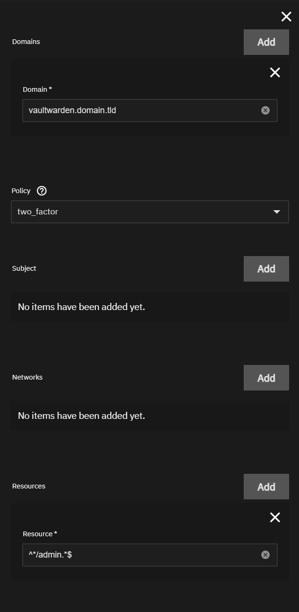
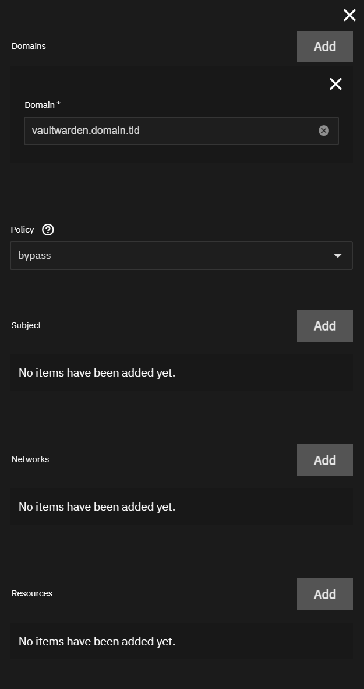
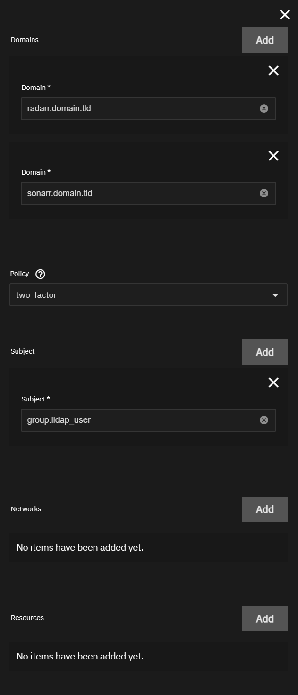
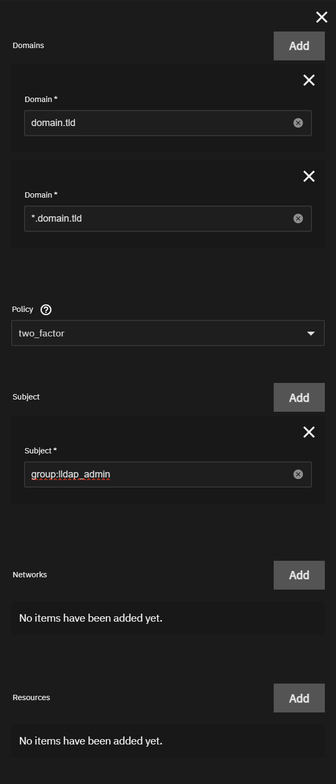

This is a collection of some common Authelia Rules.

:::note[RULE ORDER]

It is important that rules are created in the correct order in Authelia. Rules are processed from top to bottom with the first matching rule being applied. The most narrow rules should be applied first with the most broad rules last.

:::

All rules requiring Authelia authentication were configured with `two_factor` (2FA). If you do not want 2FA on some or all rules replace the Policy with `one_factor`

## API Rule

This rule will bypass Authelia for API level access in most apps. This should always be your first rule.

Domain: `*.domain.tld`

Policy: `bypass`

Subject: `Not Used (Do Not Add)`

Networks: `Not Used (Do Not Add)`

Resources:

- `^/api([/?].*)?$`
- `^/identity.*$`
- `^/triggers.*$`
- `^/meshagents.*$`
- `^/meshsettings.*$`
- `^/agent.*$`
- `^/control.*$`
- `^/meshrelay.*$`
- `^/wl.*$`

## Vaultwarden

These rules will protect the Vaultwarden admin page with Authelia but bypass when accessing the web vault. The order of these rules is critical or the admin page will not be protected.

### Rule 1

Domain: `vaultwarden.domain.tld`

Policy: `two_factor`

Subject: `Not Used (Do Not Add)`

Networks: `Not Used (Do Not Add)`

Resources: `^*/admin.*$`

### Rule 2

Domain: `vaultwarden.domain.tld`

Policy: `bypass`

Subject: `Not Used (Do Not Add)`

Networks: `Not Used (Do Not Add)`

Resources: `Not Used (Do Not Add)`

## User Rule

This rule will allow users in the `lldap_user` group access to only the specified applications.

Domain:

- `radarr.domain.tld`
- `sonarr.domain.tld`

Policy: `two_factor`

Subject: `group:lldap_user`

Networks: `Not Used (Do Not Add)`

Resources: `Not Used (Do Not Add)`

## Catch All Rule

This rule will catch any access requests not covered by other rules.

Domain:

- `domain.tld`
- `*.domain.tld`

Policy: `two_factor`

Subject: `group:lldap_admin`

Networks: `Not Used (Do Not Add)`

Resources: `Not Used (Do Not Add)`

