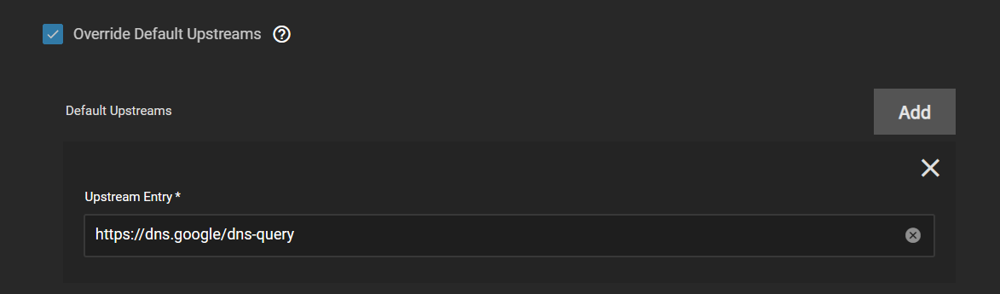
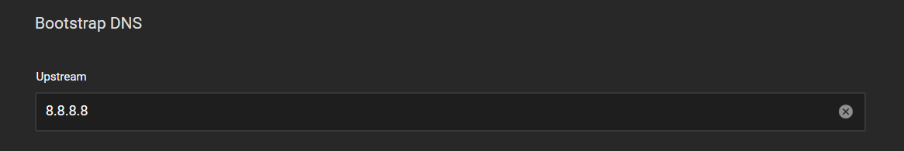
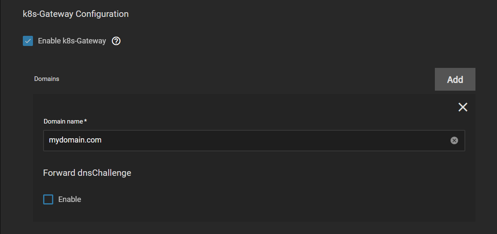

# Blocky Setup Guide

This will guide you through the basic setup of Blocky which is the preferred DNS solution for TrueCharts. This guide will cover basic setup options which will get you up and running and is not all inclusive.

## Upstream DNS

Blocky has multiple DNS entries configured by default these can be overridden to your personal preferences or left as default.

Blocky supports 3 methods for upstream DNS.

- UDP - Basic DNS
- DoT - DNS over TLS
- DoH - DNS over HTTPS

While UDP provides no security for DNS both DoT and DoH will encrypt DNS request. DoH has the added benefit of privacy since DNS traffic will appear as HTTPS traffic.

### UDP DNS Setup

- Google DNS: `8.8.8.8` `8.8.4.4`
- Cloudflare DNS: `1.1.1.1` `1.0.0.1`

### DoT DNS Setup

- Google DNS ([Bootstrap DNS Required](#bootstrap-dns)): `tcp-tls:dns.google:853`
- Cloudflare DNS: `tcp-tls:1.1.1.1:853` `tcp-tls:1.0.0.1:853`

### DoH Upstream

- Google DNS ([Bootstrap DNS Required](#bootstrap-dns)): `https://dns.google/dns-query`
- Cloudflare DNS: `https://1.1.1.1/dns-query` `https://1.0.0.1/dns-query`

## Bootstrap DNS

For DNS providers that do not use an IP address for DoT or DoH a bootstrap DNS provider
 is needed to resolve the DoT or DoH address. This provider can be any UDP upstream DNS.
 In the below example I am using Google DNS.

## DNS Blacklists

DNS Blacklists are used to prevent DNS resolution of advertisement, malware, trackers
and adult sites domains. This is completed with public maintained blocklists.
A good source for these is [firebog.net](https://firebog.net).

:::warning Warning

While publicly maintained blocklists usually do a good job of allowing legitimate traffic they
can sometimes be too broad and catch traffic that you wish to allow. You may need to disable
certain blocklists if you find legitimate traffic being blocked.

:::

1. Pick a Group Name for your blocklists.
2. Add List entries for each blocklist by URL.
  
3. Add a Clients Group Block and set Client Group Name to `default`
4. Under Groups Entry enter the Group name you used above.
  

## k8s-Gateway Configuration

k8s-Gateway will automatically provide split DNS for your local domain. This will allow
you to resolve all ingress configured subdomains locally. All that is required for setup
is to add your root domain in the Domain name block.

## Prometheus/Grafana

TBD

