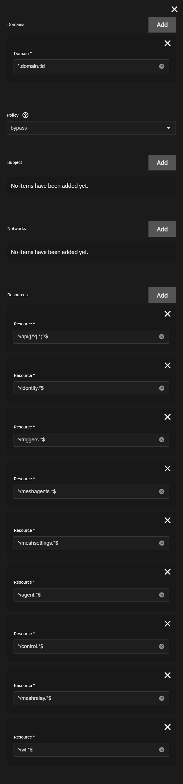
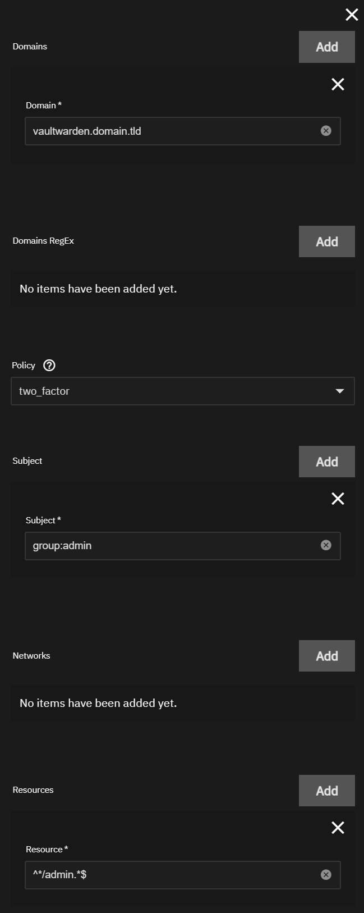
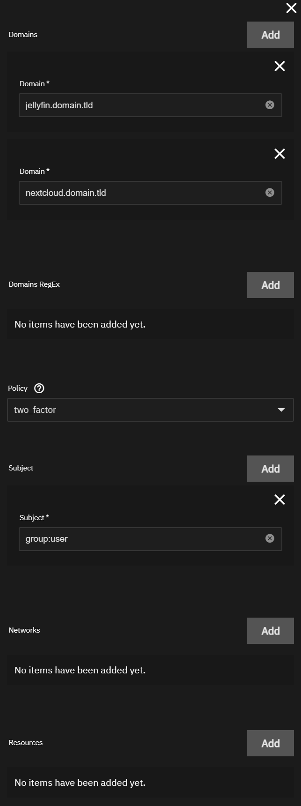
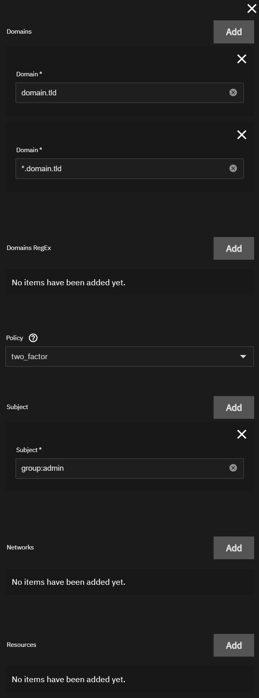

This is a collection of some common Authelia Rules.

:::note[RULE ORDER]

It is important that rules are created in the correct order in Authelia. Rules are processed from top to bottom with the first matching rule being applied. The most narrow rules should be applied first with the most broad rules last.

:::

:::note[DEFAULT POLICY]

For these rules to work as intended, your default access control policy must be set to `deny`.

:::

All rules requiring Authelia authentication were configured with `two_factor` (2FA). If you do not want 2FA on some or all rules replace the Policy with `one_factor`.

In this guide we assume you have a group `admin` and a group `user` in LDAP.
Members of the `admin` group will have access to everything.
Members of the `user` group will only have access to a select set of apps you choose.

## API Rule

This rule will bypass Authelia for API level access in most apps. This should always be your first rule.

Domain: `*.domain.tld`

Policy: `bypass`

Subject: `Not Used (Do Not Add)`

Networks: `Not Used (Do Not Add)`

Resources:

- `^/api([/?].*)?$`
- `^/identity.*$`
- `^/triggers.*$`
- `^/meshagents.*$`
- `^/meshsettings.*$`
- `^/agent.*$`
- `^/control.*$`
- `^/meshrelay.*$`
- `^/wl.*$`

## Vaultwarden

These rules will protect the Vaultwarden admin page with Authelia but bypass when accessing the web vault. The order of these rules is critical or the admin page will not be protected.

### Rule 1

This rule will allow users of the `admin` group to access the Vaultwarden admin page.

Domain: `vaultwarden.domain.tld`

Policy: `two_factor`

Subject: `group:admin`

Networks: `Not Used (Do Not Add)`

Resources: `^*/admin.*$`

### Rule 2

This rule will prevent users not in the `admin` group to access the Vaultwarden admin page.
This is necessary even if the your default policy is set to `deny` because of the `bypass` rule below.

Domain: `vaultwarden.domain.tld`

Policy: `deny`

Subject: `Not Used (Do Not Add)`

Networks: `Not Used (Do Not Add)`

Resources: `^*/admin.*$`

### Rule 3

This rule will bypass Authelia when accessing the webportal as auth is already provided by vaultwarden.

Domain: `vaultwarden.domain.tld`

Policy: `bypass`

Subject: `Not Used (Do Not Add)`

Networks: `Not Used (Do Not Add)`

Resources: `Not Used (Do Not Add)`

## User Rule

This rule will allow users in the `user` group access to only the specified applications.

Domain:

- `jellyfin.domain.tld`
- `nextcloud.domain.tld`
- `whateveryouwant.domain.tld`

Policy: `two_factor`

Subject: `group:user`

Networks: `Not Used (Do Not Add)`

Resources: `Not Used (Do Not Add)`

## Catch All Rule

This rule will give access to everything to users of the `admin` group.

Domain:

- `domain.tld`
- `*.domain.tld`

Policy: `two_factor`

Subject: `group:admin`

Networks: `Not Used (Do Not Add)`

Resources: `Not Used (Do Not Add)`

