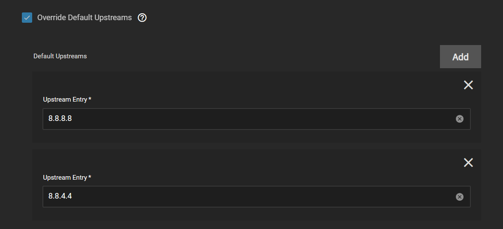
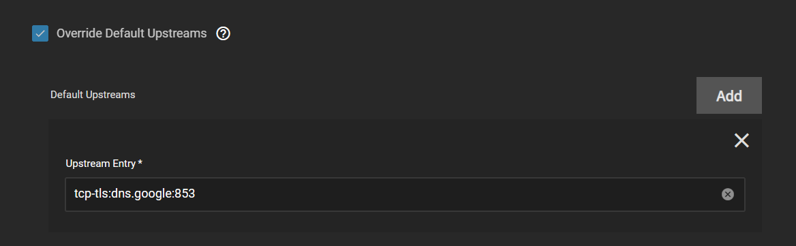
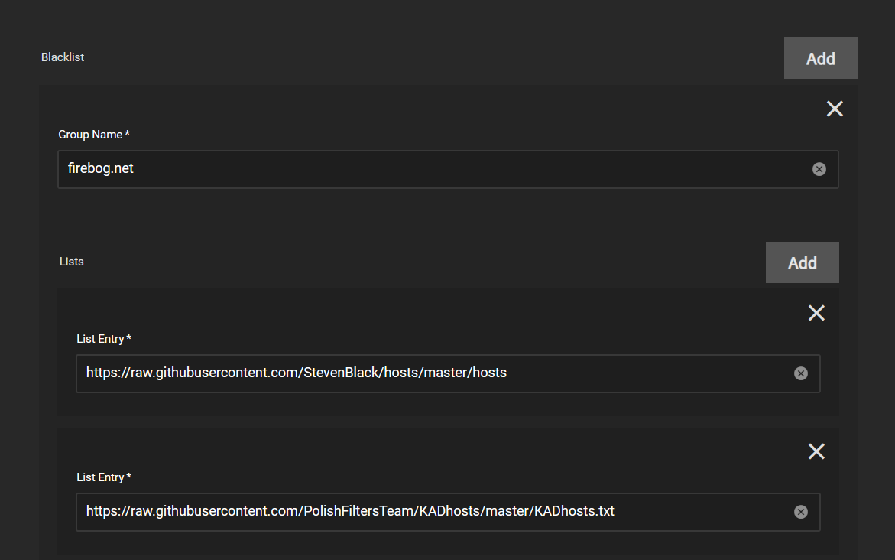

This will guide you through the basic setup of Blocky which is the preferred DNS solution for TrueCharts. This guide will cover basic setup options which will get you up and running and is not all inclusive. Configuring your devices to use Blocky is out of scope of this guide.

## Upstream DNS

Blocky has the following DNS entries configured by default. They can be overridden to your personal preferences or left as default. Here are some common ones:

Cloudflare

- 1.1.1.1
- 1.0.0.1

Google

- 8.8.8.8
- 8.8.4.4

Quad9

- 9.9.9.9
- 149.112.112.112

OpenDNS

- 208.67.222.222
- 208.67.220.220

ComodoSecure DNS

- 8.26.56.26
- 8.20.247.20

Blocky supports 3 methods for upstream DNS. You can use any combination of the below.

- UDP - Basic DNS
- DoT - DNS over TLS
- DoH - DNS over HTTPS

While UDP provides no security for DNS both DoT and DoH will encrypt DNS request. DoH has the added benefit of privacy since DNS traffic will appear as HTTPS traffic.

### UDP DNS Setup

- Google DNS: `8.8.8.8` `8.8.4.4`
- Cloudflare DNS: `1.1.1.1` `1.0.0.1`

### DoT DNS Setup

- Google DNS ([Bootstrap DNS Required](#bootstrap-dns)): `tcp-tls:dns.google:853`
- Cloudflare DNS: `tcp-tls:1.1.1.1:853` `tcp-tls:1.0.0.1:853`

### DoH Upstream

- Google DNS ([Bootstrap DNS Required](#bootstrap-dns)): `https://dns.google/dns-query`
- Cloudflare DNS: `https://1.1.1.1/dns-query` `https://1.0.0.1/dns-query`

## Bootstrap DNS

If you entered a non-IP address (meaning you used a domain name) for DoT or DoH, then you need to ensure that a bootstrap DNS provider
is configured to resolve the DoT or DoH address. This provider can be any UDP upstream DNS.
In the below example I am using Google DNS.

## DNS Blacklists and Whitelists

Blocky comes preconfigured with basic Blacklists and Whitelists. DNS Blacklists are used to prevent DNS resolution of advertisement, malware, trackers and adult sites domains. DNS Whitelists are used to always allow DNS resolution of domains regardless of existing blacklists. This is completed with public maintained blocklists. A good source for these is [firebog.net](https://firebog.net).

:::caution

While publicly maintained blocklists usually do a good job of allowing legitimate traffic they
can sometimes be too broad and catch traffic that you wish to allow. You may need to disable
certain blocklists if you find legitimate traffic being blocked.

:::

If you wish to customize the default Block Blacklists or Whitelists follow the steps below (replace whitelist as appropriate).

1. Set Group Name for your blocklists as `default`.
2. Add List entries for each blocklist by URL (or none if you wish to disable).
   

## Networking

If you want to use Blocky on your local network to take advantage of the filtering above, or the k8s-gateway below, you
need to setup a static ip address and leave the default setting DNS TCP Service and DNS UDP Service as LoadBalancer.

You need to configure the devices on your network to use the static IP address configured above. This can be done per device or by changing the DHCP or DNS settings on your router.

## k8s-Gateway Configuration

k8s-Gateway will automatically provide split DNS for your local domain. This will allow
you to resolve all ingress configured subdomains locally. All that is required for setup
is to add your root domain in the Domain name block.

## Prometheus/Grafana

Prometheus and Grafana are configured by default.
