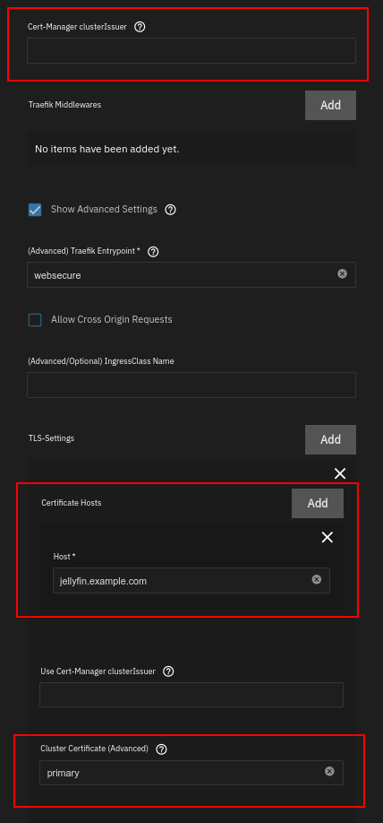

This guide will walk you through setting up and using `cluster certificates`.

:::note

Since this is an advanced feature, it is not covered by Truecharts support.

:::

## Prerequisites

- Ensure you have completed the [clusterissuer Setup Guide](how-to)
- Install the `kubernetes-reflector` app from the `premium` train

## Creating a cluster certificate

In the clusterissuer app settings create a new "Cluster-Wide certificate". As with a [single domain certificate](how-to#configure-ingress-using-clusterissuer), input a cert-manager issuer (for example an ACME issuer you configured previously), a list of hosts for which the certificate is valid (you can use wildcards), and a name you will use to reference it.

:::note

In order for an ACME issuer to issue a wildcard certificate, you need to have a DNS01 challenge solver configured.

:::

After creating the cluster certificate, verify it is working by checking the `Application Events` created in the `clusterissuer` app (see [how to verify a single app certificate is working](how-to#verifying-clusterissuer-is-working) for more information).

## Using a cluster certificate

After you have verified the certificate was created successfully, edit the settings of the app you wish to use it for and go to the _Ingress_ section.

If you have previously used a single domain certificate from clusterissuer, remove the specified issuer name. Then, click on _Show Advanced Settings_ and add a _TLS_ entry. Enter the name of your cluster certificate, and the certificate host(s) which it will be used for. These are usually the same as your app host(s), unless you wish to use more than one certificate. Save the chart.

:::note

In order for your cluster certificate to show up as valid, the certificate hosts it is used for must match the ones specified when creating it in the clusterissuer app settings. For example, in this case we configure the certificate host `jellyfin.example.com`, which matches the configured wildcard certificate host (`*.example.com`).

:::

