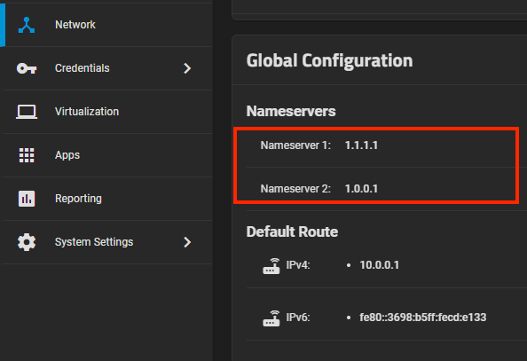
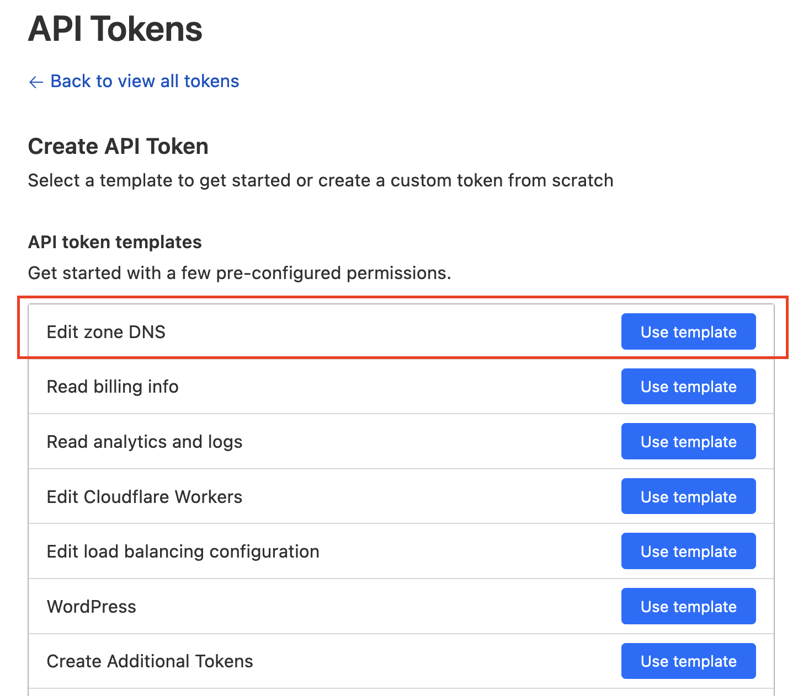
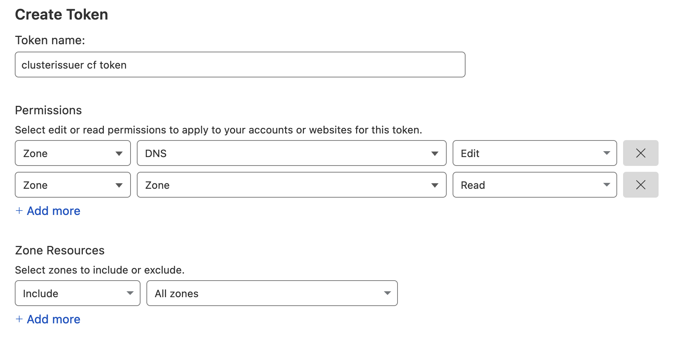
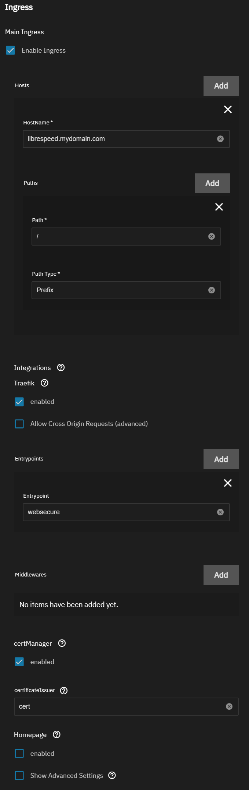

This guide will walk you through setting up `clusterissuer`, certificate management for Kubernetes.

## Prerequisites

- Ensure you have the `premium` and `system` trains enabled for `TrueCharts` as discussed [here](/scale/#adding-truecharts).
- [Traefik](/charts/premium/traefik/) is installed from premium train
- [Cert-Mananger](/charts/system/cert-manager/) and [Prometheus-Operator](/charts/system/prometheus-operator/)

:::caution[DNS]

As part of the DNS verification process cert-manager will connect to authoritative nameservers to validate the DNS ACME entry. Any firewall or router rules blocking or modifying DNS traffic will cause this process to fail and prevent the issuance of certificates. Ensure no firewall or router rules are in place blocking or modifying DNS traffic to assigned authoritative nameservers. Below is an example of cloudflare assigned authoritative nameservers (these nameservers are unique to each user).

:::

## Set Scale Nameservers

It is important to configure Scale with reliable nameserver to avoid issues handling DNS-01 challenges. Under Network -> Global Configuration-> Nameservers, we recommend setting 1.1.1.1/1.0.0.1 or 8.8.8.8/8.8.4.4.

## Install clusterissuer App

:::note

It is by design that the app does not run, there are no events, no logs and no shell.

:::

## Configure ACME Issuer

You can setup multiple domains and/or DNS providers with a single `clusterissuer` app.

### Cloudflare DNS Provider

#### Create a Cloudflare API token

Login to Cloudflare dashboard and go to the [Cloudflare API Tokens](https://dash.cloudflare.com/profile/api-tokens) page. Select Edit Zone DNS template.

The recommended `API Token` permissions are below:

#### Cloudflare ACME Issuer Settings

- **Name**: Name of the issuer entry; such as "cert" or "cloudflareprod". This name will be used later in the app ingress configuration
- **Type of DNS Provider**: `Cloudflare`
- **Server**: `Letsencrypt-Production`
- **Email**: The email address you register with Let's Encrypt for renewal/expiration notices
- **Cloudflare API key**: Leave blank since API token will be used
- **Cloudflare API Token**: Populate with token created from above.

More detail can be found on the upstream [Cert-Manager](https://cert-manager.io/) documentation for [Cloudflare](https://cert-manager.io/docs/configuration/acme/dns01/cloudflare/).

### Route 53 DNS Provider

To be completed

### Akamai DNS Provider

To be completed

### Digital Ocean DNS Provider

To be completed

## Configure Ingress using clusterissuer

Here's an example on how to add ingress to an app with clusterissuer for a single domain only.

Add the name of the `ACME Issuer` into `certificateIssuer`

If you want to support multiple domains on a single app, use the Add button next to `Hosts`.

## Verifying clusterissuer is working

Once installed using the Ingress settings above, you can see the `Application Events` for the app in question to pull the certificate and issue the challenge directly. See the example below:

Renewals are handled automatically by `clusterissuer`.
