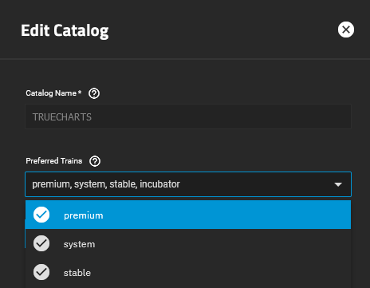
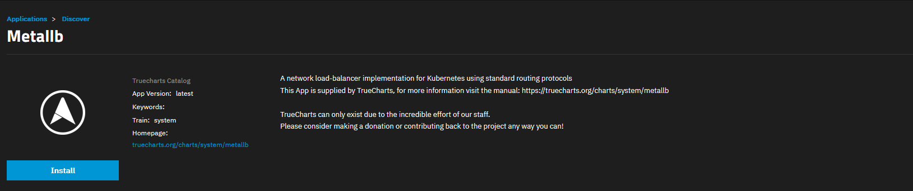
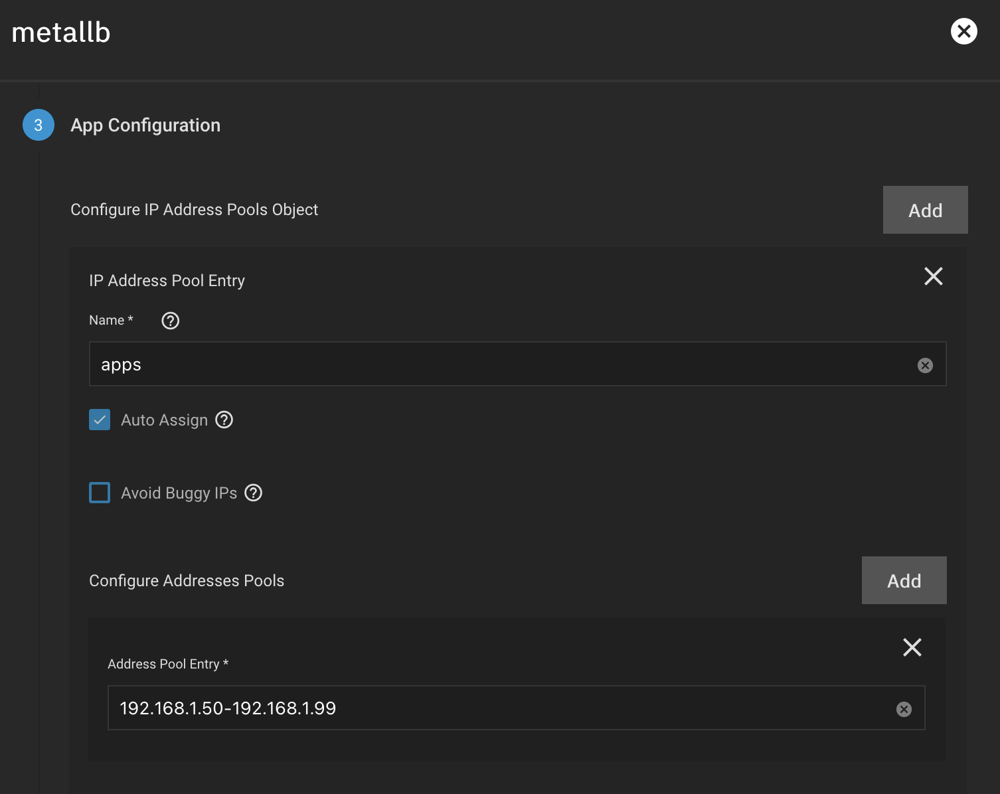
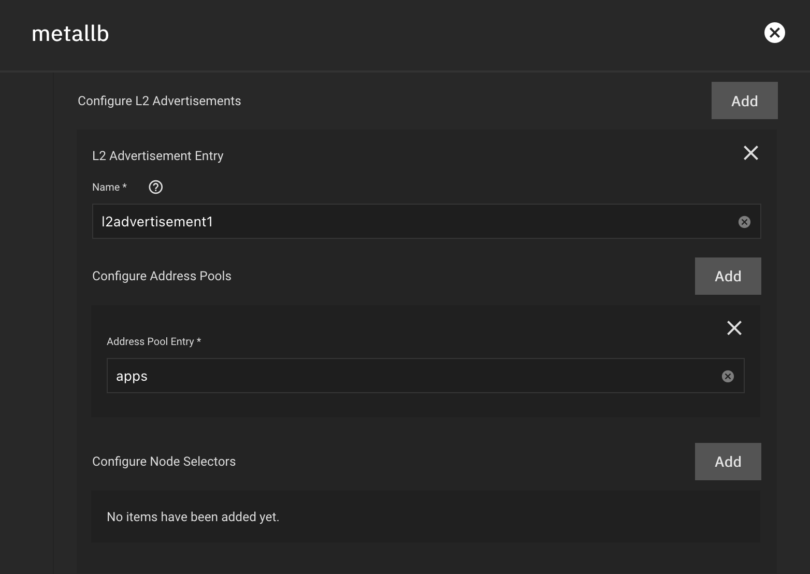
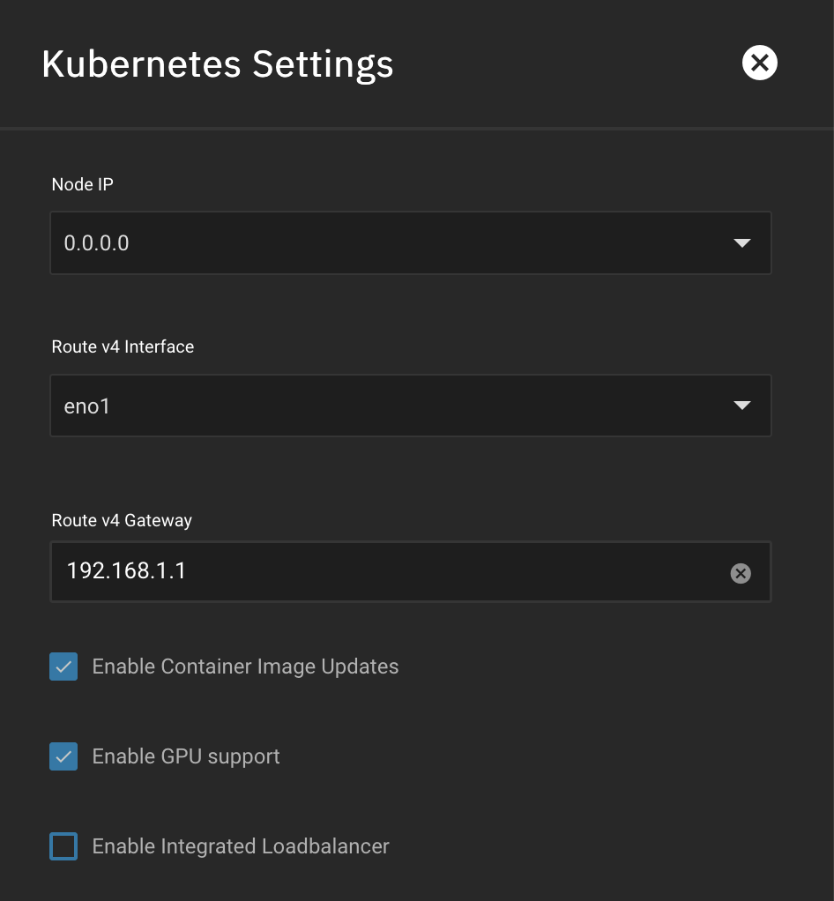

The guide walks through a basic configuration of MetalLB for a single address pool on a layer 2 network. This will allow assigning different IP addresses by app.

:::caution

With MetalLB installed, apps will not be reachable using the integrated LoadBalancer. You cannot combine two different LoadBalancers in TrueNAS SCALE.

:::

## Prerequisites

- Add the system & premium trains to your TrueCharts Catalog.

:::caution

Our customized version of MetalLB is only intended for use with other TrueCharts applications. Other catalogs will likely not support our MetalLB application. MetalLB could technically work with TrueNAS catalog apps if they used the LoadBalancer service, but they don't as they use NodePort instead. These atypical configurations aren't officially supported nor encouraged by TrueCharts.

:::

## 1. Install MetalLB Operator from system Train

Install `metallb` from `system` train first. There is no config, so just hit save.

If you encounter an error upon install, run the following command as root from system settings -> shell and attempt the install again:
`k3s kubectl delete --grace-period 30 --v=4 -k https://github.com/truecharts/manifests/delete`

If you previously had `metallb` installed and encounter an error, delete the old version, then run the above command before proceeding to install the `metallb` operator.

## 2. Set Address Pool & L2 Advertisement in MetalLB-Config

Install `metallb-config` from premium train and create a new entry under `Configure IP Address Pools Object`

- **Name**: Enter a general name for this IP range. Something like _apps_ or _charts_ for this field is fine.
- **Auto Assign**: if you want MetalLB Services to auto-assign IPs from the configured address pool without needing to specify per app. Recommendation is to keep this checked. You can still specify an IP for apps as needed (see step 3).

Create a single entry under `Configure Address Pools`

- **Address Pool Entry:** Specify an IP range for MetalLB to assign IPs that is **OUTSIDE** your current DHCP range on your LAN. For example, if your DHCP range is `192.168.1.100-192.168.1.255`, then your entry can be any range below `192.168.1.100`. This entry can also be specified in CIDR format.

_For users with VLANs or multiple subnets, you may create create additional address pool objects as needed._

Create a new entry under `Configure L2 Advertisements`.

- **Name**: Enter a basic name for your layer 2 advertisement.
- **Address Pool Entry:** This should match the **name** of the address pool created above (not the IP range itself).

:::tip

Once installed, `metallb-config` will always show as Stopped.

:::

## 3. Optional: Specify IP Address per App or Service

With MetalLB installed, it's recommended (but optional) to specify IP addresses for your apps.

For each app, under **Networking and Services**, select `LoadBalancer` Service Type for the Main Service.

In the **LoadBalancer IP** field, specify an IP address that is within the MetalLB address pool that you configured. Apply the same IP address to the **LoadBalancer IP** field on other services within the app.

## 4. Disable SCALE's Default LoadBalancer

With MetalLB installed and configured, you must now disable SCALE's default LoadBalancer.

In the SCALE UI, under **Apps** > **Settings** > **Advanced Settings**

Uncheck `Enable Integrated LoadBalancer`.

**This will trigger a restart of Kubernetes and all apps**. After roughly 5-10 minutes, your apps will redeploy using the MetalLB-assigned IP addresses.

## 5. Verify IP Addresses Are Assigned

From your SCALE shell, run the command `k3s kubectl get svc -A` to verify the IP addresses assigned for each of your apps. The IPs will be listed under the `EXTERNAL-IP` column.

If you have an IP conflict with a previously assigned address it will show as `<pending>`.

**You may need to do a system reboot as well to properly resolve the conflict.**

:::caution

Known Issue: On the SCALE Installed Applications page, the **Open** buttons on each app card will still open a URL to your app using your SCALE Host IP, rather than the MetalLB-Assigned IP. You may need to refresh the page in your browser, bypassing your browser's cache by doing `CTRL + F5`. This may be resolved in the future.

:::

For details on other configuration options, please reference the [MetaLB documentation](https://metallb.universe.tf/configuration/).
