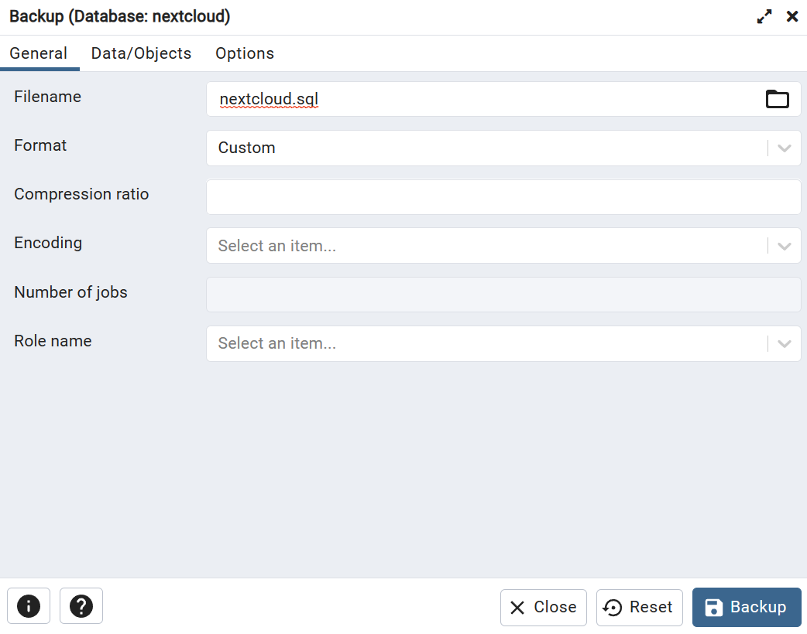
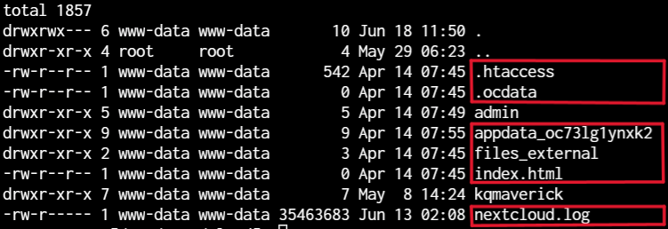
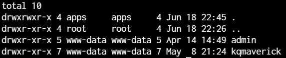
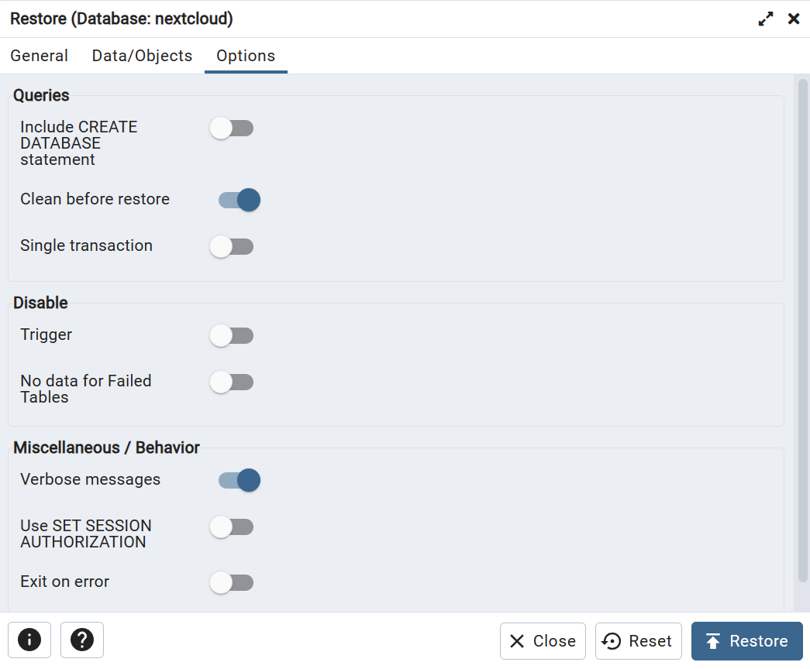
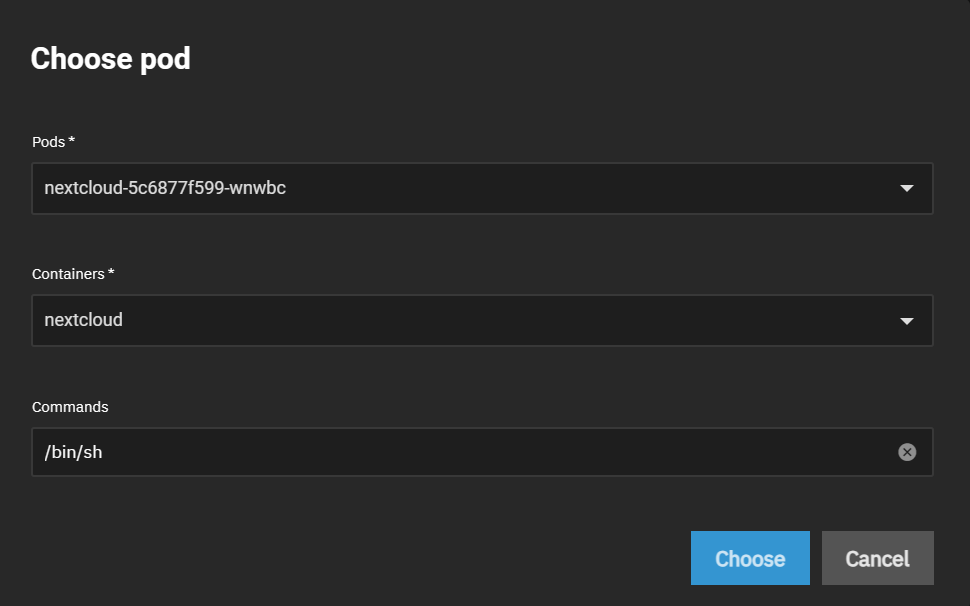

This guide can will walk through the process of backing up and existing Nextcloud installation and how to restore or migrate that installation. This guide utilize HostPath or NFS for UserData.

## Backup

:::danger SMB EXTERNAL STORAGE

If you are using SMB authenticated external storage on your Nextcloud remove it before starting this guide. The migration process will fail if it is not removed.

:::

:::danger TWO FACTOR AUTHENTICATION

If you are using two factor authentication on your Nextcloud accounts disable it before starting this guide. While it can be done via the CLI later it is much easier to disable it before hand.

:::

### Backup Database

If you have not already done so install PGAdmin and the [tcdbinfo.sh script](/platforms/scale/guides/sql-export/#how-to-list-database-login-info-for-truecharts-apps)

1. Run the tcdbinfo.sh script and take note of the connection info

   ```bash
   bash tcdbinfo.sh
   ```

   <!--  -->

2. Add Nextcloud to PGAdmin using the connection info from previous step.
   <!--  -->
   <!--  -->
3. Backup Nextcloud database.
   <!--  -->

### Backup User Data

If you are using HostPath of NFS for UserData then no further action is required. If you are using PVC for UserData then you will first need to mount your Nextcloud PVC and copy your UserData to a new dataset.

## Restore

### Remove Old AppData

This step is not required but to have a clean installation remove all UserData folder and files that are not user folders.

```bash
ls -la
```

<!--  -->

:::warning

Next steps are destructive without a way to undo. Make sure you have proper backups to avoid data loss.

You have been **warned**

```bash
rm -rf <folder>
```

```bash
rm .ocdata .htaccess index.html nextcloud.log
```

<!--  -->

:::

### Verify User Data Permissions

Nextcloud uses apps for file ownership. Apply permissions as shown below to your User Data dataset.


### Install Nextcloud

Install with a temporary admin user that you do not currently use for Nextcloud (ie. temp)

Setup Nextcloud User Data storage with your previous User Data dataset or the dataset you copied your User Data to.

<!--  -->

### Restore Database

:::caution Nextcloud Installation

Wait for Nextcloud to fully deploy before proceeding.

:::

1. Stop the main pod of Nextcloud.

   ```bash
   k3s kubectl scale deploy nextcloud -n ix-nextcloud --replicas=0
   ```

2. Add Nextcloud to PGAdmin as guided in steps 1 and 2 here.
3. In PGAdmin right click on the database and select restore as shown below.
   <!--  -->
4. Select the database backup you created previously.
   <!--  -->
5. Configure Data/Objects as shown below.
   <!--  -->
6. Configure Options as shown below and click restore.
   <!--  -->

:::caution PGAdmin Error

PGAdmin may display an error during the restore process. This is known to occur and may be ignored.

:::

7. Start the main pod of Nextcloud.

```bash
k3s kubectl scale deploy nextcloud -n ix-nextcloud --replicas=1
```

### OCC Commands

:::caution Nextcloud Deploy

Wait for Nextcloud to fully deploy before proceeding.

:::

1. Open a shell for the Nextcloud main pod as shown below. Ensure your are selecting the correct pod it should just say nextcloud for both Pods (followed by random characters only) and Containers as shown below.
   <!--  -->
2. Run the following commands in the Nextcloud shell.

```bash
occ upgrade
```

```bash
occ maintenance:mode --on
```

```bash
occ maintenance:repair
```

```bash
occ maintenance:mode --off
```

```bash
occ db:add-missing-indices
```

```bash
occ files:scan --all
```

### Delete Temporary User Data Folder

You may now remove the folder created during install for the temporary user that was configured.
