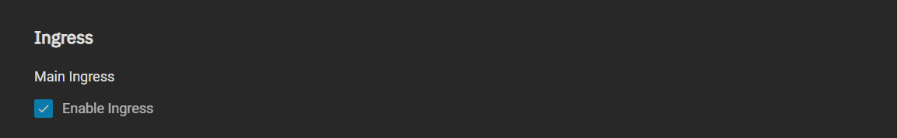

Our `traefik` chart has the ability to add various `middlewares` to the chart that can add extra functionality to your setup. You can see the full list of `middlewares` inside the `traefik` menu options. In this guide we'll go over setting up the `Basic Auth` traefik middleware.

## Prerequisites

- Traefik installed (see previous steps of `SCALE Apps Manual`)

## Installation

Once `traefik` is installed, scroll down to the `Middlewares` section

When there, you can fill out the `Configure basicAuth` section with what follows:

- Name the `basicAuth`, most people choose `basic`
- Add as name users as necessary, choosing a specific `Username` and `Password` for each user.

## Adding it to Apps using Ingress

Once you have your `basicAuth` setup, you need to add it to apps that have `Ingress`(Traefik) enabled, otherwise you cannot use this middleware.

Scroll to the section `Configure Traefik Middlewares`

- Click `Add` to add a fillable section
- Write in the name of the `basicAuth` from before. For most people that's basic as the example below.

## Verify Authentication

Once the `basicAuth` is installed, please visit the `URL` that you configured the `Ingress` for. If everything is setup correctly you should see the Pop-Up below.

## Video Guide

<iframe width="560" height="315" src="https://www.youtube.com/embed/hDdFKE5-c44" title="YouTube video player" frameBorder="0" allow="accelerometer; autoplay; clipboard-write; encrypted-media; gyroscope; picture-in-picture" allowFullScreen></iframe>

## Support

- If you need more help you can also reach us using [Discord](https://discord.gg/tVsPTHWTtr) for real-time feedback and support.
