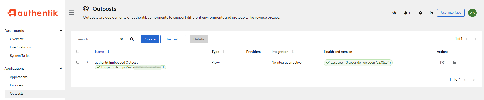

This is a quick how-to or setup guide to use Authentik with TrueNAS SCALE and setup a simple Proxy Provider with `traefik` using the Embedded Outpost to use as a Traefik `forwardauth`. This guide was created with Authentik `2022.10.0` and will be updated if things dramatically change.
This can be applied to other systems but this specific guide has been tested and created on TrueNAS SCALE and isn't guaranteed to work with any other configs.

## Requirements

- Authentik TrueCharts Chart
- Traefik Truecharts Chart

## Prerequisites

This guide assumes you're using Traefik as your Reverse Proxy / Ingress provider and have through the configuration listen in our [Quick-Start guides](/docs/manual/SCALE%20Apps/adding-letsencrypt) and/or the [Traefik documents](/charts/premium/traefik/how-to/). Please ensure that you can access your domain properly with Ingress before attempting any further steps.

## Authentik Chart Setup

:::note

The `Authentik` chart has many options, which may enhance or break your chart depending on your setup and are beyond the scope of this guide

:::

### Container Configuration

All of the defaults are fine to start off, you must choose a password, however `ingress` must be set if you wish to use `authentik` with `traefik`.

**Ingress Example**

:::note

Note that the `*.domain.com` host config is only needed if you want to use `Forward auth (single application)` in `authentik`.

:::


## Authentik GUI Setup

Default username is `akadmin` and password is whatever you entered in the initial setup.

- Once logged in enter the Admin Interface


### Create Application

- First step is to create an Application for use with `authentik`


- Specific the `Name` and `Slug` and then choose `Create Provider`


- Choose a new provider `Proxy Provider`.


- The simplest is to give it a name and use `Forward auth (domain level)`. Once there you enter the `main ingress` URL you use to access `authentik` and the `cookie domain` as the main domain you use.


- If you want to use subdomain-level access control, select `Forward auth (single application)` and enter the URL you have chosen for your apps' ingress.
- The example uses `https://application.domain.com/`, make sure your app is reachable and uses a valid certificate beforehand.
- You can set HTTP-Basic Authentication Attributes under `Authentication settings` for your service here.
  - Don't use a `basicAuth` middleware in the apps' ingress settings. Only use this if your app has build in basic auth support.
  - Add the attributes in a `authentik` group, then assign any user you want to be able to access the application to this group.


- Once done use that new `Provider` you created


### Choose Provider

If everything was done properly above, you should have the Provider you created assigned to your Application


### Use Embedded Outpost



- Next step is simply attaching your `application` with the `authentik Embedded Outpost` that has been created automatically. Click the `Edit` button under Actions


- Name your `Outpost` and choose the `Application` you wish to use with `authentik`. Click `Update` and verify it's usage with the Healthcheck below.


## Traefik ForwardAuth Setup

Once `authentik` is setup and running, you must create a `forwardAuth` inside `Traefik` in order to use authentication with Traefik. For my purposes `auth` is what I used but as long as you remember it you're fine.


:::note

The main thing about this screen is to use the internal DNS name for simplicity

- I have successfully used an `authentik` instance on a difference host together with `external-service` using this URL:
  - `https://authentik-external-service.ix-authentik.svc.cluster.local:9443/outpost.goauthentik.io/auth/traefik`
- Use `heavyscript dns -a` to get the internal DNS name for your `authentik` instance in that case.
- I suggest using the `https` endpoint and port because it is what worked for me.

:::

```shell
http://authentik-http.ix-authentik.svc.cluster.local:10230/outpost.goauthentik.io/auth/traefik
```

**Double-check the DNS name and port.**

There's also a list of `authResponseHeaders` inside `authentik` listed for use with `Traefik`, so in case you need them here they are.

- `X-authentik-username`
- `X-authentik-groups`
- `X-authentik-email`
- `X-authentik-name`
- `X-authentik-uid`
- `X-authentik-jwt`
- `X-authentik-meta-jwks`
- `X-authentik-meta-outpost`
- `X-authentik-meta-provider`
- `X-authentik-meta-app`
- `X-authentik-meta-version`

Add the `authorization` header to pass the HTTP-Basic headers from `authentik` to you application.

### Add Traefik forwardAuth to Charts

- Once that is done all you need to add the `middleware` to your Charts under the `Ingress section`, as in my case it's called `auth`.


And that's it.

## Verification it works

- Simply visit any `URL` that you have `Traefik` + the `forwardAuth` middleware enabled


- Login and voila!


## Support

- You can also reach us using [Discord](https://discord.gg/tVsPTHWTtr) for real-time feedback and support
- If you found a bug in our chart, open a Github [issue](https://github.com/truecharts/apps/issues/new/choose) but generally it's advised to contact us on Discord first in most cases.

---

All Rights Reserved - The TrueCharts Project
