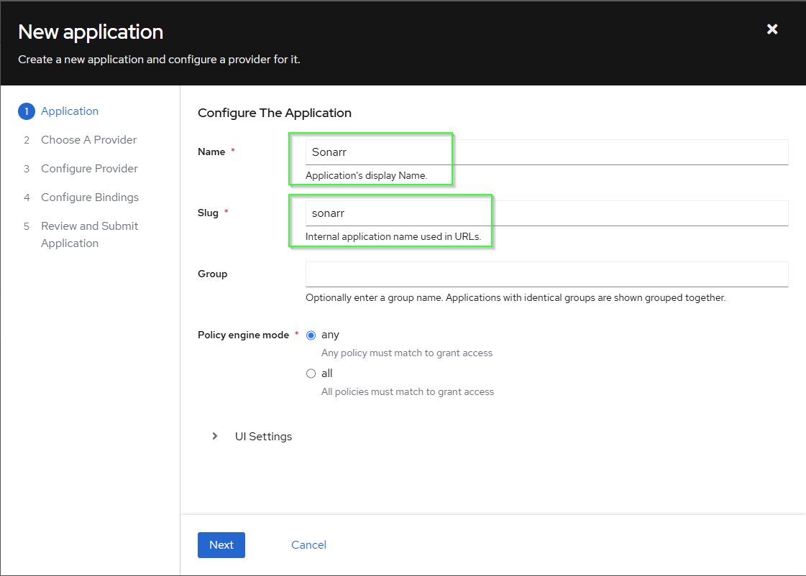
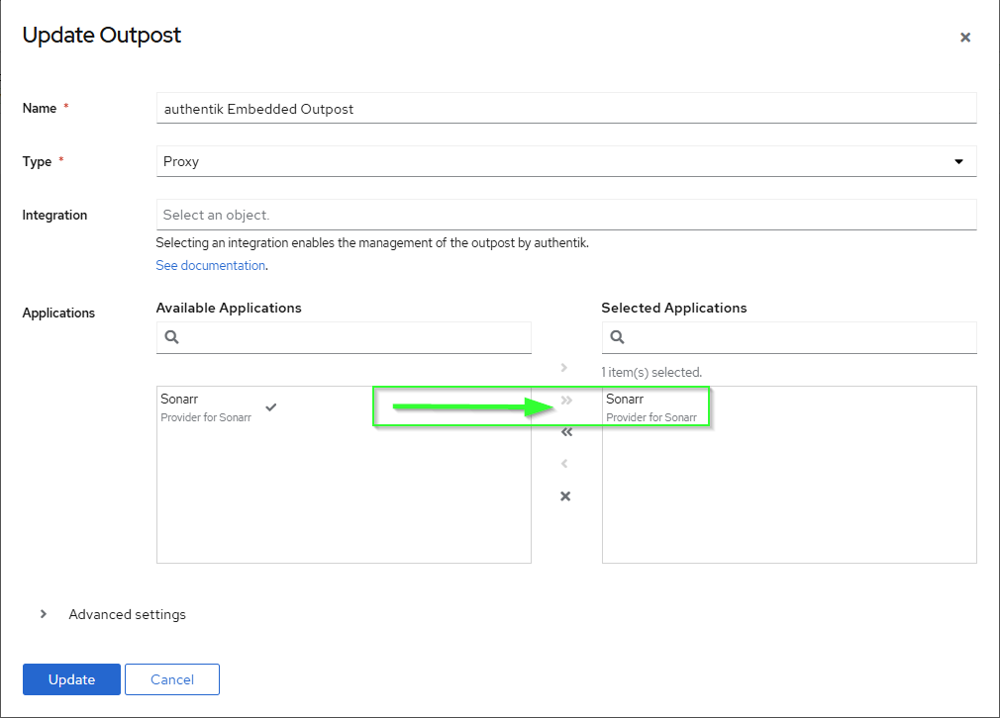
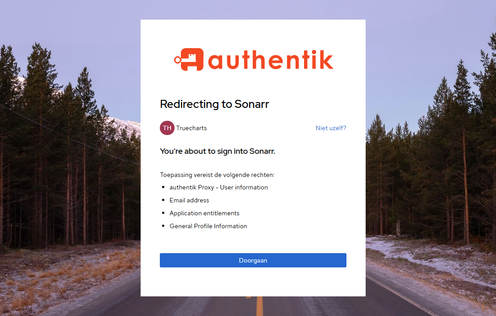

This is a quick how-to or setup guide to use Authentik and setup a simple Proxy Provider with `traefik` using the Embedded Outpost to use as a Traefik `forwardauth`. <br>
This guide is created with Authentik `2025.2.1`.

## Prerequisites

This guide assumes you're using Traefik as your Reverse Proxy / Ingress provider. Please ensure that you can access your domain properly with Ingress before attempting any further steps.

## Authentik Chart Setup

:::note

The `Authentik` chart has many options, which may enhance or break your chart depending on your setup and are beyond the scope of this guide.

:::

### Chart Values

All of the defaults are fine to start off, only the `.Values` you need to set are password and the ingress settings.

:::note

Note that the `*.domain.com` host config is only needed if you want to use `Forward auth (single application)` in `Authentik`.

:::

```yaml
// .Values
ingress:
  main:
    enabled: true
    hosts:
      - host: auth.domain.com
      - host: "*.domain.com"
        paths:
          - path: /outpost.goauthentik.io
            pathType: Prefix
    integrations:
      traefik:
        enabled: true
      certManager:
        enabled: true
        certificateIssuer: domain-0-le-prod

authentik:
  credentials:
    email: info@domain.com
    password: secretpassword
```

## Authentik GUI Setup

:::note

During testing it is adviced to use Incognito browser windows.

:::

- Browse to `https://auth.domain.com`

Default username is `akadmin` and password is whatever you entered in the chart .Values.

- Once logged in enter the Admin Interface


### Create an User

- Create an user or more


- Set the users password


### Create Application based upon subdomain-level access control `Forward auth (single application)`

If you want to use subdomain-level access control, you have to make per subdomain a Provider and an Application.
The example uses `https://sonarr.domain.com/`, make sure your app is reachable and uses a valid certificate beforehand.

1. First step is to create an Application for use with `authentik`.


2. Specific the `Name` and `Slug` and press `Next`.



3. Choose a Provider `Proxy Provider` and press `Next`.


4.
- Configure Proxy Provider by select `Forward auth (single application)` and fill your `External host`.
- Select the preffered `Authorization flow`
- When you scroll down you can enable `Send HTTP-Basic Authentication` under `Authentication settings` and complete the correct keys for your service here. Don't use a `basicAuth` middleware in the apps' ingress settings. Only use this if your app has build in basic auth support. More information upstream [here](https://docs.goauthentik.io/docs/add-secure-apps/providers/proxy/header_authentication). In this how_to we don't use this.
- press `Next`


5. Choose `Bind existing policy/group/user` to assign an user(s), which are allowed to access. If you assign nothing all users are allowed to access. Press Save Binding


6. Review the Application and submit.


### Create Application based upon domain access control `Forward auth (domain level)`

:::note

This is not further tested during creation of this HOW-TO, feel free to complete.

:::

- If you want no controll per sub domain. You can choose at step 4 above `Forward auth (domain level)`.
- Once there you enter the `main ingress` URL you use to access `authentik` and the `cookie domain` as the main domain you use.
- Call it for example as Application name `All` and as provider name `Provider Domain`.


### Review Provider

If everything was done properly above, you should have the Provider you created assigned to your Application


### Set Embedded Outpost

- Go to `Outposts` and check directly the healthcheck.


- Next step is simply attaching your `application` with the `authentik Embedded Outpost` that has been created automatically. Click the `Edit` button under Actions



## Traefik ForwardAuth Setup

Once `authentik` is setup and running, you must create a `forwardAuth` inside `Traefik` in order to use authentication with Traefik. For my purposes `auth` is what I used but as long as you remember it you're fine.

```yaml
middlewares:
  forwardAuth:
    - name: auth
      address: http://authentik-http.authentik.svc.cluster.local:10230/outpost.goauthentik.io/auth/traefik
      authResponseHeaders:
        - X-authentik-username
        - X-authentik-groups
        - X-authentik-email
        - X-authentik-name
        # - authorization      # According to previous how_to to pass the HTTP-Basic headers from `authentik` to you application  (NOT TESTED)
      trustForwardHeader: true

## Other Available authResponseHeaders according upstream documentation: https://docs.goauthentik.io/docs/add-secure-apps/providers/proxy/server_traefik
# - X-authentik-entitlements
# - X-authentik-uid
# - X-authentik-jwt
# - X-authentik-meta-jwks
# - X-authentik-meta-outpost
# - X-authentik-meta-provider
# - X-authentik-meta-app
# - X-authentik-meta-version
```

## Add Traefik forwardAuth to Charts

- Once that is done all you need to add the `middleware` to your Charts under the `Ingress section`, as in my case it's called `auth`.

```yaml
ingress:
  main:
    enabled: true
    integrations:
      traefik:
        enabled: true
        middlewares:
          - name: auth
            namespace: traefik
```

## Verification it works

- Simply visit any `URL` that you have `Traefik` + the `forwardAuth` middleware enabled


- Login and voila!



## Support

- You can also reach us using [Discord](https://discord.gg/tVsPTHWTtr) for real-time feedback and support
- If you found a bug in our chart, open a Github [issue](https://github.com/truecharts/apps/issues/new/choose) but generally it's advised to contact us on Discord first in most cases.

---

All Rights Reserved - The TrueCharts Project
