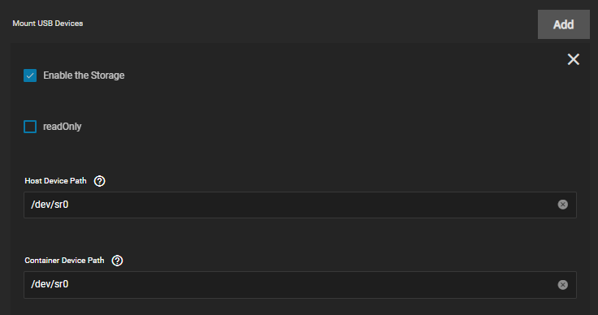

Installation notes and warnings for A.R.M

:::caution

This app uses advanced privileges aka "GOD MODE" on the host

:::

Configure the app and storage.

Mount your dvd with host and container path : `/dev/sr0`.

Do the same for all DVD burners you want to mount.

- `/dev/sr0`
- `/dev/sr1`
- `/dev/sr2`
- `/dev/sr3`
- `/dev/sr4`

