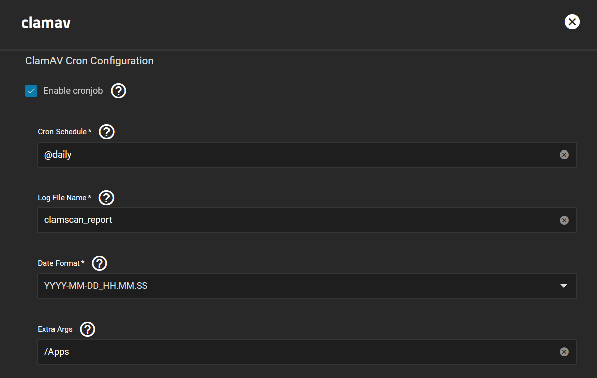

This is a quick setup-guide on how-to to use ClamAV with mounting directories using NFS shares and using the integrated cron job to scan these mounted folders.

:::tip

- ClamAV TrueCharts App
- NFS Shares of the folders you want to scan

:::

## Guide

### Step 1

Setup App Name and Configuration as necessary, but where you deviate from defaults is by `Enable cronjob` at the <u>ClamAV Cron Configuration</u> section.

- To generate a cron schedule one can use a website like [cronhub](https://crontab.cronhub.io) or [crontab.guru](https://crontab.guru)

**Note the added directory to `Extra Args`, this is where your scanned directories will go**

### Step 2

Add your scanned directories using `Configure Additional Storage` and make sure your mounted directories match the directory in the `Extra Args` section above

That's it, without a GUI having the cron job is the easiest way to have your ClamAV running in the background at specific times.

## Support

- If you need more details or have a more custom setup the documentation on the [upstream](https://github.com/Cisco-Talos/clamav) is very complete so check the descriptions of the options there.
- You can also reach us using [Discord](https://discord.gg/tVsPTHWTtr) for real-time feedback and support
- If you found a bug in our chart, open a Github [issue](https://github.com/truecharts/apps/issues/new/choose)

---

All Rights Reserved - The TrueCharts Project
