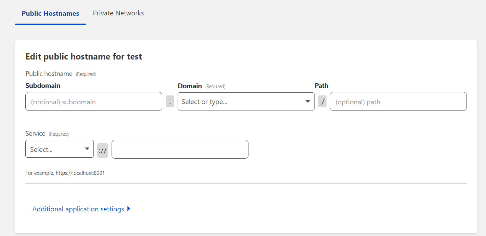
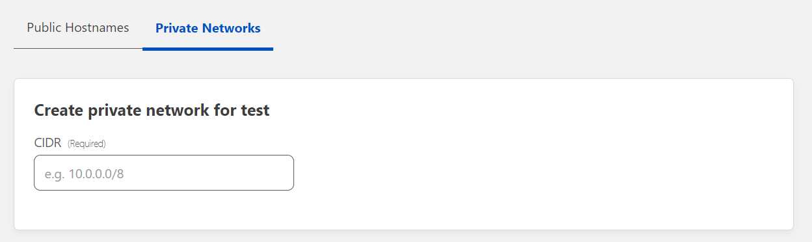
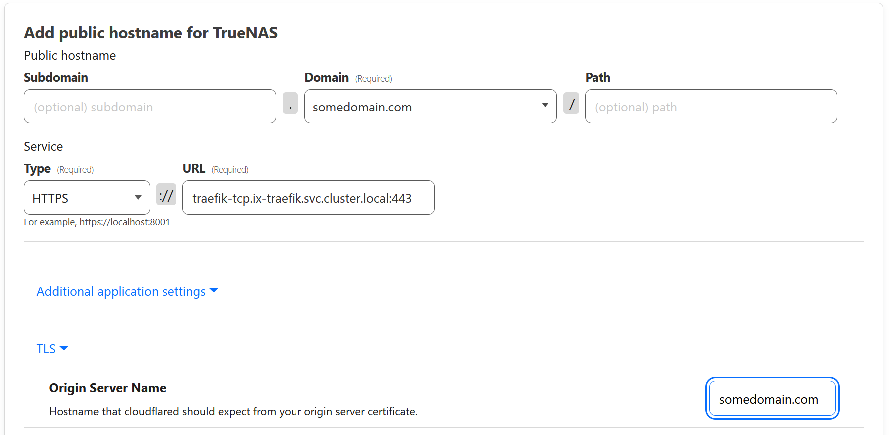
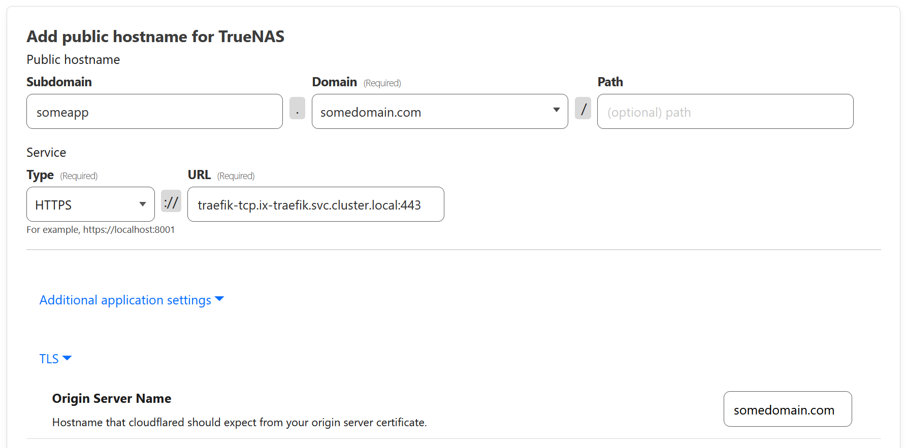

- Go to [cloudflare team dash](https://dash.teams.cloudflare.com) and create a tunnel or migrate a current tunnel (this action is not reversible) by going to access and then tunnels tab.

- Create a tunnel like so (or migrate a current one)

- Copy **JUST** the token from tunnel's overview **Install and run a connector** section.

- Set the `token` with **your** tunnel's token. the tunnel ID will **NOT** work.
- Now you can manage the tunnel via cloudflare dash by setting a private network or create ingress rules for your services and domain, explained in [Setting up individial apps](#setting-up-individual-apps)

Notes:

- You MAY need to modify cloudflared Zero Trust various settings in order for this work out-of-the-box which is beyond the scope of this guide.

- You can use this as a reverse proxy directly or use it in conjunction with traefik if you are behind a CGNAT, do not have a static IP, or can not port forward 443 (SSL).

## Setting up individual apps

### Using traefik

If you've set up your apps with traefik, you need to set up two public hostnames

1. Set `domain` to your domain
2. Set `type` to `HTTPS`
3. Set `URL` to your traefik URL, usually `traefik-tcp.ix-traefik.svc.cluster.local:443` (make sure the port is the same as the port you specified in traefik config)
4. Under `Additional app settings` > `TLS`, set `Origin Server Name` to your domain.

Setup should look like this:

Then you need to do the same to set up the subdomain for each app you want to expose, using the same subdomain you specified in the app's ingress settings as follows:

:::danger Wildcard Subdomains

It's also possible to set up access to all apps at once by using a wildcard `*` subdomain public hostname, and then adding a CNAME record in the DNS settings with name=`*` and target equal to the target in the CNAME record for the parent domain, but this is not recommended due to security concerns.

:::

### Without traefik

If you've not set up traefik and ingress, and exposing the ports using the normal loadbalancer, you only need to set up each app individually, and set `URL` to `<TrueNAS Local IP>:<PORT of app>` for each app.
