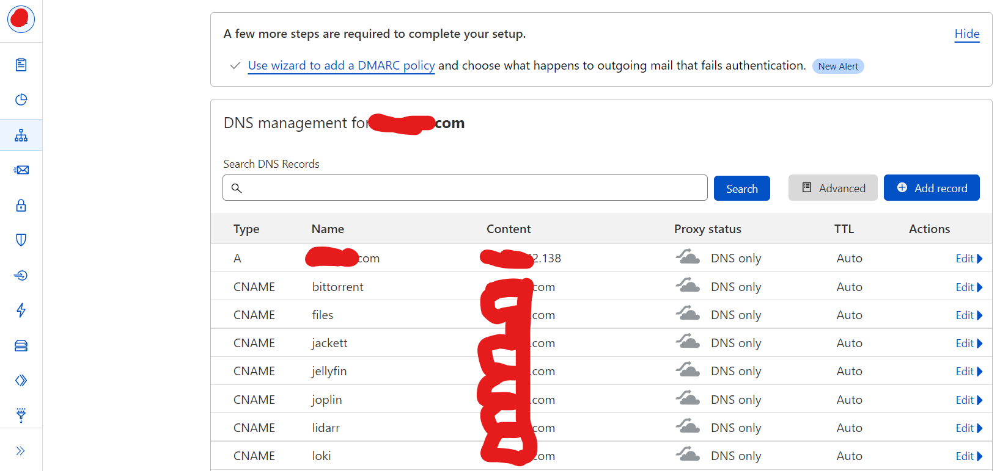
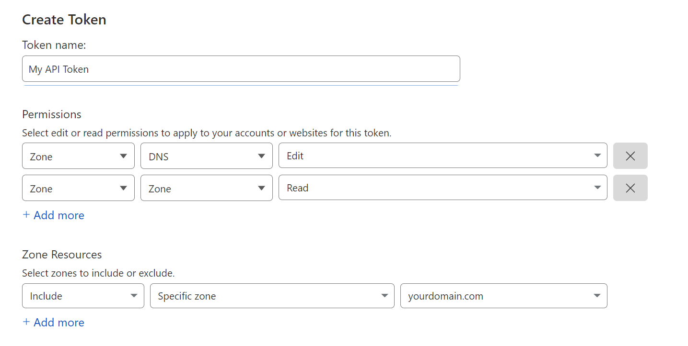
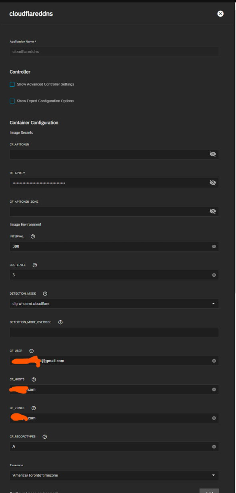

So you've followed some of our TrueNAS guides, setup your domain name, certificates and use Cloudflare for your DNS management, however you don't have a static IP, then this guide is for you. This quick guide will help you go through the steps to use Cloudflareddns to update your dynamic IP along with your entire deployment so that even if you change IP your domain will point to the right address.

## Requirements

Domain name (can be purchased through Cloudflare or any other domain registrar)

Cloudflare DNS management

- Sign up for Cloudflare free
- Point your nameservers to the ones Cloudflare assigns to you

  

Cloudflareddns chart

## Prerequisites

This guide assumes you've followed our [clusterissuer guide](/charts/premium/clusterissuer/how-to) with your domain on TrueNAS and done the configuration for your DNS on Cloudflare

The recommended way is to setup CNAMEs for your subdomains (charts) and keep your A record pointed to your base domain, such as below

> Create an API Token, with the following permissions:
> Click `Create Token` and `Use Template` on the Edit zone DNS.
>
> - Zone - DNS - Edit
> - Zone - Zone - Read
>
> And the following Zone resources
>
> - Include - Specific zone - yourdomain.com
>
>   

## Cloudflareddns Chart Setup

Use API Token previously created for the `CF API Token` field.

Click Add for Hosts, Zones and Record Types.

- Change `Domain` to your DNS Zone A record (yourdomain.com)
- Change `Zone` to DNS Zone ID found on the Cloudflare Overview Page for your domain.
- Change `Record Type` to A if you're only changing your main domain

If you're using or changing specific A records or CNAMEs you may want to refer to the upstream documentation for more examples [here](https://hotio.dev/containers/cloudflareddns/))
