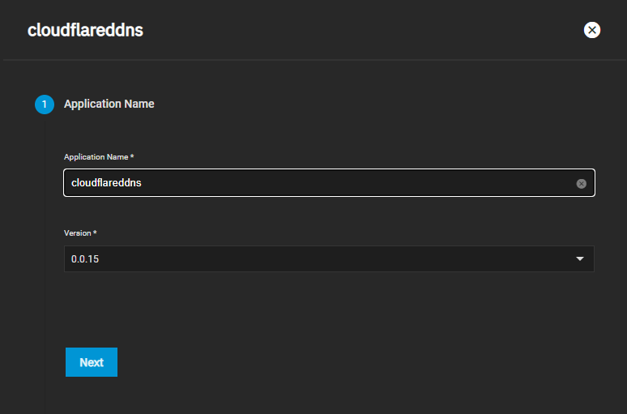

# How-To

So you've followed some of our TrueNAS guides, setup your domain name, certificates and use Cloudflare for your DNS management, however you don't have a static IP, then this guide is for you. This quick guide will help you go through the steps to use Cloudflareddns to update your dynamic IP along with your entire deployment so that even if you change IP your domain will point to the right address.

## Requirements

Domain name (can be purchased through Cloudflare or etc)

Cloudflare DNS management

- Sign up for Cloudflare free
- Point your nameservers to the ones Cloudflare assigns to you

  

Cloudflareddns chart

## Prerequisites

This guide assumes you've followed our main [Guide](https://truecharts.org/manual/guides/adding-letsencrypt/) with your domain on TrueNAS and done the configuration for your DNS on Cloudflare
(see this video on our YouTube channel)

<iframe width="560" height="315" src="https://www.youtube.com/watch?v=hJVghecs3rE" title="YouTube video player" frameborder="0" allow="accelerometer; autoplay; clipboard-write; encrypted-media; gyroscope; picture-in-picture" allowfullscreen></iframe>

The recommended way is to setup CNAMEs for your subdomains (charts) and keep your A record pointed to your base domain, such as below

To keep things simple, one can simply use the Global API key from Cloudflare that you previously used inside our guides to setup your certificates, in case you forget it's in the page below

> **Alternatively** you can create an API Token, with the following permissions:
> Click `Create Token` and `Use Template` on the Edit zone DNS.
>
> - Zone - DNS - Edit
> - Zone - Zone - Read
>
> And the following Zone resources
>
> - Include - Specific zone - yourdomain.com
>
>   

## Cloudflareddns Chart Setup

Step 1-2: Name chart and leave defaults for Step 2

Step 3:

Use Global API key from Cloudflare Domain Overview page (see above) for the `CF_APIKEY` field

- Change `CF_USER` to your Cloudflare Email Account
- Change `CF_HOSTS` to your DNS Zone A record (mydomain.com)
- Change `CF_ZONES` to the same Zone (mydomain.com)
- Change `CF_RECORDTYPES` to A if you're only changing your main domain

> **Alternatively** (Only if you created an API Token)
>
> - Change `CF_APITOKEN` to your generated Token
> - Change `CF_HOSTS` to your `yourdomain.com` (or the record you want to update)
> - Change `CF_ZONES` to your Zone ID (Found in your Cloudflare dashboard, on the right column)
> - Change `CF_RECORDTYPES` to `A` if you want to update an A record

If you're using or changing specific A records or CNAMEs you may want to refer to the upstream documentation for more examples [here](https://hotio.dev/containers/cloudflareddns/))

Steps 4-8: Adjust as necessary but defaults are fine

## Support

- If you need more details or have a more custom setup the documentation on the [upstream](https://hotio.dev/containers/cloudflareddns/) is very complete so check the descriptions of the options there.
- You can also reach us using [Discord](https://discord.gg/tVsPTHWTtr) for real-time feedback and support
- If you found a bug in our chart, open a Github [issue](https://github.com/truecharts/apps/issues/new/choose)

---

All Rights Reserved - The TrueCharts Project
