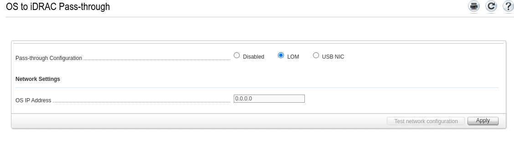

## iDRAC version

This Docker container only works on Dell PowerEdge servers that support IPMI commands, i.e. iDRAC 9 firmware 3.30.30.30.

## How to access iDrac over LAN

Visit this [link](https://github.com/tigerblue77/Dell_iDRAC_fan_controller_Docker#to-access-idrac-over-lan-not-needed-in-local-mode-)

## Can't ping iDrac?

Make sure you have OS to iDrac passthrough enabled

