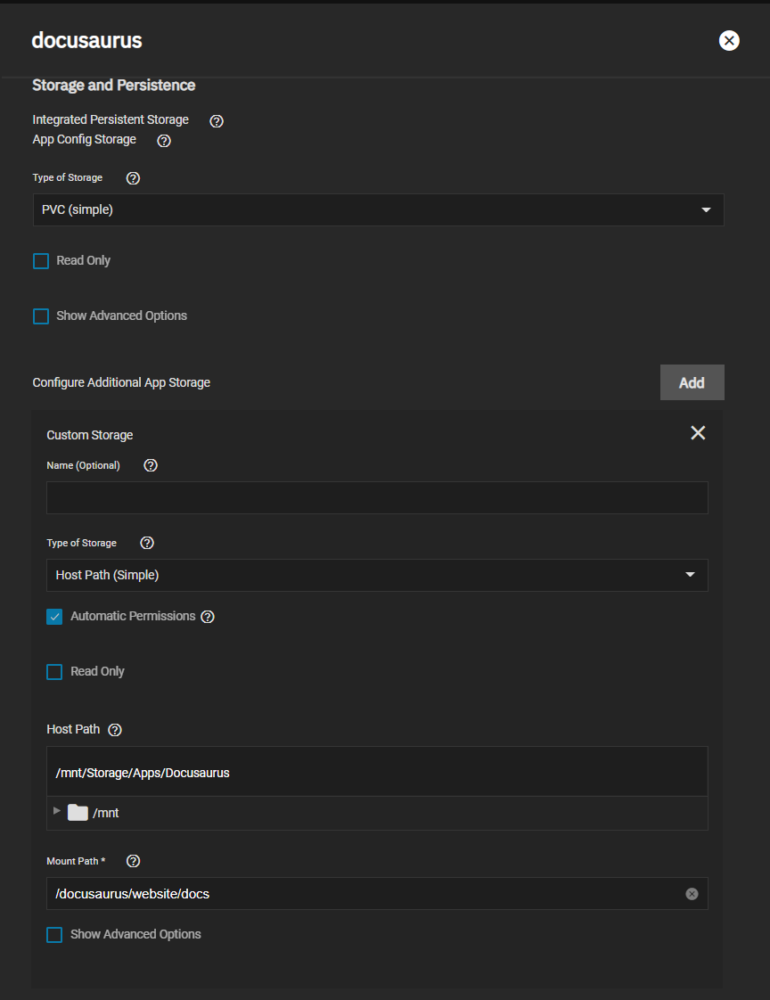

This is a quick how-to or setup-guide to run Docusaurus on your own server.
This can be applied to other systems but this specific guide is made on TrueNAS SCALE and screenshots are provided from that system.

## Requirements

None necessary, a domain name is recommended for usage but not required.

## Docusaurus Chart Setup

### Container Configuration

- Enter Docusaurus or Website Name
- Docusaurus Default Template is generally `classic` unless you've manually installed another
- Choose `Production` mode or `Development` mode

### Networking and Services

- Leave defaults unless using Ingress then `ClusterIP` is recommended

### Storage and Persistance

- This chart uses `PVC` for storage as most of our charts do for `Storage`. However some may want to edit certain files or directories more often. This can be done with `Configure Additional Storage`.
  - Click `Add` under `Configure App Additional Storage`
  - Add the `Host Path` of the folder you wish to use
  - Use the `Mount Path` of the folder you wish to have accessible. For example `/docusaurus/website/docs` mounts the files inside the `/docs` of the standard Docusaurus website.

### Ingress

Recommended for use with a domain name but not required as mentioned above. You can refer to our Quick-Start Guides for an overview on using Ingress with your chart.

## Support

- If you need more details or have a more custom setup the documentation on the [upstream](https://github.com/facebook/docusaurus) is very complete so check the descriptions of the options there.
- You can also reach us using [Discord](https://discord.gg/tVsPTHWTtr) for real-time feedback and support
- If you found a bug in our chart, open a Github [issue](https://github.com/truecharts/apps/issues/new/choose)

---

All Rights Reserved - The TrueCharts Project
