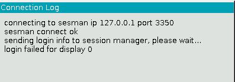
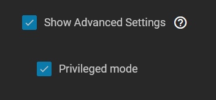

# Installation Notes

Double Commander requires `Privileged mode` else you will experience a login failure.

To enable `Privileged mode`:

In `Security and Permissions` `Security Context` `Container`

- check `Show Advanced Settings`
- check `Privileged mode`.

