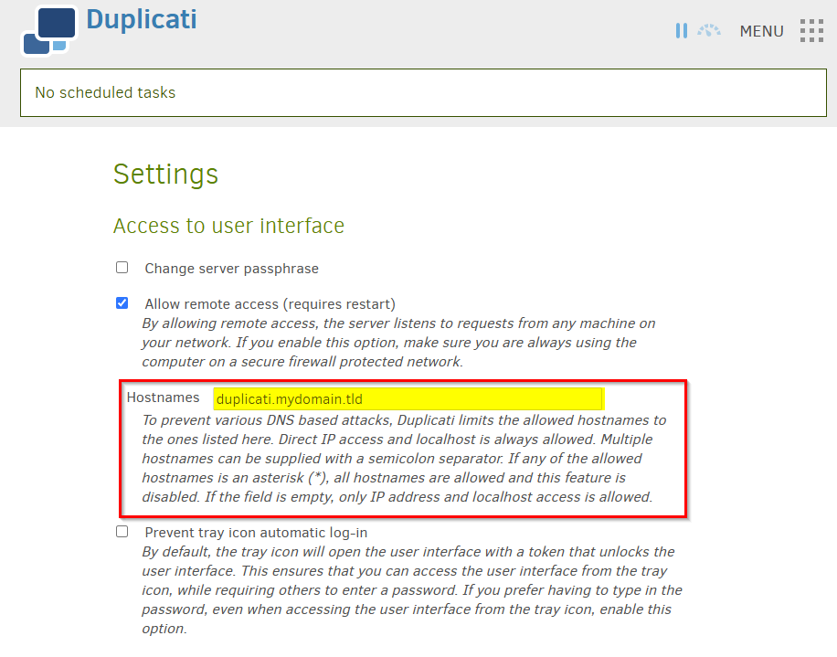

## Envirable Variable

Ideally, you need at least the settings encryption key provided to the container, how to generate a key can be found below.
Also the webservice password can be given upfront. If you don't set a webservice password an one time login link is given via the logs.
Both can easily provide this via a regular environment variable.

```yaml
workload:
  main:
    podSpec:
      containers:
        main:
          env:
            DUPLICATI__WEBSERVICE_PASSWORD: "SuperSecretPassword"
            SETTINGS_ENCRYPTION_KEY: "<real encryption key>"
```
### Example Encryption Key Generation

Below is an example of one way to generate the RPC Secret value, which can be copy paste in a terminal which have openssl installed.

```
$ openssl rand -hex 32
```

## Ingress

This chart requires Ingress to be enabled after initial deployed of this chart due to the configuration of the application upstream.
More information: (see [Duplicati forum post](https://forum.duplicati.com/t/error-message-in-browser-the-host-header-sent-by-the-client-is-not-allowed/5806)).

1. Please deploy the chart without Ingress
2. Login via http://IP/login.html
3. Go to the settings of the application and add your hostname inside the settings of Duplicati.



4. Restart the chart
5. Once this is done you can successful add an Ingress to the chart. How to add an Ingress can be found in the common documentation.

If you require more help or details please refer to our Discord for help from our Support Staff.

## Read locked files

Information from documentation [upstream](https://docs.duplicati.com/detailed-descriptions/using-duplicati-from-docker#read-locked-files):

Duplicati has support for LVM-based snapshots which is the recommended way for getting a consistent point-in-time copy of the disk. For some uses, it is not possible to configure LVM snapshots, and this can cause problems due to some files being locked. By default, Duplicati will respect the advisory file locking and fail to open locked files, as the lock is usually an indication that the files are in use, and reading it may not result in a meaningful copy.
If you prefer to make a best-effort backup, which was the default in Duplicati v2.0.8.1 and older, you can disable advisory file locking for individual jobs with the advanced option: --ignore-advisory-locking=true. You can also disable file locking support entirely in Duplicatie.

```yaml
workload:
  main:
    podSpec:
      containers:
        main:
          env:
            DOTNET_SYSTEM_IO_DISABLEFILELOCKING: true
```
