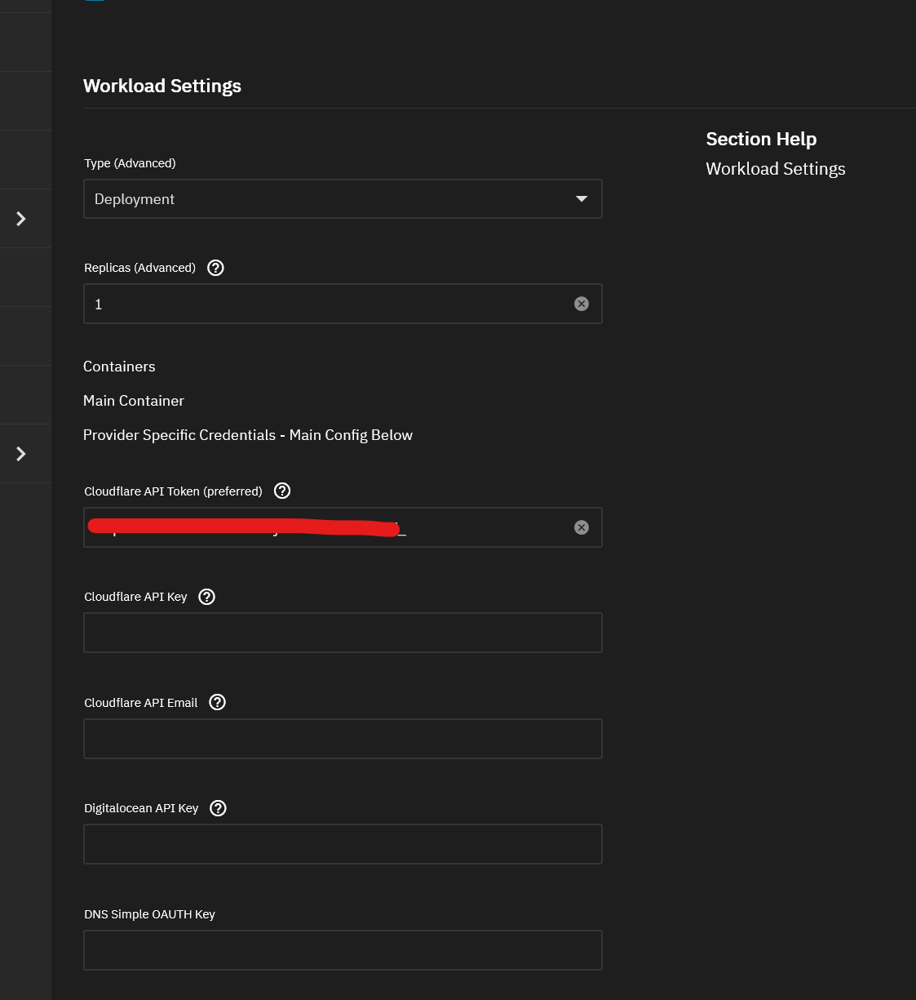
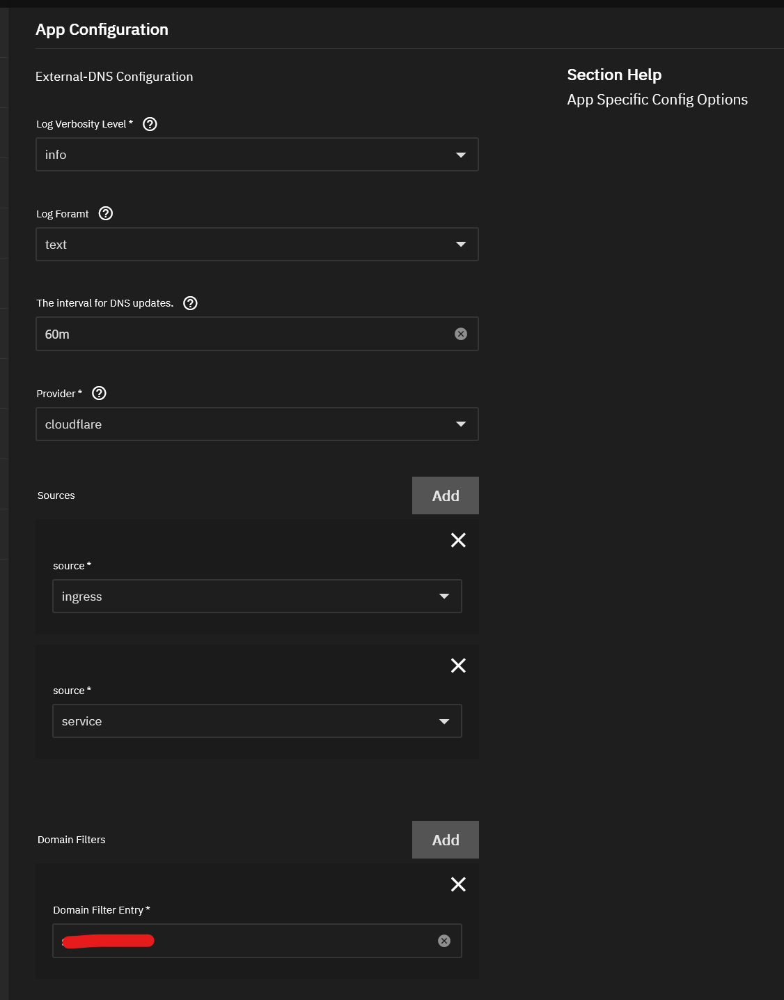
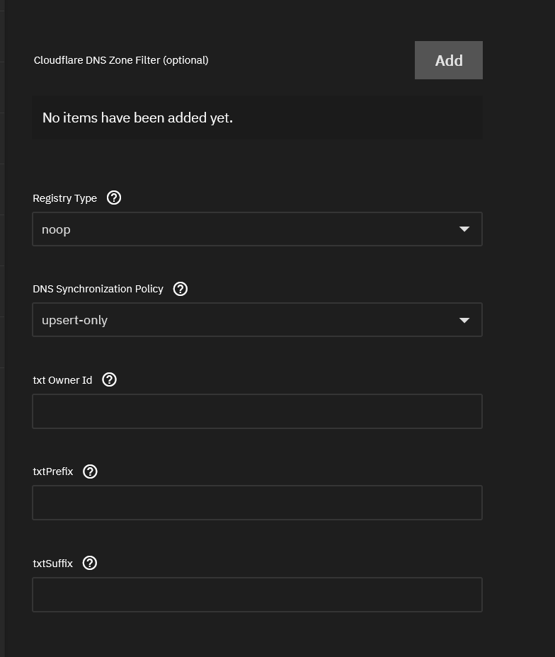
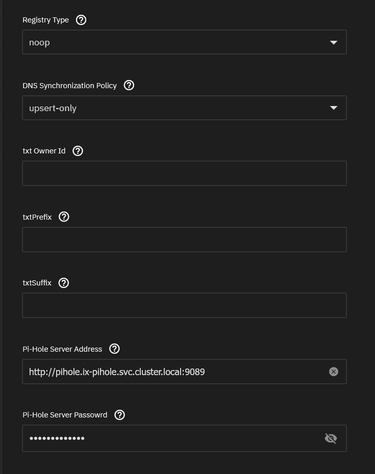
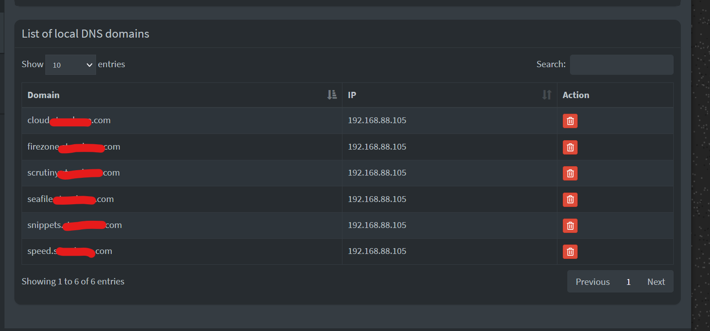

ExternalDNS synchronizes exposed Kubernetes Services and Ingresses with DNS providers.

## What it does?

Inspired by Kubernetes DNS, Kubernetes' cluster-internal DNS server, ExternalDNS makes Kubernetes resources discoverable via public DNS servers. Like KubeDNS, it retrieves a list of resources (Services, Ingresses, etc.) from the Kubernetes API to determine a desired list of DNS records. Unlike KubeDNS, however, it's not a DNS server itself, but merely configures other DNS providers accordingly—e.g. AWS Route 53 or Google Cloud DNS.

### Prerequisites (required for Support on TrueCharts Discord)

- Traefik
- Clusterissuer / Cert-manager installed (vital if exposed externally)

Please follow the [Getting Started](/platforms/scale/guides/getting-started/) guide on the [Truecharts](https://truecharts.org) website.

## Installation instructions

This guide will cover 2 scenarios, `Cloudflare` and `Pi-Hole` / `Pihole`, for more external DNS record providers, see [External-DNS Docs](https://github.com/kubernetes-sigs/external-dns/tree/master/docs/tutorials).

### Cloudflare

These instructions taken from [external-dns cloudflare tutorial](https://github.com/kubernetes-sigs/external-dns/blob/master/docs/tutorials/cloudflare.md)

#### Step 1

Enter `CF_API_TOKEN` (preferred) or `CF_API_EMAIL`/`CF_API_KEY`



#### Step 2

Enter preferences for Logs and DNS updates (I suggest >5m to prevent log spam) and select `cloudflare` as provider and select sources. I find `ingress` and `service` covers everything. If you want to filter by multiple domains add your `Domain Filter Entry`



I recommend using `noop` for `Registry Type` and leaving the rest as default, can add DNS Zone filters as necessary as well (see upstream/cloudflare docs).



#### Step 3

Verify it works, check the logs for updates to DNS records

```shell
2023-11-07 09:36:07.165596-05:00time="2023-11-07T09:36:07-05:00" level=info msg="Instantiating new Kubernetes client"
2023-11-07 09:36:07.165633-05:00time="2023-11-07T09:36:07-05:00" level=info msg="Using inCluster-config based on serviceaccount-token"
2023-11-07 09:36:07.165850-05:00time="2023-11-07T09:36:07-05:00" level=info msg="Created Kubernetes client https://172.17.0.1:443"
2023-11-07 09:36:08.958946-05:00time="2023-11-07T09:36:08-05:00" level=info msg="Changing record." action=CREATE record=seafile.DOMAIN.com ttl=1 type=A zone=d959ce24eb85d78a7f527b6150446335
```

If this works, you'll see DNS entries inside Cloudflare's DNS page.

### PiHole

#### Step 1

Ignore Provider Credentials, and skip straight to `App Configuration` and select `pihole`, add domain filters as necessary


Change to `noop` for `Registry Type` and add `PiHole Server Address` (default is `http://pihole.ix-pihole.svc.cluster.local:9089`) and `PiHole Server Password`



#### Step 2

Verify logs from `External-DNS` to see if it connects and updates `PiHole`

```shell
d:false IBMCloudConfigFile:/etc/kubernetes/ibmcloud.json TencentCloudConfigFile:/etc/kubernetes/tencent-cloud.json TencentCloudZoneType: PiholeServer:http://pihole.ix-pihole.svc.cluster.local:9089 PiholePassword:****** PiholeTLSInsecureSkipVerify:false PluralCluster: PluralProvider:}"
2023-11-07 10:29:07.801555-05:00time="2023-11-07T10:29:07-05:00" level=info msg="Instantiating new Kubernetes client"
2023-11-07 10:29:07.801568-05:00time="2023-11-07T10:29:07-05:00" level=info msg="Using inCluster-config based on serviceaccount-token"
2023-11-07 10:29:07.801861-05:00time="2023-11-07T10:29:07-05:00" level=info msg="Created Kubernetes client https://172.17.0.1:443"
2023-11-07 10:29:08.008741-05:00time="2023-11-07T10:29:08-05:00" level=info msg="add firezone.DOMAIN.com IN A -> 192.168.88.105"
2023-11-07 10:29:10.048171-05:00time="2023-11-07T10:29:10-05:00" level=info msg="add scrutiny.DOMAIN.com IN A -> 192.168.88.105"
```

Check `PiHole` GUI for A records under `Local DNS`



Enjoy!
