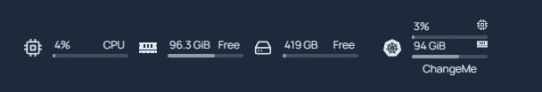
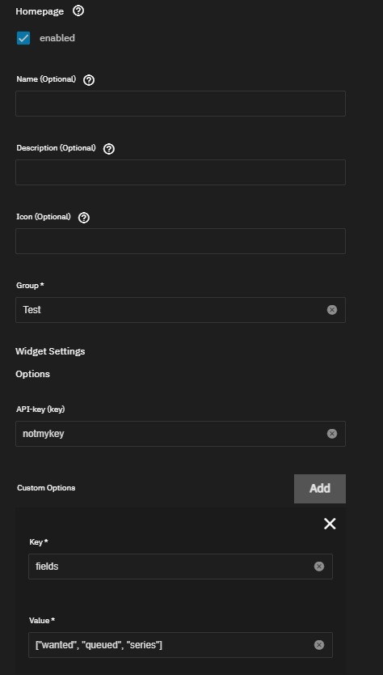
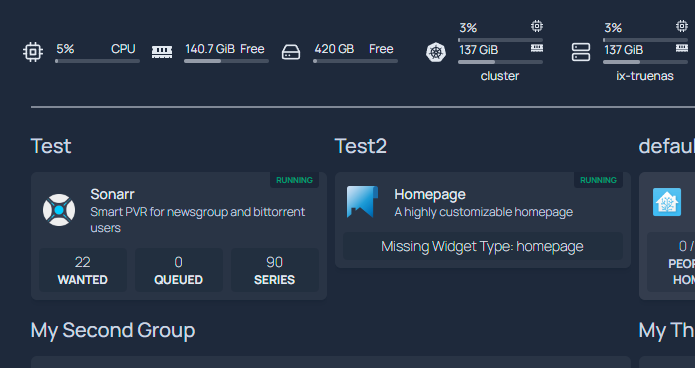
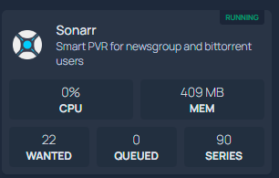

TrueCharts has adopted `Homepage` as its default dashboard application due to its support for Kubernetes.

This guide will cover how to use the TrueCharts/Homepage integration included in the chart and how to edit the YAML files in Homepage using the code-server addon. This guide will not cover every aspect of options available to Homepage. For more information, please visit the following links:

GitHub: <https://github.com/gethomepage/homepage>
Website: <https://gethomepage.dev/>

:::caution[INGRESS REQUIRED]
For Homepage to "discover" your apps, Ingress is required using our ingress configuration guidelines and the integration options for the chart configuration. Otherwise, all Kubernetes features can be used with manual configuration of Homepage via its configuration YAML files.
:::

## Getting Started

<details>
<summary> ⚠️ Advanced Section regarding metrics server for Scale users ⚠️ </summary>

If you wish to make use of the metrics components of Homepage, you can enable the metrics server in Cobia. Currently, there is no GUI option for this, but it should be available in a future release. As such, this falls under advanced usage. It's advised to make a backup before running the following command. This command will force all your apps to restart, so be aware.

`midclt call -job kubernetes.update '{"metrics_server": true}'`

You can then run `k3s kubectl top pods -A` once all apps have resumed to confirm the metrics server is running properly.

You can then add the following to your widgets.yaml file to add the cluster/node resources display:

```yaml
- kubernetes:
    cluster:
      # Shows cluster-wide statistics
      show: true
      # Shows the aggregate CPU stats
      cpu: true
      # Shows the aggregate memory stats
      memory: true
      # Shows a custom label
      showLabel: true
      label: "ChangeMe"
    nodes:
      # Shows node-specific statistics
      show: false # Set to True in Clustered Kubernetes environments
      # Shows the CPU for each node
      cpu: true
      # Shows the memory for each node
      memory: true
      # Shows the label, which is always the node name
      showLabel: true
```

This will result in the following being added:


And you will be able to have outputs similar to this to see memory and CPU:


:exclamation: Due to how Homepage calculates utilization for your applications, this is only an approximation. The percentage is not based on your physical CPU utilization but on the max CPU limit for the chart and is additive for each pod. If your chart has a 2000m CPU limit and has 1 pod, 1000m of usage will read as 50%. If the chart has 2 pods each with a 2000m limit, it will read as 25% for 1000m of usage as the pods total 4000m. RAM utilization is the total combined RAM usage across all pods.

</details>
<br>

## Enabling Integration in Charts

To edit an existing chart with ingress, go to the ingress section and enable the Homepage integration checkbox.

- **Name** can be left blank or use the name of your choice.
- **Description** can be left blank or you can use the description of your choice.
- **Icon** can be left blank or link to the icon of your choice.
- **Group** This is important and required. It will allow you to group different apps together. For example, all your media apps may be in a group called "Media". You can also use the group names you may have already defined in services.yaml, and it will add the discovered app to that group.
- **Enable Widget**: If the app does not have a widget option set, leave this unchecked.
- **API Key**: This is where you will enter an API key for your application if needed. If this is a new install and you do not have an API key yet, you can come back and add this later.
- **Custom-Options** Adding custom options will allow you to add fields to the widget, or define username/password when there is no API key to apply. You can see the various fields available in the widgets section of the Homepage documentation at their site above.



Which results in the following in Homepage:



As you can see, the application is running and the fields have populated.

You may also notice in the above screenshot that Homepage has a message "Missing Widget Type: homepage". At this time, you will have to define applications without widgets manually in services.yaml.
If you see this message on an application that has a widget per the Homepage documentation, please submit a GitHub bug request to us so that we may correct the type setting.

If you have turned on the metrics server in the above section, you can click 'Running' to see the application's approximate utilization.



You can also use settings.yaml to change the group layout from a single column to rows (with up to 5 columns per row) and other settings.

## Known Issues and Limitations

- When using the integration to detect your apps, applications may change places within the group on each restart of Homepage as it populates in the order it detects the application.
- Some applications may have an incorrect widget type. Please open a bug report on our [GitHub](https://github.com/truecharts/charts/issues).
- When using the integration, you will not be able to control settings on a per-app basis as far as auto showing/hiding stats, changing the status indicator, or adding a ping with ms response time readout.
- External Services are not supported at this time despite the options being present.
- If you define a group in services.yaml, it must contain at least one manual entry. Otherwise, it will interfere with widget API calls and cause an API JSON error.
- Custom-App will report Pod Status and stats but has no widget support at this time.
