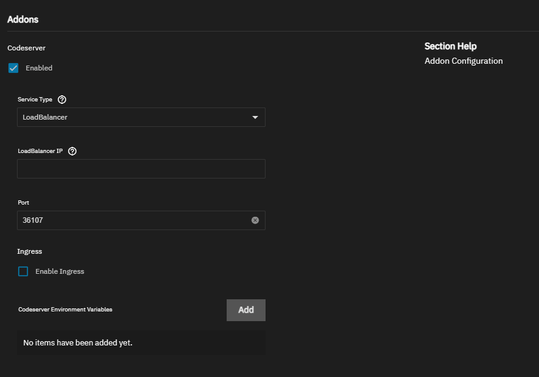
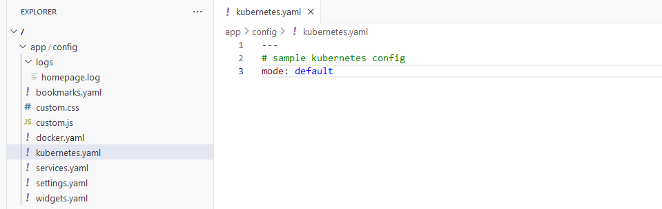
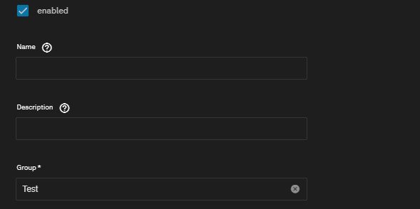

# Homepage Truecharts integration guide
TrueCharts has adopted HomePage for it defacto dashboard application due to its support of kubernetes  

This Guide will cover how to use the Truecharts/Homepage integration included in the chart and the editing of the yaml files in homepage using the code-server addon. this guide will not cover every aspect of options available to homepage. Please see the Homepage links below for more information. The Guide is primarily written with scale users in mind but native Kubernetes/Helm users may find some useful information here

⚠️ In order for Homepage to "discover" your apps, Ingress is required using our ingress configuration guidelines and the integration options for the chart configuration. Otherwise all kubernetes features can be used with manual configuration of homepage via its configuration yaml files⚠️

## Homepage Links
Github: https://github.com/gethomepage/homepage  
WebSite https://gethomepage.dev/  

### Getting Started
   Install Truecharts Homepage and enable code-server addon. for this guide i'll just be using ip:port
  

  put in the IP:port in to your browser. the IP will depend on your setup but usually the scale IP  

  once in code server under app/config you will see the following files these will allow you to manipulate many aspects. but first we will turn on homepage kube support by editing kubernetes.yaml  

  For Scale users you will enter ```mode:default``` Native Kubernetes & Helm users may need to user ```mode:cluster```  which will use a service account  
  


<details>
<summary> ⚠️ Advanced Section regarding metrics server for Scale users⚠️ </summary>  


If you wish to make user of the metrics components of homepage you can enable the metrics server in cobia, currently there is no gui option for this but should be in a future release. as such this does fall under advanced. its advised to make a backup before running the following command. this command will force all your apps to restart, its a good idea to do a stop-all on any CNPG apps as they don't always like when the apps cycle as a result of this command.  

```midclt call -job kubernetes.update '{"metrics_server": true}'```

you can then run ```k3s kubectl top pods -A``` once all apps have resumed to confirm the metrics server is running properly  

You can then add the following to you widgets.yaml file to  add the cluster/node resources display

```
- kubernetes:
    cluster:
      # Shows cluster-wide statistics
      show: true
      # Shows the aggregate CPU stats
      cpu: true
      # Shows the aggregate memory stats
      memory: true
      # Shows a custom label
      showLabel: true
      label: "cluster"
    nodes:
      # Shows node-specific statistics
      show: true
      # Shows the CPU for each node
      cpu: true
      # Shows the memory for each node
      memory: true
      # Shows the label, which is always the node name
      showLabel: true
```
which will result in the following being added  
  

and you will be able to have outputs similar to this to see mem and CPU
 
</details>
<br>
We can now enable our first integration!

### Enabling Integration in charts
Edit and existing chart with ingress and go to the ingress section and enable the homepage integration checkbox  

:white_check_mark:Name can be left blank or use the name of your choice.  
:white_check_mark:Description can be left blank or you can use the description of your choice  
:exclamation: Group is important and required it will allow you to group the different apps together so for example all your media apps you may want in a group called "Media" for this example we are using sonarr/radarr with groups Test and Test2  
:exclamation: Api Key is where you will enter an api key for your application if needed, if this is a new install and you do not have an api key yet, you can come back and add this



which results in the following in Homepage, the API error is due to no API keys being entered yet, we will take care of that now. edit the app again and use the Widgets Settings as so
