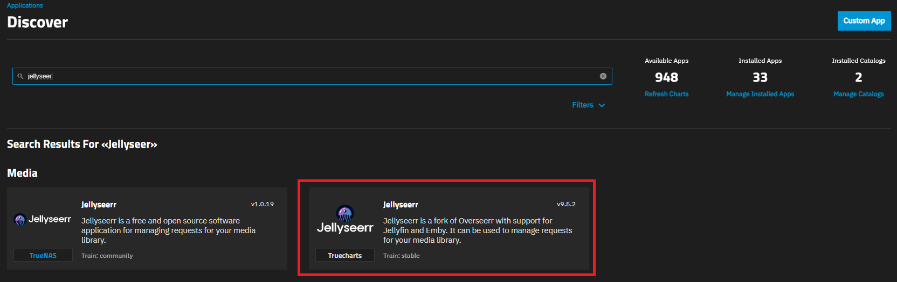
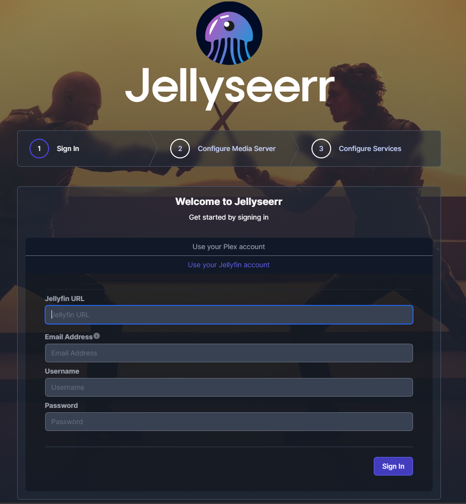
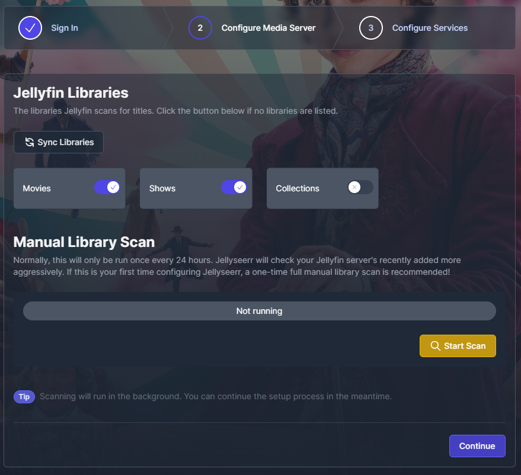

**Jellyseerr** is a free and open source software application for managing requests for your media library. It is a fork of [Overseerr](https://github.com/sct/overseerr) built to bring support for [Jellyfin](https://github.com/jellyfin/jellyfin) & [Emby](https://github.com/MediaBrowser/Emby) media servers!

## Requirements

- Jellyseerr TrueCharts Chart
- Jellyfin TrueCharts Chart
- Installation of the TrueCharts Catalog, starting [here](/scale/#adding-truecharts-to-scale)

## Install Jellyseerr inside TrueNAS SCALE

- Select `Apps` inside the `TrueNAS` menu,
- Then choose the `Available Applications` tab,
- and search for `jellyseerr`

- Click the Install button, and you’ll be prompted to set up the **Jellyseer** software.
- Most of the settings can be left at the default values, but ensure you select the correct
  timezone before scrolling down to the Networking and Services section.
  Take note of the default port (10241) that **Jellyseerr** listens on.

Scroll to the bottom of the window and click Save.

Once you hit Save, the process of downloading and setting up **Jellyseerr** will begin.
Switch back to the Installed Applications tab, and wait for the application to switch
from Deploying to Active - once it does, click the Open button to launch the **Jellyseerr** welcome portal.

## Jellyseerr Initial Setup

- Select "Use your Jellyfin account" and fill in your Jellyfin URL, Email address
- Define a user to be used for administrative purposes in **Jellyseerr** and click next.

- Sync your libraries automatically and enable any libaries you want Jellyseer to be able to access.
- Perform a manual scan and click next after it finishes.

- Configure your existing Sonarr/Radarr services you wants to use and click "Finish Setup".

## Support

- You can also reach us using [Discord](https://discord.gg/tVsPTHWTtr) for real-time feedback and support
- If you found a bug in our chart, open a Github [issue](https://github.com/truecharts/apps/issues/new/choose)
- For further information on **Jellyseerr** itself, start with their [Github](https://github.com/Fallenbagel/jellyseerr).
- For further information on operating **Overseerr** itself, start with their [Documentation](https://docs.overseerr.dev/).
