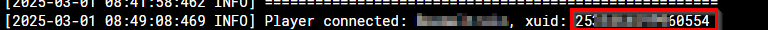
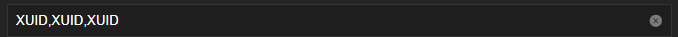

In order to OP a player through `OPS` variable you will need to get the XUID of the player. You can temporarily join and grab your XUID from the logs.



To add multiple XUIDS, you can do so by separating each `xuid` by a comma:



Or use this 3rd party service [here](https://www.cxkes.me/xbox/xuid) to grab the XUID of the username instead.

:::caution

We have no control over the 3rd service at all. Use it at your own risk.

:::

The `/data/permissions.json` should look something like this:

```json
[
  {
    "permission": "operator",
    "xuid": "XUID"
  },
  {
    "permission": "operator",
    "xuid": "XUID"
  },
  {
    "permission": "operator",
    "xuid": "XUID"
  }
]
```

:::tip

- You can also reach us using [Discord](https://discord.gg/tVsPTHWTtr) for real-time feedback and support
- If you found a bug in our chart, open a Github [issue](https://github.com/truecharts/apps/issues/new/choose) but generally it's advised to contact us on Discord first in most cases.

:::

## Executing server commands

This image comes bundled with a script called send-command that will send a Bedrock command and argument to the Bedrock server console. The output of the command only be visible in the container logs.

shell into the container and run whatever command you want for example:

```shell
send-command gamerule dofiretick false
```
