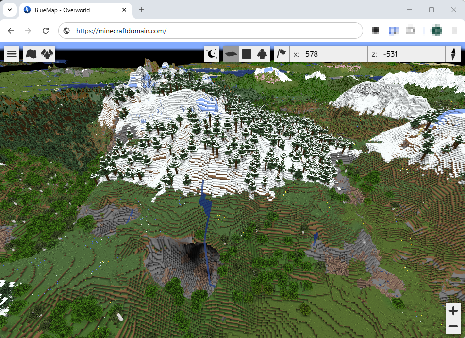

## Running Multiple MC-Java Servers

You can easily deploy Multiple MC Servers charts. You simply need to change have different IP adresses. Ports can be kept the standard port or when you prefered for both MC Servers a different port. This is depending of your way to route the traffic via your router.

MC Server 1

```yaml
service:
  main:
    type: LoadBalancer
    loadBalancerIP: ${MCServer1}
        enabled: true
    ports:
      main:
        port: 25565  #standard MC port
```

MC Server 2

```yaml
service:
  main:
    type: LoadBalancer
    loadBalancerIP: ${MCServer2}
    enabled: true
    ports:
      main:
        port: 25566  #different MC port
```

Another option the run multiple MC servers is to use the chart `minecraft-router`. When using this chart you can keep the service type on CLusterIP and keep the standard ports. This chart will redirect to your CLuster Domain Names.

## Plugins DIR

To easily get Plugins in to your MC server since PVC's are in use for the config storage you can add a NFS path storage for either /mods or /plugins depending on what your server needs.

This will give you an easy folder to drop the plugins in and they will then sync to /data/plugins or /data/mods, how to add extra storage you can check the common docs.
You will/may need to shell in to the pod to periodically clean up old versions or add a codeserver extension.

## Plugins/mods that need additional ports

Using plugins which needs an additional port, you need to configure an extra service. You can do this with loadBalancer and an IP or define with an Ingress.
This is an example with Bluemap with an Ingress.

```yaml
service:
  bluemap:
    enabled: true
    type: LoadBalancer            # Optional - when not use ingress
    loadBalancerIP: ${BluemapIP}  # Optional - when not use ingress
    ports:
      bluemap:
        enabled: true
        protocol: tcp
        port: 8100

ingress:
  bluemap:
    enabled: true
    primary: true
    targetSelector:
      bluemap: bluemap
    hosts:
      -  host: ${MINECRAFT_URL}
    integrations:
      traefik:
        enabled: true
      certManager:
        enabled: true
        certificateIssuer: ${ISSUER}
```

Bluemap Web working


