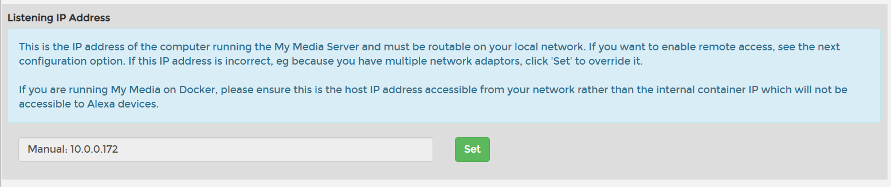

- Set `medialibrary` to Host Path(Simple) and mount it to your music library.

- Go through the setup and sign in with your amazon account.

- Install the `My Media` skill in the Alexa companion app.

- Make sure to set the listening IP address to the local IP and not the kubernetes IP like the image below:

- For more info please go [here](https://www.mymediaalexa.com/).
