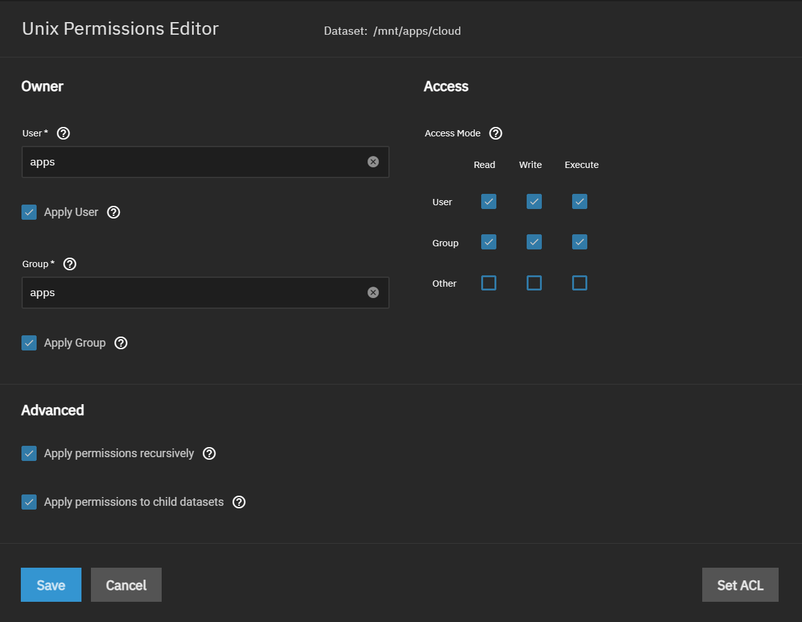

# Installation Notes

## Prerequisites

1. The cloudnative-pg operator is required from the operator train. More information can be found [here](https://truecharts.org/manual/SCALE/guides/getting-started#cnpg-operator-installation-and-migration-guide-for-older-users)

2. While nextcloud can run without ingress setup a lot of features will not work. More information can be found [here](https://truecharts.org/manual/SCALE/guides/getting-started#traefik-installation-for-ingress--reverse-proxy-support-with-truecharts-apps)

## User Data Permissions

If you plan to use HostPath or NFS to store user data then the permissions for the dataset will need to be set as shown below.

## Nextcloud Configurations

### Required

The following configurations must be set during initially setup for nextcloud to deploy.

1. Initial Admin Username

2. Initial Admin Password

3. Default Phone Region (if you are unsure about your region, you can find your code [here](https://en.wikipedia.org/wiki/ISO_3166-1_alpha-2#Officially_assigned_code_elements))

### Optional Addons

1. Notify Push (this allows nextcloud to notify clients of changes)

2. ClamAV (anti-virus for nextcloud, this includes a complete sidecar installation of ClamAV)

3. Collabora (document editor for nextcloud, this includes a complete sidecar installation of Collabora)

4. Only Office (document editor for nextcloud, this DOES **NOT** include a sidecar installation. You will need to have a separate installation of Only Office)

### Networking and Services

If you are setting up Ingress (highly recommended) then change the Service Type to ClusterIP from LoadBalancer. Nextcloud will not work with Ingress configured unless ClusterIP is set.

### Storage

You can change the User Data Storage option to your preference here if you previously setup the proper dataset permissions. All other Storage should remain the default of PVC.

