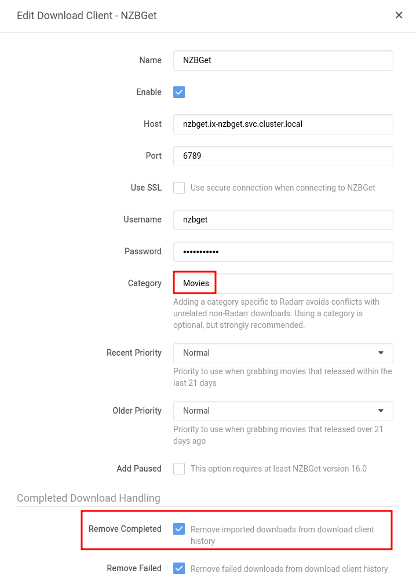
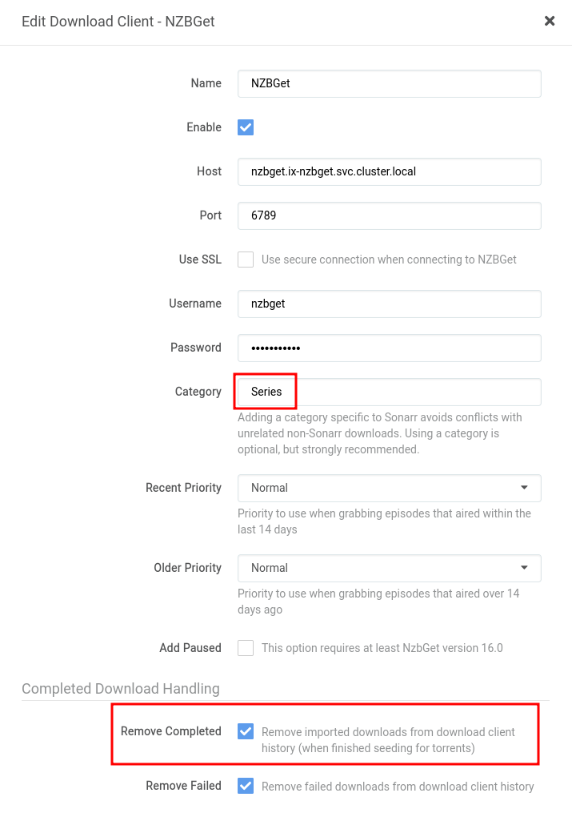

:::caution[Support]

In app configuration isnt covered by support and only serves as a short example on a possible configuration.

:::

## Categories

I use 5 categories

- `Movies` is used by Radarr:

  - We also always enable `Remove Completed` for NZBs
  

- `Series` is used by Sonarr:

  - We also always enable `Remove Completed` for NZBs
  

- `Music` is used by Lidarr:

  - We also always enable `Remove Completed` for NZBs
  

- `Manual` is ignored by all of my applications and only for my personal use

- `Manga` is for Komga:
  - Komga doesn't automatically import, We just decided to give it its own category anyway

While creating these categories, We _ONLY_ changed the name, no other field was changed, the files once completed, will still go into their own directory as shown below.

