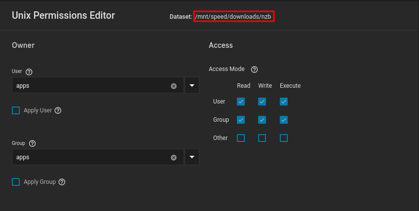
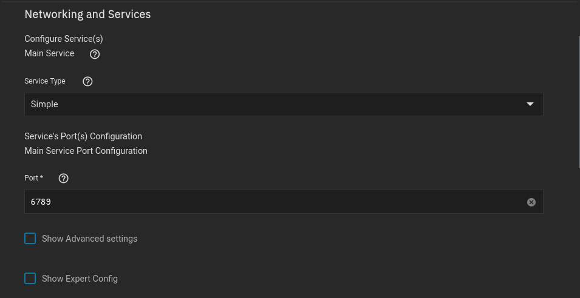
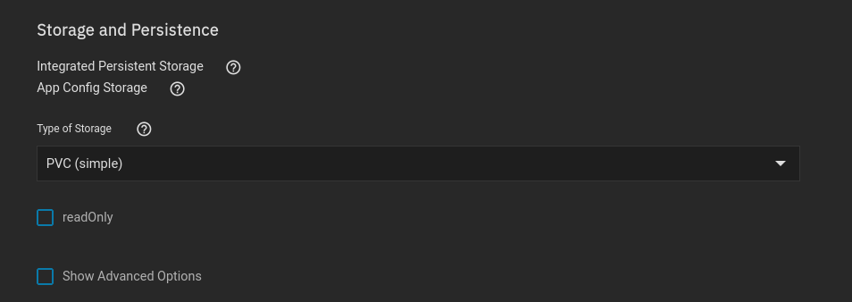
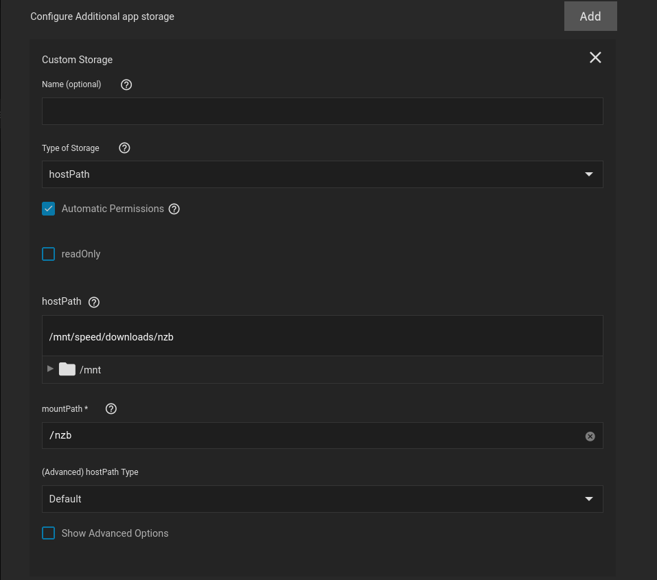
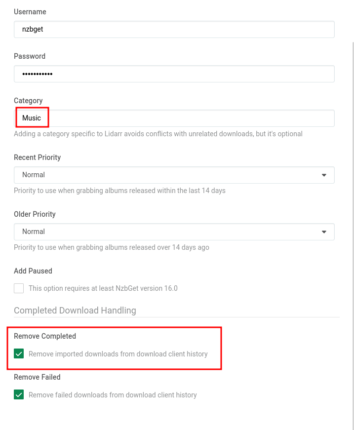
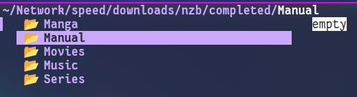

## Dataset Structure

This is the location your completed nzb files will be located

Typical setting user:group to `apps`, nothing fancy here

- Placed the created `nzb` dataset within the `downloads` folder

??? Note "Note"
The `apps`:`apps` user:group is built into Truenas SCALE, it is the default user for most applications on Truenas SCALE. You do not have to create a separate user for each application.

    When configuring your application you'll typically see user:group `568`, this is the UID for `apps` and its recommended not to change it.

 

## App Installation

### Networking

The setup is completely default

However, if you want to use ingress, its probably better to use clusterIP instead

 

### Storage

#### Configuration

The setup is also default

#### Data

I always mount to the root directory of the container

Keep in mind, these are just my personal settings, if you are wanting a more in-depth example, check out [TRaSH Guides: NZBGet Documentation](https://trash-guides.info/Downloaders/NZBGet/Basic-Setup/)

 

### Paths

**MainDir**

`/nzb`

**ScriptDir**

`${MainDir}/scripts`

 

### Security

**ControlPassword**

`NEW_PASSWORD`

- set this to something you can remember

**AuthorizedIP**

`127.0.0.1,192.168.0.*,172.16.*.*`

- This field is separated by commas.
- We added my Lan on there `192.168.0.*`
- As well as the kubernetes Network `172.16.*.*`

 

### Categories

I use 5 categories

- `Movies` is used by:

??? Radarr "Radarr"

    - We also always enable `Remove Completed` for NZBs

    

- `Series` is used by:

??? Sonarr "Sonarr"

    - We also always enable `Remove Completed` for NZBs

    

- `Music` is used by:

??? Lidarr "Lidarr"

    - We also always enable `Remove Completed` for NZBs

    

- `Manual` is ignored by all of my applications and only for my personal use

- `Manga` is for Komga
  - Komga doesn't automatically import, We just decided to give it its own category anyway

While creating these categories, We _ONLY_ changed the name, no other field was changed, the files once completed, will still go into their own directory as shown below.

 
