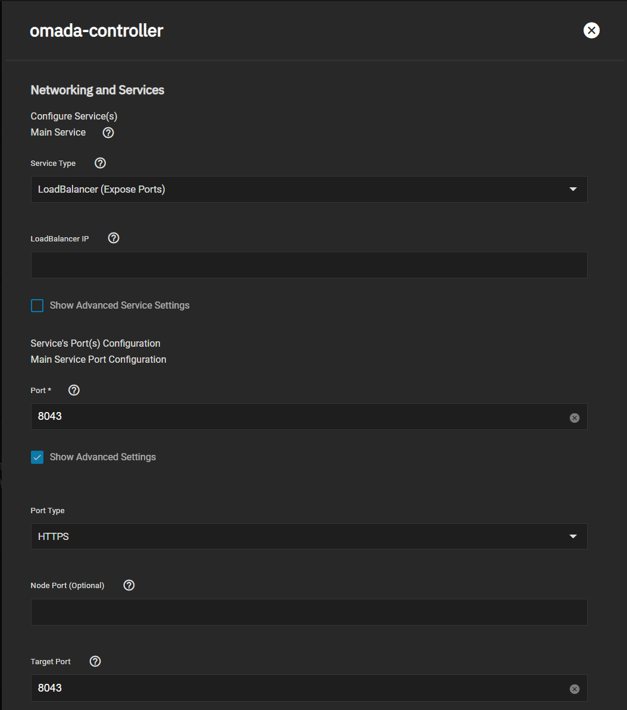
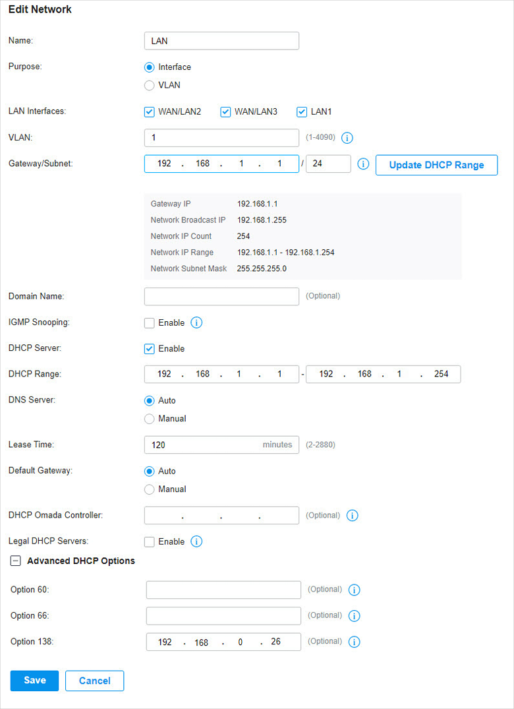

Our chart by default runs on internal port `443` however those not running `Ingress` may run into issues with other processes requesting port `443`.

**The Solution**

- Click `Advanced Settings`
- Change `Target Port` to 8043 to match the `external` port as below

## Finding APs / Omada Discovery Utility

By default the `omada-controller` chart doesn't support discovery by APs on the same network.

**The solution**

- One must use the [`Omada Discovery Utility`](https://www.tp-link.com/us/support/download/omada-software-controller/#Omada_Discovery_Utility) and point APs to your `omada-controller`.
- Please follow the directions on the [TP-Link Website](https://www.tp-link.com/us/support/download/omada-software-controller/#Omada_Discovery_Utility) to download and use this utility. They have a nice [FAQ](https://www.tp-link.com/ca/support/faq/3087/) that may be of use.

## DHCP Option 138

As well, the `Omada-Controller` supports using DHCP to inform your APs of the location of the controller. This can be done using the `Omada` software or another DHCP server such as `OPNsense`. This has been tested by users (see [TP-Link Reddit](https://www.reddit.com/r/TPLink_Omada/comments/wv8nsi/omada_sdn_controller_eap_discovery_across/) for more info) but there's a reference guide available in the official [Omada SDN Software Controller](https://www.tp-link.com/us/user-guides/omada-sdn-software-controller/chapter-3-manage-omada-managed-devices-and-sites.html#ug-sub-title-2) users guide.

