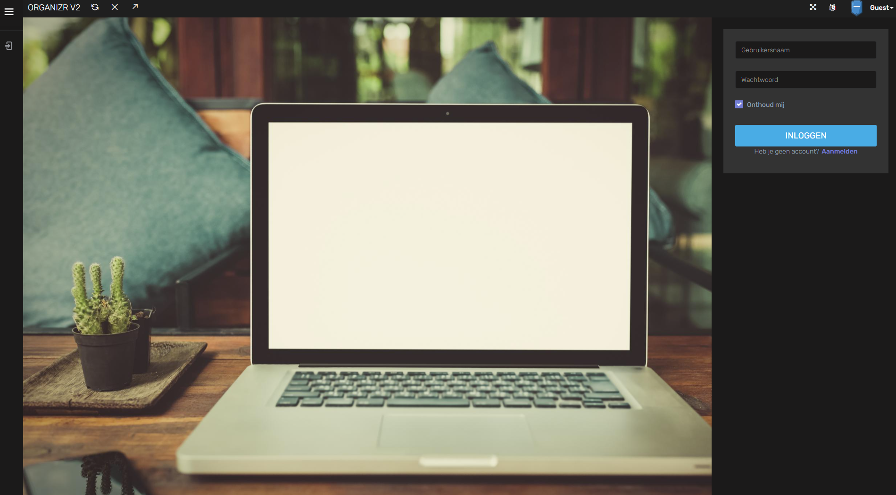
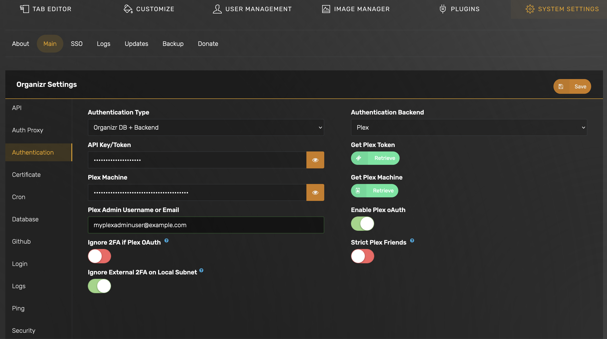
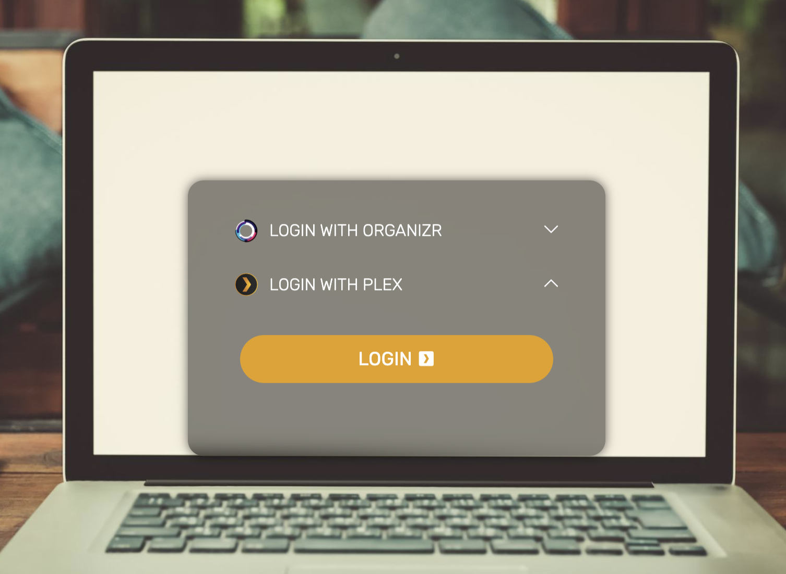

Basic setup guide for enabling Organizr authentication on your apps using Traefik forwardAuth.

## Requirements

- Organizr TrueCharts Chart
- Traefik TrueCharts Chart

## Prerequisites

This guide assumes you're using Traefik as your Reverse Proxy / Ingress provider and have through the configuration listed in our
[Quick-Start guides].
Please ensure that you can access your domain properly with Ingress before attempting any further steps.

## Organizr Chart Setup

All of the defaults are fine to start off, however `ingress` must be set if you wish to use `organizr` with `traefik`.
In this guide the chart name is `organizr` and ingress is configured as `organizr.example.com`

## Organizr GUI Setup

Once the app is deployed, complete the standard installation steps until you get to the Organizr settings page.

### Review Pre-defined Groups

Goto Organizr Settings -> User Management -> Manage Groups

No changes needed here for now unless you want to create a custom group


### Configure Traefik Redirect

Goto Organizr Settings -> System Settings -> Main -> Security

- Set `Enable Traefik Auth Redirect` to on
- Set `Traefik Domain for Return Override` to `https://organizr.example.com` (this should match the address you defined in the Organizr app ingress section)


## Traefik ForwardAuth Setup

Once Organizr app is up and running, you must create `forwardAuth` middleware entries inside Traefik in order to use Organizr's authentication on your apps.

We will use the Organizr user groups that map to specific forwardAuth URLs.

The below table shows the example forwardAuth entries that correspond to the user groups in Organizr.
The URLs for these entries use the kubernetes internal DNS address & default port (`10022`) for your Organizr app. You can name the forwardAuth entries whatever you like.

```yaml
middlewares:
  forwardAuth:
    - name: organizr-admin
      address: http://organizr.organizr.svc.cluster.local:10022/api/v2/auth?group=0
      trustForwardHeader: true
    #OPTIONAL
    - name: organizr-guest
      address: http://organizr.organizr.svc.cluster.local:10022/api/v2/auth?group=999
      trustForwardHeader: true
    #OPTIONAL, CUSTOM
    - name: organizr-custom5
      address: http://organizr.organizr.svc.cluster.local:10022/api/v2/auth?group=5
      trustForwardHeader: true
```

See Organizr [documentation](https://docs.organizr.app/features/server-authentication#using-the-organizr-authorization-api) on "Server Authentication"
for more details on the predefined groups and their corresponding URL pattern.

### Add Traefik forwardAuth to Apps

Once that is done all you need to add the `middleware` to your apps under the `Ingress section`, corresponding to the level of
permissions the app's user should have to access it. Example below uses `organizr-admin`.

```yaml
ingress:
  main:
    integrations:
      traefik:
        enabled: true
        middlewares:
          - name: organizr-admin
            namespace: traefik
```

## Verify it works

Visit the app's `URL` where you set ingress + forwardAuth middleware. You will see the following organizr login page:



## Optional: Enable Plex OAuth (or LDAP backend service)

Additionally Organizr supports enabling plex oauth or LDAP as your authentication backend. If you have users already provisioned
in Plex, you can point to your plex server for OAuth.



When Plex OAuth is enabled, users will see the option on the Organizr authentication page:



See Organizr [documentation](https://docs.organizr.app/features/authentication-backends/plex-backend) on "Plex Authentication Backend" for more details.
