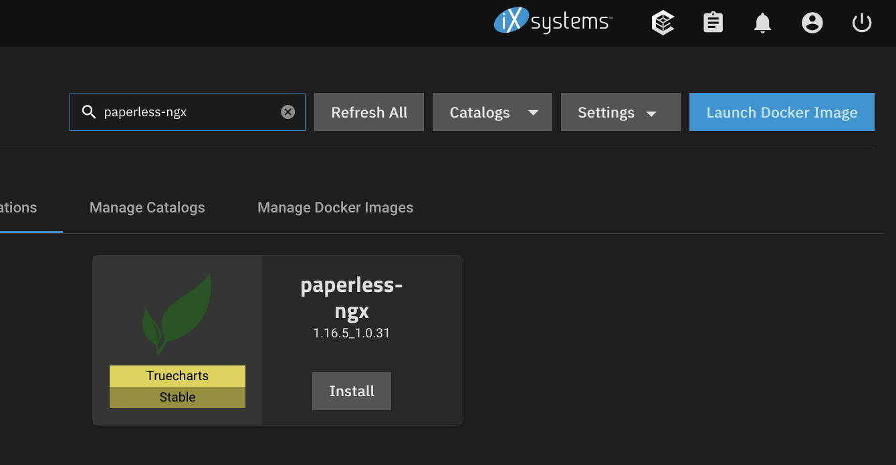
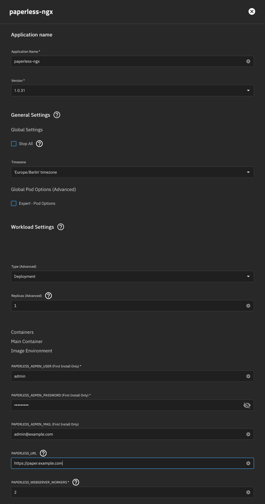
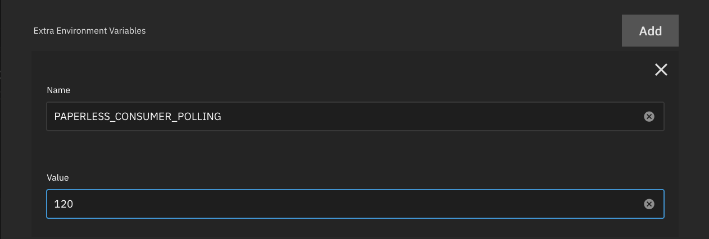
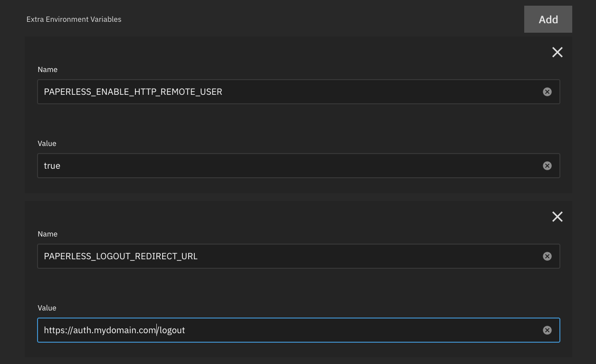

**Paperless-ngx** is an open-source document management system that transforms your physical documents into a searchable
online archive. Our app is a simple way to install it on your TrueNAS SCALE server.

## Requirements

- Installation of the TrueCharts Catalog, starting [here](/scale/) and the required operators (Prometheus-Operator and Cloudnative-PG).
- Paperless-ngx TrueCharts Chart

## Media Storage

- If you plan on importing documents into Paperless-ngx via a network share, for example from a computer or scanner, it
  is recommended to set up an `NFS Share` for the shared folder. See the [NFS Shares
  guide](/scale/guides/nfs-share) for further information.

## Install Paperless inside TrueNAS SCALE

- Select `Apps` inside the TrueNAS menu.
- Choose the `Available Applications` tab.
- Search for `paperless-ngx`.

- Click the `Install` button, you'll be prompted to set up Paperless-ngx. You can leave most options at their default
  values, but:
  - Check that the `Timezone` is set correctly for this app.
  - Provide `PAPERLESS_ADMIN_USER`, `PAPERLESS_ADMIN_PASSWORD` and `PAPERLESS_ADMIN_MAIL`, those will only apply on
    installation, you can change them later in the app.
  - Enter the URL your Paperless-ngx will be accessible under in `PAPERLESS_URL` if you plan on making your app
    accessible from the web.
- If you have set up [Traefik](/charts/premium/traefik/how-to/) for ingress click `Enable Ingress` and enter your
  Paperless-ngx domain in the Hosts section.

Scroll to the bottom of the window and click `Save`. Once you hit Save Paperless-ngx will be donwloaded and configured.

Switch back to the `Installed Applications` tab, and wait for the application to switch from `Deploying` to `Active`.
Once `paperless-ngx` shows `Active` you can click its `Open` button to launch to its login screen. Use the initial Admin
credentials you provided in the configuration to login.

### Configure additional OCR languages

Paperless-ngx supports different [configuration options](https://docs.paperless-ngx.com/configuration/#ocr) to customize
how it performs OCR. The most prominent option is the language or languages used to perform OCR operations. You can skip
this section if you only expect to import documents written in English.

Per default OCR is only performed in English. Check the Paperless-ngx documentation regarding the
[`PAPERLESS_OCR_LANGUAGE` (singular)](https://docs.paperless-ngx.com/configuration/#ocr) and note what configuration
would best match your use-case. Paperless-ngx only comes with a few OCR languages pre-installed, see the
[`PAPERLESS_OCR_LANGUAGES` (plural)](https://docs.paperless-ngx.com/configuration/#docker) configuration option for more
information, and note if you need this configured too.

### Configure import share

In addition to document uploads via the Web UI, Paperless-ngx can import documents from a [consumption
directory](https://docs.paperless-ngx.com/usage/#the-consumption-directory). This would allow you to move new documents
to a shared folder on your TrueNAS SCALE from your computer or directly from your scanner and Paperless-ngx would pick
up the documents from there. See the explanation of the feature linked above and its [configuration
options](https://docs.paperless-ngx.com/configuration/#consume_config) for more information.

Due to the [Hast Path Validation Safety](/scale/guides/add-storage/#host-path-validation-safety) checks of TrueNAS
SCALE, using storage for an application on your TrueNAS SCALE and with a network share at the same time requires a bit
of work. See also the [FAQ](/general/faq/) regarding this
topic.

This guide will only describe the Paperless-ngx specific options required to set up importing documents from a network
share. Please refer to Part 1 of the [NFS shares with TrueChart apps guide](/scale/guides/nfs-share) to prepare
the NFS share you want to use with Paperless-ngx and note its path. Refer to the [TrueNAS SCALE adding SMB shares
guide](https://www.truenas.com/docs/scale/scaletutorials/shares/smb/addsmbshares/) to set up network sharing of that
same folder for Windows computers or scanners offering this functionality.

In addition to adding the NFS share to the Paperless-ngx application we need to configure polling for the import folder.
The NFS Share and TrueNAS SCALE applications do not support the default polling model Paperless-ngx uses.

Once you have set up the NFS share, configure your Paperless-ngx installation as follows:

- Select `Apps` inside the TrueNAS menu.
- You should be on the `Installed Applications` tab.
- Look for your `paperless-ngx` installation.
- Click the 3-button menu in its box and select `Edit`. This will open the application configuration pane similar to the
  configuration page on installation.
  - Scroll down to the `Extra Environment Variables` section and click `Add`.
  - Enter the name `PAPERLESS_CONSUMER_POLLING` and the value `120`, Paperless-ngx will then look for new documents in
    the import share every 120 seconds (2 minutes).
  - Scroll further down to the `To-be consumed Document Storage` section and set `Type of Storage` to `NFS Share`, `NFS Server` to `localhost` and `Path on NFS Server` to the path you configured above.

Scroll to the bottom of the window and click `Save`. This will reconfigure and restart Paperless-ngx. Documents added to
shared folder will be automatically imported by Paperless-ngx. Those options can be changed at any time, documents still
in the import share will not be imported anymore though.

### Configure ForwardAuth authentication

Users that have set up [Traefik with ForwardAuth, for example with Authelia](/charts/premium/authelia/setup-guide/)
can take advantage of authentication through Authelia for their Paperless-ngx installation. Paperless-ngx will honor
logins passed from Authelia but not the e-mail address nor the groups of the logged-in user, those will be internal to
Paperless-ngx and separate from those in Authelia. ForwardAuth can be added to an existing Paperless-ngx installation as
long as the logins of Authelia users match the logins of Paperless-ngx users.

This guide will only describe the Paperless-ngx specific options required to set up ForwardAuth. Please refer to the
[Traefik + Authelia ForwardAuth setup guide](/charts/premium/authelia/setup-guide/) on how to prepare ForwardAuth.

Once you have set up ForwardAuth in your Traefik installation, configure ForwardAuth in Paperless-ngx as follows:

- Select `Apps` inside the TrueNAS menu.
- You should be on the `Installed Applications` tab.
- Look for your `paperless-ngx` installation.
- Click the 3-button menu in its box and select `Edit`. This will open the application configuration pane similar to the
  configuration page on installation.
  - Scroll down to the `Extra Environment Variables` section and click `Add` twice.
  - Enter the name `PAPERLESS_ENABLE_HTTP_REMOTE_USER` and set its value to true, and `PAPERLESS_LOGOUT_REDIRECT_URL`
    and your logout URL (`https://auth.mydomain.com/logout` as per the above guide's example domain) in the second box.

Scroll to the bottom of the window and click `Save`. This will reconfigure and restart Paperless-ngx. Authentication to
your Paperless-ngx installation will be handled by Authelia now. Those options can be removed at any time,
authentication to your Paperless-ngx installation will then revert to the Paperless-ngx built-in authentication
mechanism.

## Where to go from here?

Paperless-ngx offers a helpful [best practices guide](https://docs.paperless-ngx.com/usage/#basic-searching) as a
starting point, as well as a recommended workflow a little further along on that same page.

## Support

- You can reach us using [Discord](https://discord.gg/tVsPTHWTtr) for real-time feedback and support.
- If you found a bug in our chart, open a [GitHub issue](https://github.com/truecharts/apps/issues/new/choose).
