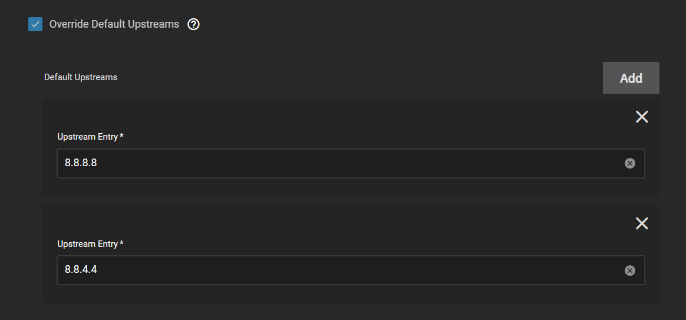
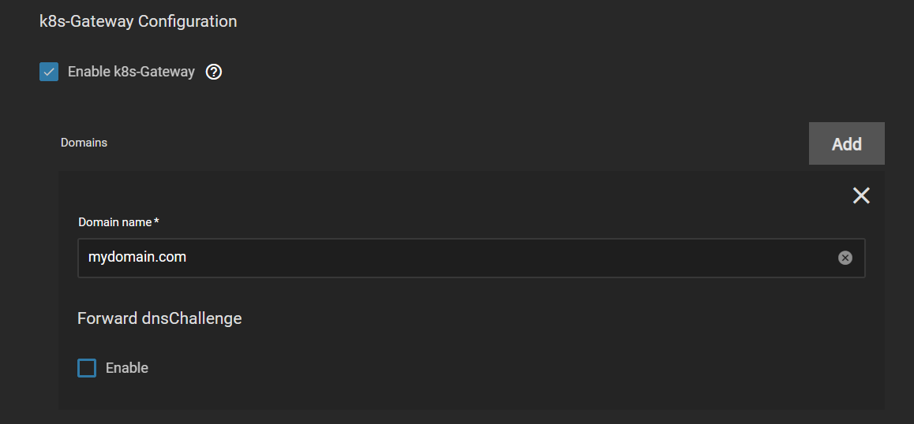
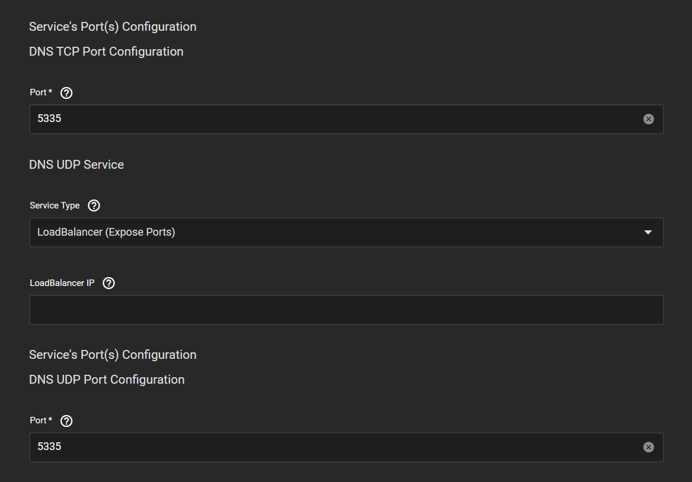
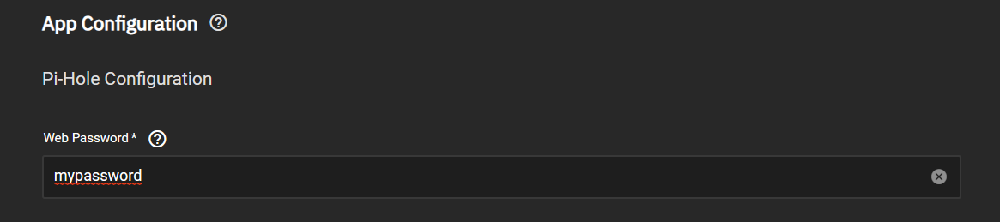
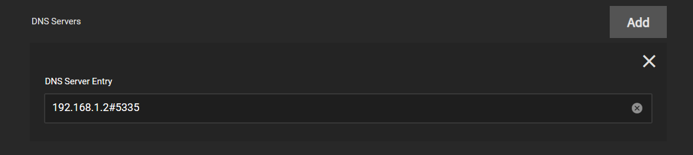

_Using Blocky in conjunction with PiHole enables seamless automated split DNS functionality._

:::danger[unrecommended configuration]

The below guide is not the recommended DNS solution for TrueCharts. We recommend running Blocky from the premium train in a standalone configuration. Setting up your DNS as outlined below adds complexity and will reduce reliability.

:::

## Install Blocky

:::note[Blocky]

Blocky includes k8s Gateway which automates the split DNS process. We will be using Blocky in between PiHole and your upstream DNS servers of choice to resolve your domain.

:::

1. Install Blocky from the premium train with all defaults except for the following.

2. Override Default Upstreams

   a. Here you can choose your upstream DNS servers of choice. In my example I am using Google.

   

3. Enable k8s-Gateway

   a. Here you need to add your domain for split DNS.

   

4. DNS TCP/UDP Port Configurations

   a. Since PiHole will be using port 53 for DNS we need to change the port on blocky to something else. The recommend port is 5335. If you are using MetalLB then this step is not needed.

   

## Install PiHole

1. Install PiHole from the Stable train with all the defaults except for the following.

2. Web Password

   a. Here you need to pick a password for the PiHole WebGUI.

   

3. DNS Servers

   a. Here you need to remove one of the pre-configured entries and change the other to your Blocky DNS address. In my example the address is my TrueNAS Scale server IP and the port we previously configured for Blocky. If you are using MetalLB this would just need to be the IP address assigned to Blocky.

   

## Configure Router

1. Configure your router to use your PiHole DNS when configuring DNS clients. You will need to consult your router manual for this as each router is different. In my example I would configure my router to use 192.168.1.2 as the DNS server. If you use MetalLB this would be the IP address assigned to PiHole.
