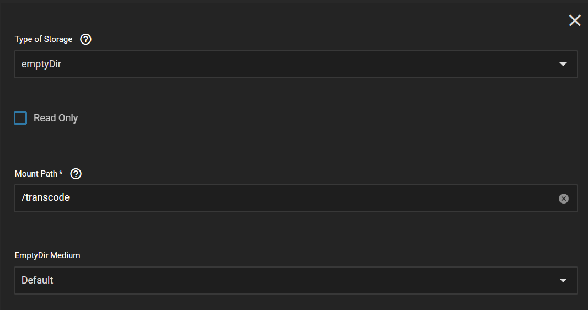
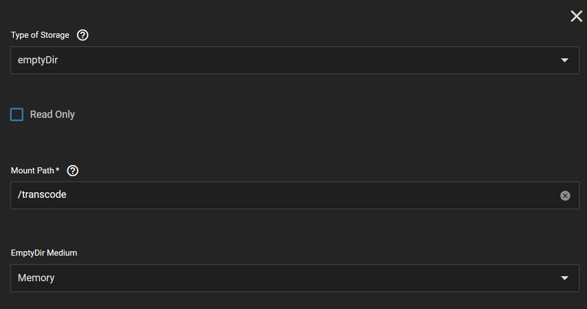
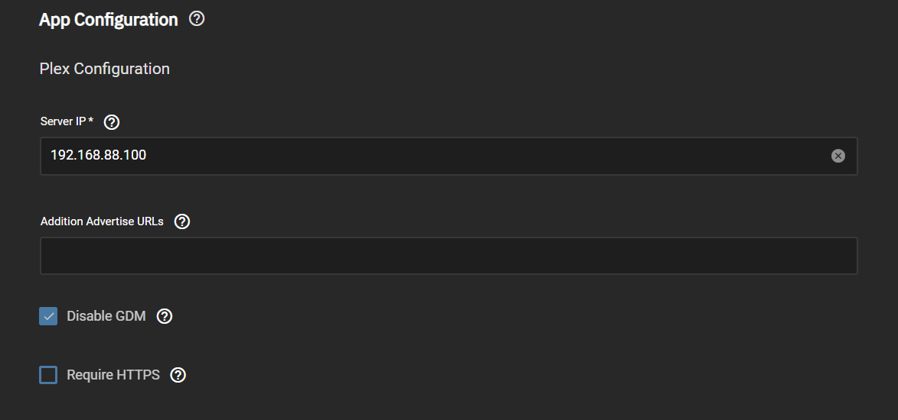
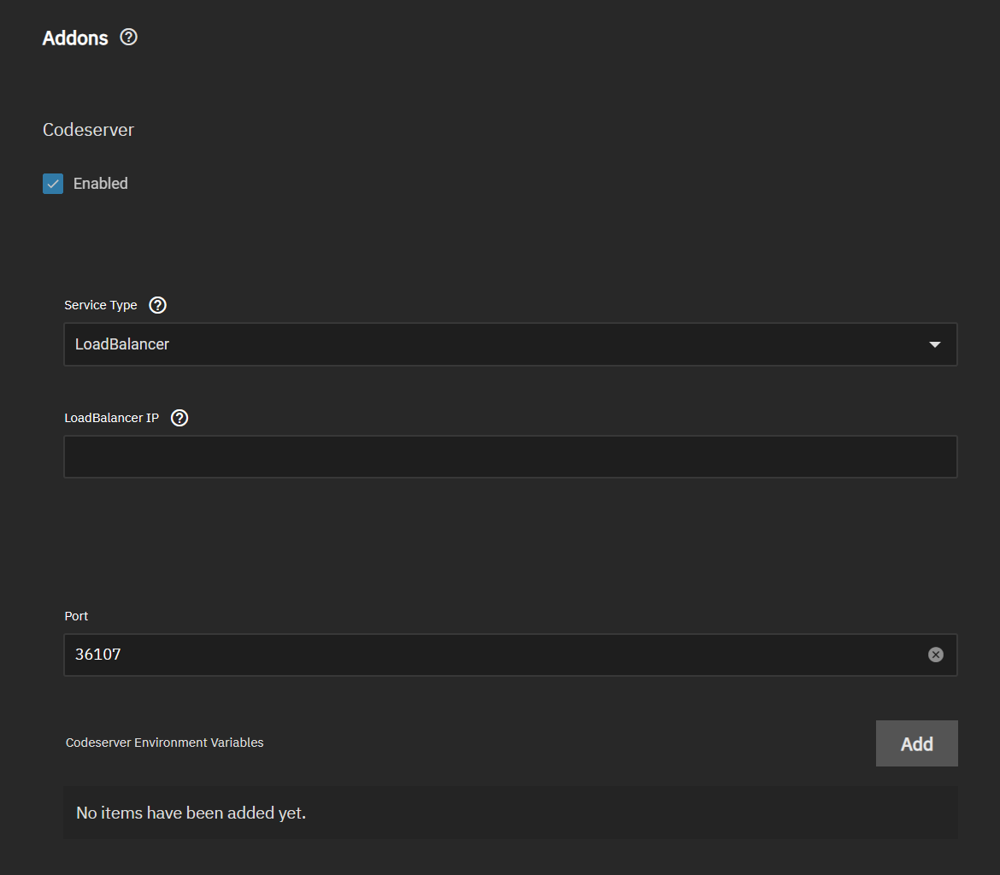

# Plex Installation Notes

## Public Port

- The LAN port used by Plex (32400) is hardcoded and cannot be changed. Because of this do not change the port in the Plex app config from 32400. If you need to run Plex on a different public port you will need to setup port forwarding on a router from the public port to 32400 on your server IP. You will also need to change the public port in the remote access section of Plex settings.

## Transcode Folder

- By default the Plex transcode folder is not configured. The recommend setup is emptyDir.

:::danger Memory Requirements

Please be aware of memory requirements if you memory for emptyDir.
Plex transcode storage requirement is size of file being transcoded + 100MB per simultaneous stream.

Keep in mind that emptyDir's memory counts against the resources defined.

:::

1. Under Additional App Storage click add.
2. Setup either a Disk Transcode or Memory Transcode as shown below.

### Disk Transcode

### Memory Transcode

## Require HTTPS

- This option cannot be enabled until initial plex setup is complete and remote access is enabled and functioning as shown below.

## Plug-ins

Plex allows for the installation of plug-ins. Plug-ins can be added using the codeserver addon.

1. Enable the codeserver addon in Plex application configuration.

2. Access codeserver using the previously configured port (ie. http://192.168.1.2:36107).

3. Browse to the plug-ins folder in codeserver.

4. Upload plugins.

5. Restart Plex
