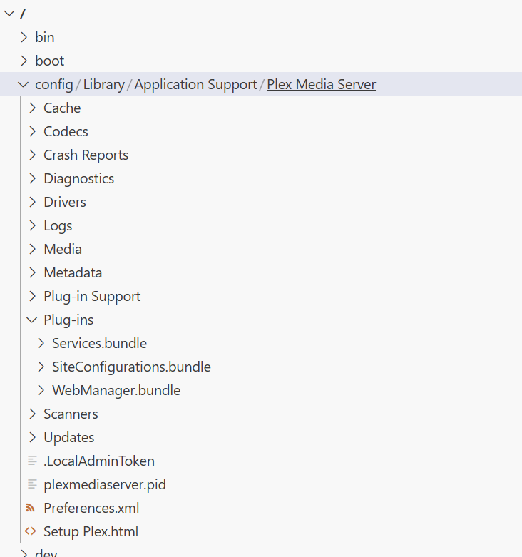
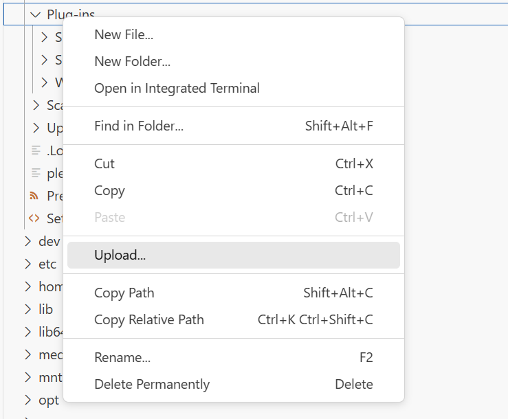

## Public Port

- The LAN port used by Plex (32400) is hardcoded and cannot be changed. Because of this do not change the port in the Plex helm chart from 32400. If you need to run Plex on a different public port you will need to setup port forwarding on a router from the public port to 32400 on your server IP. You will also need to change the public port in the remote access section of Plex settings.

## Example yaml of above for .values.plex

```yaml
plex:
  # User Defined
  serverIP: "${IP_PLEX}"
  additionalAdvertiseURL: ""      # http://${IP_PLEX}:32400,https://${INGRESS}:443,https://${INGRESS}:32400   <-- configured automaticly
  disableGDM: true
  requireHTTPS: false             # First Deploy set to false, till remote acces is configured and working then you can set to true
```

## Require HTTPS

- This option cannot be enabled until initial plex setup is complete and remote access is enabled and functioning as shown below.


## Additional Advertise URL

Those can be included via `.Values.plex.additionalAdvertiseURL`.
The URL's based upon your IP and ingress URL will be added automaticly.

## Plug-ins

Plex allows for the installation of plug-ins. Plug-ins can be added using the codeserver addon.

1. Add the codeserver addon in Plex helm configuration, details in general documentation.
2. Access codeserver using the previously configured URL.
3. Browse to the plug-ins folder in codeserver.
   
4. Upload plugins.
   
5. Restart Plex
