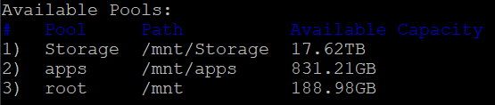
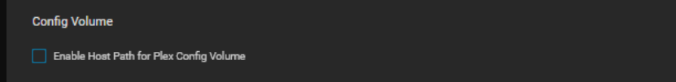

:::caution

This guide does not fall under support, use at your own risk. You can create a thread in our discord channel [#📚・tc-scale-apps](https://discord.gg/a5fj3FJ9Mx) for basic support for the guide itself.

:::

This guide will walk you through on migrating your plex config data from an _old_ to a new plex instance.

The first thing you need to do is go to **settings** and then **Library**.

- Disable `Empty trash automatically after every scan` checkbox if its enabled.

Go to **Settings** -> **General** and `Sign Out` of your server completely.

In TrueNAS Scale, go to **Apps** -> **Installed Applications** and stop the _old_ app.

Follow the sub section depending on how your app config was stored.

- App config on PVC -> [Backing up App Data From PVC](#migrating-data-from-pvc)
- App config on HostPath -> [Accessing App Data From HostPath](#migrating-data-from-hostpath)
- App config on HostPath(ix-applications) -> [Migrating App Data From IxVolumes](#migrating-data-from-ixvolumes)

## Dataset Permissions

This is our default perms for our plex app. Please make sure to keep plex perms set to `568`.


## Migrating Data from PVC

To access the old app's data from **PVC**, we are going to use [**heavyscript**](https://github.com/Heavybullets8/heavy_script#how-to-install) `mount` flag.

Go to **System Settings** -> **Shell**.

Make sure heavyscript is installed and active (refer to the link above for the how to guide) before running the following commands:

```console
heavyscript --mount
```

```console
1
```

You will get list similar like this for example.


To mount the directory just enter the correct number...so for me I have to enter `24`. Verify the number you are entering is for plex-config.

You will get another list similar like this for example.



To mount the directory to your root pool just enter the correct number...so for me I have to enter `3`. Verify the number you are entering is for root.

you will get a unmount command similar to this:

```console
zfs set mountpoint=legacy "apps/ix-applications/releases/plex/volumes/pvc-97b6d951-7dac-45fa-81fa-76cb5707fb86" && rmdir /mnt/mounted_pvc/plex-config
```

The old plex app is mounted in a dir for example `/mnt/mounted_pvc/plex-config`.

The above assumes your app is named `plex`, if its not the dir `name` will be **different**.

```console
cd /mnt/mounted_pvc/plex-config
```

Run this command to verify you see a single dir called **Library**.

```console
ls
```

Create a temp dataset in **storage** -> **datasets** for your old app plex config with the follow [perms](#dataset-permissions).

Replace this command's path with your **OWN** `pool` and `dataset` name.

```console
rsync -rav Library /mnt/POOL/DATASET
```

Check the dir if it contains a dir called `Library` if it does then unmount the PVC.

```console
heavyscript --mount
```

```console
2
```

You can delete the original app at this point.

Please move on to [Migrating App Data to the New App](#migrating-app-data-to-the-new-app).

## Migrating Data from HostPath

If your plex config is available on your own dataset, validate its [perms](#dataset-permissions).

Follow the prerequisites and then uninstall the original app. If the perms are good you can move on to [migrating to the new app](#migrating-app-data-to-the-new-app).

### Migrating Data from ixVolumes

This section is only for the official app where users didn't specify their own hostpath.



:::danger

Be very cautious while in this particular dataset. Run the commands carefully.

:::

To quickly get the correct directory run the following commands:

```console
cd /mnt/POOL/ix-applications
```

```console
find /mnt/POOL/ix-applications -name Preferences.xml
```

You should see an output like so -> `/mnt/POOL/ix-applications/releases/plex/volumes/ix_volumes/ix-plex_config/Library/Application Support/Plex Media Server/Preferences.xml`

We are only interested for this location as its the start of the config dir for plex -> `/mnt/POOL/ix-applications/releases/plex/volumes/ix_volumes/ix-plex_config/Library`.

Create a temp dataset in **Storage** -> **Datasets** for your old app plex config with the follow [perms](#dataset-permissions).

Go back to the system shell and replace this command's path with your **OWN** `path`, `pool` and `dataset` name.

```console
rsync -rav /mnt/POOL/ix-applications/releases/plex/volumes/ix_volumes/ix-plex_config/Library /mnt/POOL/DATASET
```

Verify if the the temp dataset contains the `Library` dir by running this command.

```console
ls /mnt/POOL/DATASET
```

If it does please move on to [migrate to the new app](#migrating-app-data-to-the-new-app).

## Migrating App Data to the New App

If the new plex app is not installed yet, please do so now. Verify that the **new** app can go active with just the defaults for now.

If it works, don't sign in yet, simply turn off the app and then go to **System Settings** -> **Shell**.

We're going to mount the new plex app config data. Run the following commands in the shell.

```console
heavyscript --mount
```

```console
1
```

You will get list similar like this for example.


To mount the directory just enter the correct number...so for me I have to enter `24`. Verify the number you are entering is for plex-config.

You will get a unmount command similar to this:

```console
zfs set mountpoint=legacy "apps/ix-applications/releases/plex/volumes/pvc-97b6d951-7dac-45fa-81fa-76cb5707fb86" && rmdir /mnt/mounted_pvc/plex-config
```

The new plex app is mounted in a dir for example `/mnt/mounted_pvc/plex-config`.

Change the working directory to the mounted dir for the new app:

```console
cd /mnt/mounted_pvc/plex-config
```

Check if you're in the right location by running:

```console
ls
```

You should only see a single dir called `Library`.

Delete this dir from the new app.

```console
rm -r Library
```

Change the working directory to the temp dataset.

```console
cd /mnt/POOL/DATASET
```

Run the `ls` command on the dir to verify that its correct and you see a single dir called `Library`.

```console
ls
```

If everything is set you can proceed to run the rsync copy command to the mounted PVC location.

```console
rsync -rav Library /mnt/mounted_pvc/plex-config
```

:::note

This process can a while to complete depending on how large your config is and how your pools are setup. Make sure scale doesn't time out, simply keep the tab active and interact with the page menu top right will suffice until its done.

:::

If the operation completed successfully you can run the following commands to unmount the PVC.

```console
heavyscript --mount
```

```console
2
```

## New Plex App

Before you start the new plex app edit the app and add your media via additional storage with the correct **mountpath** from the original app and update any variables as needed.

The official app from scale use the `/data` path for media, but you could have used an entirely different dir for it.

I highly recommend setting up the variable `Plex Claim Token` last as it has a 4 min window.

To get a claim token from plex, go to [Plex Claim Token](https://plex.tv/claim).

Once set, save and wait a min for the task to finish and then start the app.

The app will take some time to migrate the db after startup and rest assured its normal to see something like this:


---

You should now be able to access plex's web service as normal with all your data intact, sign in if needed.

You can remove the temp dataset that holds your plex config as its not needed anymore.
