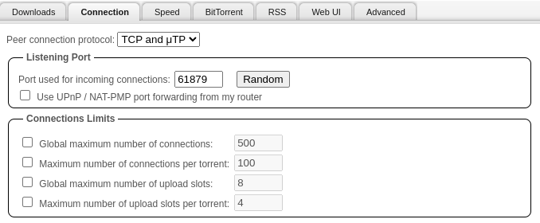
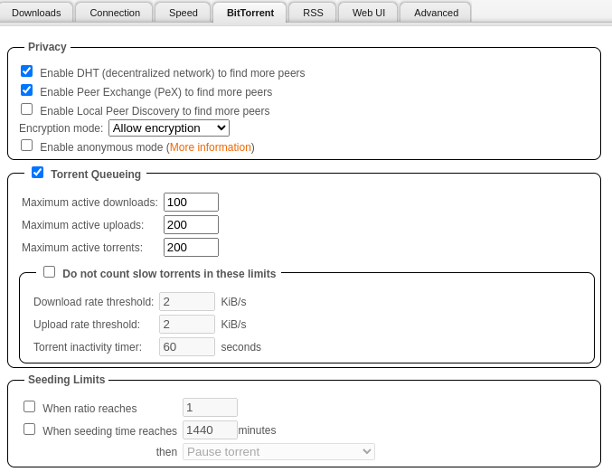

## Chart configuration

### Dataset Structure

You need to add a pesistence, for where your completed bittorrent files can be stores. For examle a NFS share:

```yaml
persistence:
  data:
    type: nfs
    # Example NFS Share
    server: "192.168.0.10"
    path: "/qbitvpn/"
```

### Networking

Add an `loadBalancerIP` to the `main` service or configure an Ingress if you prefer. Common documentation can be checked for more information.

### Listening Ports

:::tip[VPN "With VPN"]

- No need to port forward on your router
- If you want fast seeding, you will need a service that supports port forwarding and set the TCP Listening Port to the port Desired
- Mullvad for example, from Qbit Webui, Tools > Options > Connection tab. Set TCP Listening port to the Port Provided by Mullvad.

:::

:::tip[NOVPN "Without VPN"]

- You can leave the two ports default without a VPN
- If you want fast seeding though, you will need to port forward this port on your router

:::

An loadBalancer IP must assigned to the `Listening` port. Standard configures as port `6881`

```yaml
service:
  torrent:
    enabled: true
    type: LoadBalancer
    loadBalancerIP: 192.168.1.230
```

### VPN

Use the [Gluetun VPN Add-on Setup Guide](https://truecharts.org/guides/addons/vpn-setup/)

<br />

## In-App Setup

### Downloads

#### qBittorrent "qBittorrent Table + Explanation"

    |          Setting                                   |         Value                  |          Explanation                                                                 |
    |------------------------------------------------    |----------------------------    |----------------------------------------------------------------------------------    |
    | Default Torrent Management Mode:                   | Automatic                      | This is to automatically move the files torrents based on category                   |
    | When Torrent Category changed:                     | Relocate Torrent               | This is to automatically move the files torrents based on category                   |
    | When Default Save Path changed:                    | Relocate Affected Torrents     | This is to automatically move the files torrents based on category                   |
    | When Category Save Path changed:                   | Relocate Affected Torrents     | This is to automatically move the files torrents based on category                   |
    | Default Save Path:                                 | `/qbitvpn/complete `           | Set this to what you set your dataset mountpoint as                                  |
    | Keep incomplete torrents in:                       | `/qbitvpn/temp`                | Keep incomplete torrents in a folder no apps are monitoring                          |
    | Copy .torrent files for finished downloads to:     | `/qbitvpn/backup`              | Its nice to have a backup folder of all your `.torrents` in the event of a crash     |
    | Monitored Folder                                   | `/qbitvpn/monitor`             | Place `.torrent` files in this directory to automatically start those torrents       |


<br />

### Connection

This should equal to your listening port you set [during the installation](https://heavysetup.info/applications/qbittorrent/installation/#listening-ports)



<br />

### Speed

- Set `Alternative Rate Limits` to `10000` KiB
  - This is so during the day, or when users are using my Plex server, my qBittorrent instance isn't using _ALL_ of my bandwidth seeding
- Set my schedule from `08:00` to `02:00`
  - 8am to 2am, which is around the time users are watching Plex


<br />

### BitTorrent

- Disabled `Local Peer Discovery`
  - This is only useful if you are on a huge network, like a college campus or something like that



<br />

### WebGUI

- Changed the password to something We would remember

Added both my LAN and Kubernetes LAN to the bypass list, this way neither of them have to authenticate, it gets annoying to log in over and over on your own network

**Bypass authentication for clients in whitelisted IP subnets**

- `192.168.0.0/16`
- `172.16.0.0/16`


Add the Kubernetes LAN to:

**Enable reverse proxy support**

- `172.16.0.0/16`


<br />

### Advanced

#### qBittorrent "qBittorrent Table + Explanation"

    |          Setting                                                       |         Value         |          Explanation                                                                    |
    |------------------------------------------------                        |-----------------------|----------------------------------------------------------------------------------       |
    | Network interface:                                                     | `wg0` or `tun0`       | Bind this to `tun0` if you are using Gluetun                                            |
    | Optional IP address to bind to:                                        | All Ipv4 Addresses    | Kubernetes doesnt support ipv6 now anyway so, We set this to just ipv4                  |
    | Resolve peer countries:                                                | True                  | Just so We can see what countries We am leeching/seeding from                           |
    | Reannounce to all trackers when IP or port changed:                    | True                  | In the event my IP or port changes, We want everyone to know, so We can seed or leech   |


<br />
