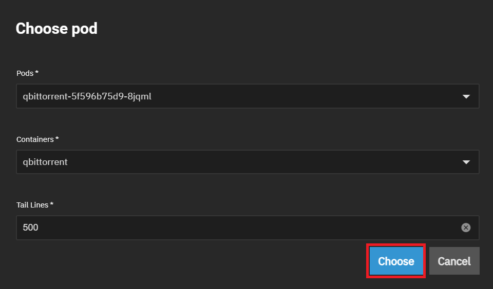
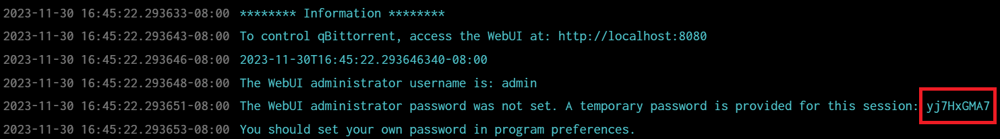

As of qBittorrent 4.6.1 the default password of `adminadmin` is no longer used. If you previously used this password or are completing a new installation of qBittorent you will now have a randomly generated password. This guide will show you how to locate this randomly generated password.

1. With qBittorent selected in the application window select the logs button.
   
2. In the `Choose Pod` windows ensure the qBittorent Pod and Container is selected and click `Choose`.
   
3. In the `Information` section of the logs take note of the randomly generated password.
   
4. Use the randomly generated password to login to the WebUI. You must change it in the qBittorent settings after you login as it will generate a new random password each time qBittorent is started until a password is set.
