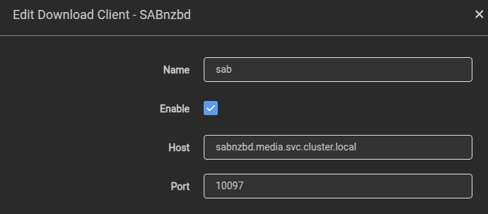

## App Installation

### Storage

#### Configuration

 - The chart is set up with a default PVC that holds the application's configuration files.
 - The recommended backup solution is to use VolSync.

#### Additional Storage

It is recommended to place the NFS share within the same dataset to optimize performance. This ensures that moving or copying files between directories happens instantly at the filesystem level, avoiding unnecessary read/write operations. As a result, the process is significantly faster and reduces disk wear, improving overall system efficiency.

##### Media

- The media destination folder is where Radarr stores completed downloads.
- This folder serves as the source for e.g. Plex or Kodi to scan media files.

##### Downloads

- This is the location where Radarr looks for completed downloads.
- It is the same location where clients such as NZBGet, SABnzbd, qBittorrent, or Syncthing save their completed movie files.
- We reccomend to keep the mount points consistent across all applications. If the mount points differ, you will need to configure a `Remote Path Mapping`, which adds extra complexity and may lead to issues with file handling.

```yaml
persistence:
  media:
    enabled: true
    type: nfs
    path: ${NFS_PATH}
    server: ${SERVER_IP}
    mountPath: /media
```

## In-App Configuration

- For general configuration guidance, we recommend to follow the [TRaSH guides for Radarr](https://trash-guides.info/Radarr/).
- When linking Radarr to a download client, use the internal domain name of the respective download client.
  - General guidance on linking applications can be found on our website: [Linking Apps](/guides/linking-apps)
    </br>
    


## Advanced Configuration

### VolSync Backup considerations

To reduce potential costs (e.g., for an S3 storage provider), it makes sense to exclude certain folders from being backed up by VolSync.
- Depending on the library size, the folder **/config/MediaConver** can contain a significant amount of data.
  - This folder does not store any configuration and will be recreated during a library scan.
- Another way to reduce backup size is to exclude the **/config/Backups** folder from being backed up.
  - Since VolSync already backs up all configuration files, there is no need to include the application's internal backups.

As of now, VolSync does not provide a way to exclude specific folders from backups. The only way to achieve the same effect is to mount these folders to a separate PVC, NFS share, or another external storage location, ensuring they are not included in the primary PVC backup process.
Keep in mind that if a folder is moved to a different PVC or storage location, any existing data in the original PVC will not be deleted automatically. As a result, the backup size will not be reduced unless you manually remove the previously stored data.
However, this does not apply to fresh installations, as the folder will not contain any pre-existing data in the primary PVC.

Example configuration for **/config/MediaConver**:
```yaml
persistence:
  covers:
    enabled: true
    targetSelector:
      main:
        main:
          mountPath: /config/MediaCover
```
