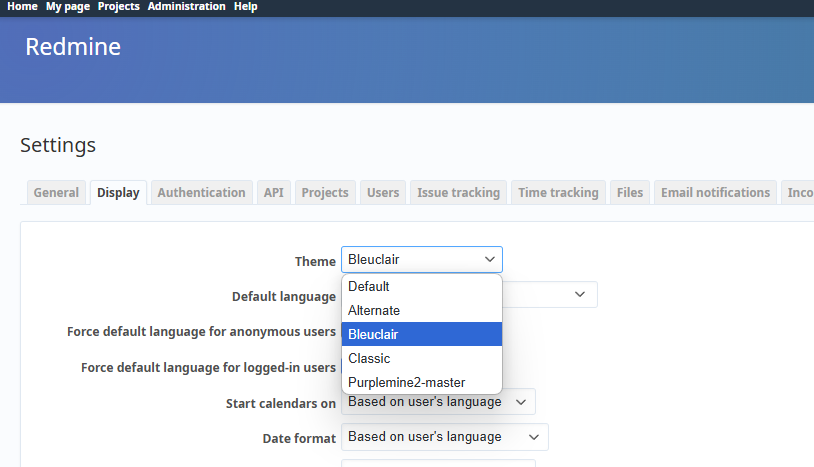

# How to install the custom theme for TrueCharts Redmine with PVC storage

This tutorial explains installing the https://github.com/mrliptontea/PurpleMine2 theme for the Redmine app installed from the TrueCharts catalog.

## Setup configuration

Default configuration with PVC storage

Add additional app storage as PVC with Mount path `/usr/src/redmine/public/themes`


You might also want to add `/usr/src/redmine/plugins` folder as PVC mount. This is the folder where you need to unzip your plugins if you want to use some.

As of the time of writing the app is not running normally when created with settings RunAsUser 568 RunAsGroup 568


changing the configuration to RunAsUser 999 RunAsGroup 999 solves the issue. Check this ticket for details

https://github.com/truecharts/charts/issues/15079

Click on Save. Wait for the app to deploy.

Open the app. Login with default credentials (see below). You will be prompted to change the password.

- User: `admin`
- Password: `admin`

Go to `Administration->Settings->Display`. See that the only available theme is Default.

## Mount PVC volumes using HeavyScript

Now you can close the Redmine webpage and open the TrueNAS shell.

We will need to mount the PVC volumes using the HevyScript. If you don't have HeavyScript installed simply run this command to install it

sudo heavyscript

Would you like to mount anything else? (y/N): n

## Use Moonlight Commander to copy the themes into the mounted volume

Now the redmine themes folder is available as the system path and we need to copy the theme files there.

I have already SMB Share setup so I copy the files into the SMB share. You can use Filebrowser app to upload the theme as well.

So I'm downloading the theme from https://github.com/mrliptontea/PurpleMine2

And Unzip it to my SMB share folder.

Now in TrueNas shell I use

sudo mc

```
To launch the moonlight commander app. I navigate to my SMB share and to the mounted PVC path and copy the files over



## Change permissions of the themes files

Now we need to exit moonlight commander and navigate to the mounted themes folder in console using

```

cd /mnt/mounted_pvc/redmine/redmine-persist-list-0
ls - la

But you can see that all of the copied files are owned by my user and the group root. This means the Redmine will not be able to access the files.

Chage the owner of the files with the following command


## Unmount volumes and launch the app

Now you can unmount the volume using HeavyScript command

## Apply the theme

Open the Redmine web page. Sign in with your new password for Admin.

Go to Administration -> Settings -> Display. Pick the newly added theme


