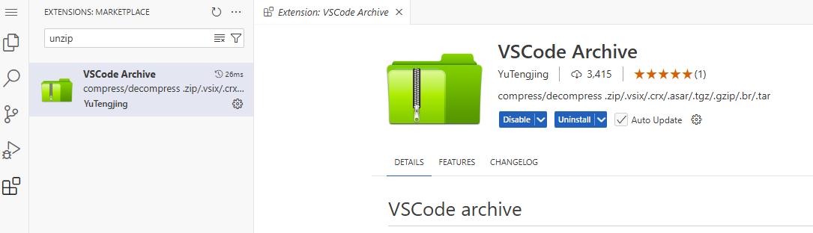

This tutorial explains installing some themes for Redmine.

## Chart deploy configuration

- Add ingress with [codeserver](https://truecharts.org/guides/addons/code-server/) addon.
- Add additional `themes` PVC persistence with `mountPath: "/usr/src/redmine/themes"` Since Redmine v6 location is changed to ./redmine/themes instead of /redmine/public/themes.
- Optional add `plugins` PVC persistence with `mountPath: "/usr/src/redmine/plugins"` This is the folder where you need to unzip your plugins if you want to use some.

Example deployment:
```yaml
// Values.yaml
ingress:
  main:
    enabled: true
    hosts:
      - host: redmine.${BASE_DOMAIN}
    integrations:
      traefik:
        enabled: true
      certManager:
        enabled: true
        certificateIssuer: cloudflare

persistence:
  themes:
    enabled: true
    mountPath: "/usr/src/redmine/themes"
  plugins:
    enabled: true
    mountPath: "/usr/src/redmine/plugins"

addons:
  codeserver:
    enabled: true
    ingress:
      enabled: true
      hosts:
        - host: cs-redmine.${BASE_DOMAIN}
      integrations:
        certManager:
          enabled: true
          certificateIssuer: cloudflare
        traefik:
          enabled: true
```

## Check the application

Check if you can open the application in your browser. Login with default credentials and you will be prompted to change the password.

- User: `admin`
- Password: `admin`

Go to `Administration -> Settings -> Display`. See that there are three available themes which are Default, Alternate and Classic.

## Add themes via codeserver addon to Redmine

- Browse to your codeserver addon.
- Add the themes in the `redmine\themes` folder.
- Per theme it can be different how to achive this.

For example `redmine_theme_farend_bleuclair`:
- Open integrated terminal in `redmine\themes`
- `git clone https://github.com/farend/redmine_theme_farend_bleuclair.git themes/bleuclair`
- Restart Redmine for example, via add the `.Values`
      ```yaml
      global:
            stopAll: false
      ```
- and set it back to true.

For example `PurpleMine2`:
- Open integrated terminal in `redmine\themes`
- `wget https://github.com/mrliptontea/PurpleMine2/archive/master.zip`
- Install extension `VSCode Archive` in codeserver
- Decrompress
- Remove `master.zip`
- Move `PurpleMine2-master` directly in `themes` folder

Some images from codeserver:





## Apply the theme

Open the Redmine web page. Sign in with your new password for Admin.

Go to `Administration` -> `Settings` -> `Display`. Pick the newly added theme


