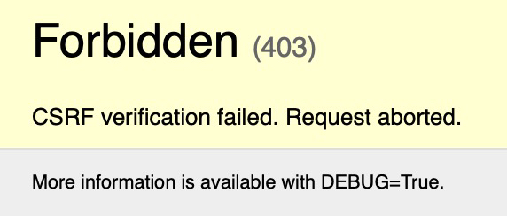
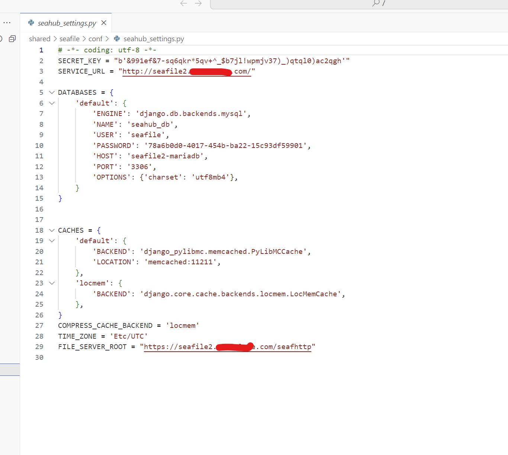
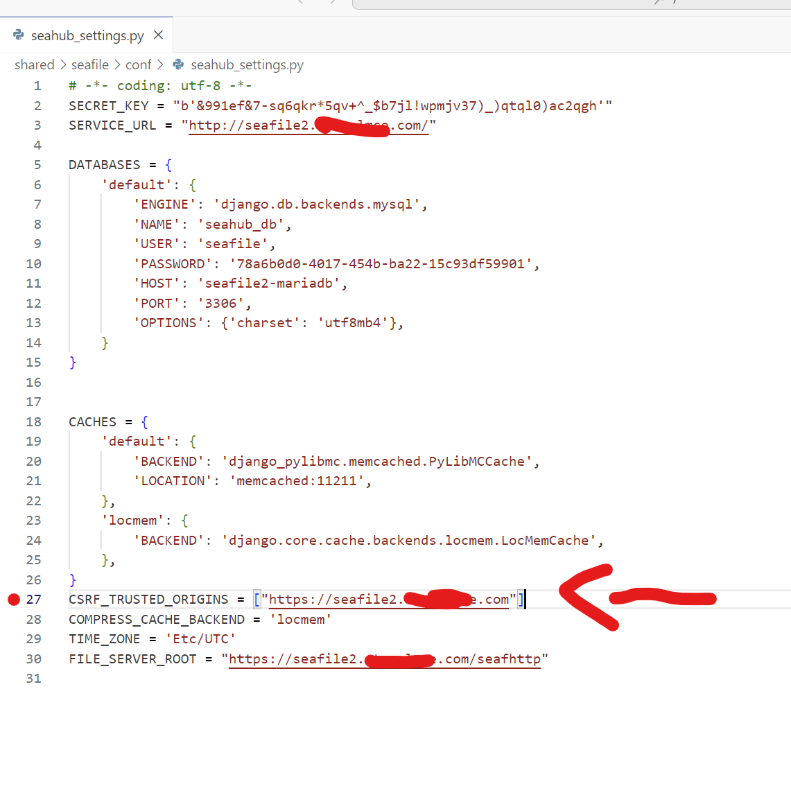
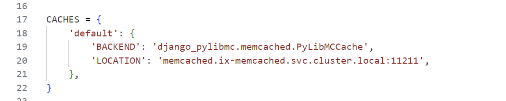
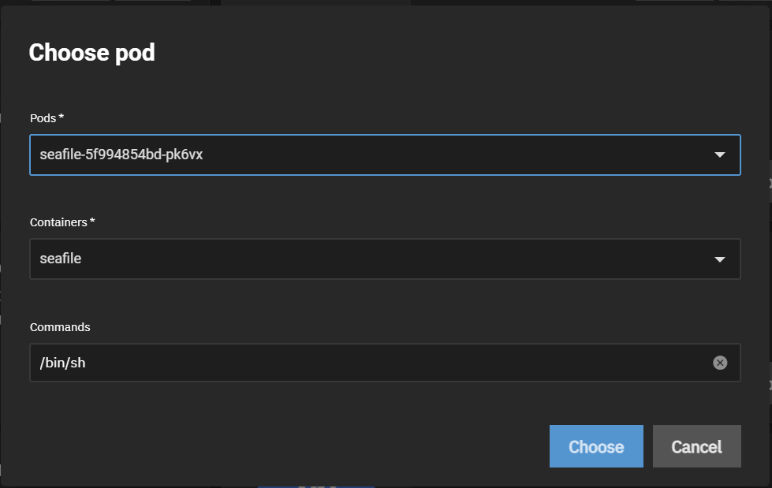
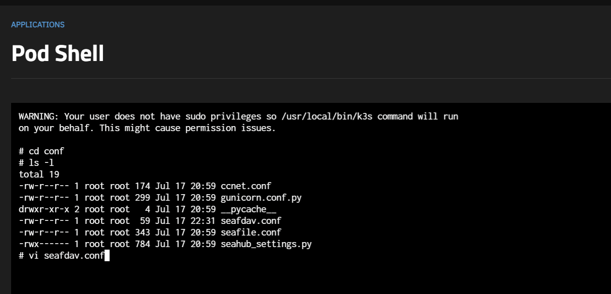
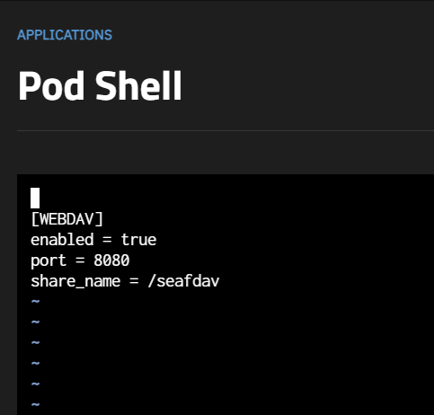

## Ingress

Our install requires a FQDN or domain name entered when installing the chart. This doesn't mean you need Traefik however we support only installs using FQDN with valid certificates + Traefik installed

## CSRF Error

Starting with Seafile 11, the defaults fail CSRF verification, and you may see the error message when logging in.



To fix this, the following must be added to your `seahub_settings.conf` file. It is found inside `/shared/conf`. We recommedend enabling the `Code-server` addon or mounting the container



Add an entry for: `CSRF_TRUSTED_ORIGINS = ["https://seafile.YOURDOMAINHERE.com"]`



## Storage

Seafile uses Block storage so files/folders uploaded to Seafile aren't visible by default when mounting the persisted storage. For more information see the this [post](https://forum.seafile.com/t/maintain-file-name-after-upload/11190/3) on the Seafile Forums. As well, Seafile uses init scripts which need to be run as `root` so if `hostpath` is used (such as using HDDs) then make sure your storage is owned by `root`.

## Memcached Log Spam and fixes

Unfortunately there's no easy solution at the moment to add `memcached` automatically without user intervention (redis support is also coming soon to Seafile) so if users wish to use `memcached` (isn't required) then the following steps must be followed

- Add `dependency` train to TrueCharts catalog and add/install `memcached` chart

- Edit `CACHES` -> `default` inside `seahub_settings.py` to add `memcached.ix-memcached.svc.cluster.local` instead of `memcached` and you can delete the locmem.



Or

- Simply delete the `CACHES` section, while not optimal for large installs is truly used with 50+ users according to Seafile docs.

Either of these steps will prevents the logs filling up with:

```shell
2023-11-15 03:54:55,368 [ERROR] django.pylibmc:167 set_many MemcachedError: error 47 from memcached_set_multi: SERVER HAS FAILED AND IS DISABLED UNTIL TIMED RETRY
Traceback (most recent call last):
  File "/usr/local/lib/python3.10/dist-packages/django_pylibmc/memcached.py", line 165, in set_many
    return super(PyLibMCCache, self).set_many(*args, **kwargs)
  File "/opt/seafile/seafile-server-11.0.1/seahub/thirdpart/django/core/cache/backends/memcached.py", line 127, in set_many
    failed_keys = self._cache.set_multi(
pylibmc.ServerDown: error 47 from memcached_set_multi: SERVER HAS FAILED AND IS DISABLED UNTIL TIMED RETRY
```

## WebDAV

By default WebDAV is disabled by default, as per [upstream docs](https://manual.seafile.com/extension/webdav/). Here's some simple instructions to modify your `seafdav.conf` to enable WebDAV if you wish to use it with Traefik.

- Enter Seafile Pod Shell



- Use the CLI to enter the Seafile WebDAV (`seafdav.conf`) config file



- Use vi commands to edit the `Enabled` to `true` and change the share name as desired (default is `/seafdav`).

> Use `i` to insert text and and `:wq`, and `ESC key` to exit insert mode



- Restart Seafile and your WebDAV share will be accessible using your domain.com/seafdav


## FUSE Extension

The FUSE extension isn't supported by default due to privileges required by the extension and non-standard mounts, so no support tickets will be accepted for using/enabling it.
