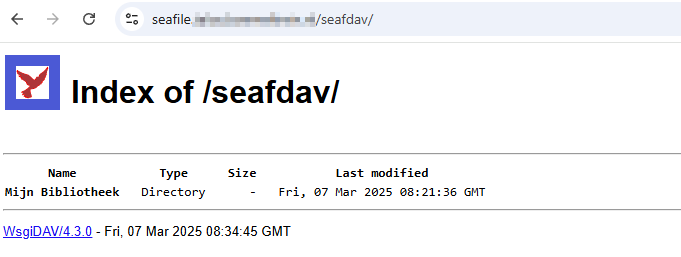

## Minimal example deployment

```yaml
// values.yaml
workload:
  main:
    podSpec:
      containers:
        main:
          env:
            SEAFILE_SERVER_HOSTNAME: "seafile.${DOMAIN}"
            INIT_SEAFILE_ADMIN_EMAIL: me@example.com
            INIT_SEAFILE_ADMIN_PASSWORD: a_very_secret_password

ingress:
  main:
    enabled: true
    hosts:
      - host: seafile.${DOMAIN}
    integrations:
      traefik:
        enabled: true
      certManager:
        enabled: true
        certificateIssuer: cloudflare
```


## Storage

Seafile uses Block storage so files/folders uploaded to Seafile aren't visible by default when mounting the persisted storage. For more information see the this [post](https://forum.seafile.com/t/maintain-file-name-after-upload/11190/3) on the Seafile Forums. As well, Seafile uses init scripts which need to be run as `root` so if `hostpath` is used (such as using HDDs) then make sure your storage is owned by `root`.

## WebDAV

By default WebDAV is disabled by default, as per [upstream docs](https://manual.seafile.com/extension/webdav/). Here's some simple instructions to modify your `seafdav.conf` to enable WebDAV if you wish to use it with Traefik.

 **Option 1:** 
- Enter Seafile Pod Shell
- Use the CLI to enter the Seafile WebDAV (`seafdav.conf`) config file
- Use vi commands to edit the `Enabled` to `true` and change the share name as desired (default is `/seafdav`).
> Use `i` to insert text and and `:wq`, and `ESC key` to exit insert mode
- Restart Seafile and your WebDAV share will be accessible using your domain.com/seafdav

**Option 2:**
- Add [codeserver](https://truecharts.org/guides/addons/code-server/) as addon to the deplyment.
- Browse to `/shared/seafile/conf/seafdav.conf`
- Change `enabled = false` to `enabled = true`
- Restart Seafile and your WebDAV share will be accessible using your domain.com/seafdav

<br>


