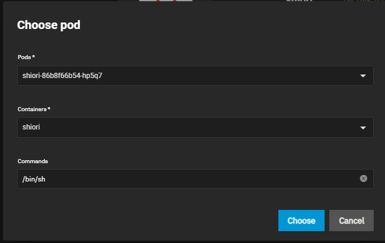

# Installation Notes

- After installation, shell into the app by going to the app's 3 dot -> shell and select the `shiori` pod and container.



- Run the following command:

```terminal
shiori migrate
```

- There's typically no output or message after running the command, if ran multiple times, it will display `Error during migration: no change/shiori $`

## Export/Import

- Running the following commands to export/import your data.

  - Export command:

  ```terminal
   shiori export /data/data.html
  ```

  - Import command:

  ```terminal
  shiori import /data/data.html
  ```
