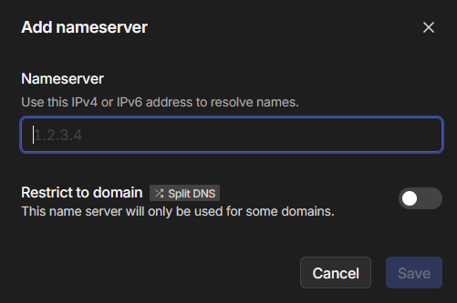

This is a quick how-to or setup-guide to use Tailscale on Talos.

:::caution

This guide doesn't cover using Tailscale with individual applications. While there are methods to use Tailscale (as an app) with other individual apps this requires `Host-Networking` and beyond the scope of this guide and may not work for all apps. The suggested use in the future will be the Tailscale Add-On

:::

## Requirements

### Tailscale
- Tailscale Account (Free accounts available at [Tailscale's Official website](https://www.tailscale.com))
- Tailscale DNS setup for Talos Cluster Domain

Generate a Tailscale Auth Key for your setup, easy to generate on the page below


### Sysctl
:::note[sysctl]

This part is not needed for CLustertool setup with TalosOS.

:::
At some OS's it is required to set two `sysctl` values for proper acces to your local network (LAN). Check your OS documentation how this needs to be done.
```
net.ipv4.ip_forward = 1
net.ipv4.conf.all.src_valid_mark = 1
```

## Tailscale Chart Setup

### Application name

Ideally use `tailscale` but you can use any name here.

### App Configuration

- `Auth Key`: Required - The key you received from tailscale in prerequisites above
- `Hostname`: Required - Please specify a specific hostname for use inside Tailscale. This is required to have a persistant machine name appear in the Tailscale portal. Values.yaml has been updated to set hostname to truecharts-tailscale to avoid the state not persisting for those to do not set this field. Without it, the default setting would use the tailscale kubernetes podname as the hostname, creatimg additional machines in the Tailscale portal over time. (Passes `--hostname HOSTNAME` to `Extra args`)
- `Userspace`: Now enabled by default, as it is _required_ when using local routes and as an exit node (see below). Userspace restricts clients to only accessing the GUI and Samba. More info in the [Tailscale Userspace Guide](https://tailscale.com/kb/1112/userspace-networking/).
- `Accept DNS`: Enabling it will pass your Global Nameservers from Tailscale to your local install.
- `Routes`: Change to the routes you wish Tailscale to have access to on the devices it's connected, ie your LAN.
- `Extra Args` passes arguments/flags to the `tailscale up` command.
- `Advertise as exit node` This is used to pass traffic through tailscale like a private VPN. (Passes `--advertise-exit-node` to `Extra args`)

For more Extra Args and their usage please check the [Tailscale Knowledge Base](https://tailscale.com/kb/1080/cli/#up)
since we consider these advanced features and these may/not be compatible with everyone's exact setup.

## Namespace Privileges Required for Talos Cluster

In your namespace.yaml file add
```
labels:
    pod-security.kubernetes.io/enforce: privileged
```

to allow this Chart to run with privileged permissions.

### Tailscale DNS Setup

In Tailscale Portal on DNS, Namespace section add a new custom nameserver using  the Blocky IP address and restrict to domain (SplitDNS) for the Domain used in ClusterTool for Talos.



### Working Values Example

```yaml
tailscale:
  authkey: MY_PRIVATE_AUTHKEY
  accept_dns: true
  routes: 192.168.1.0/24 # LAN Example
  advertise_as_exit_node: true
  hostname: "MyHostname"
```
