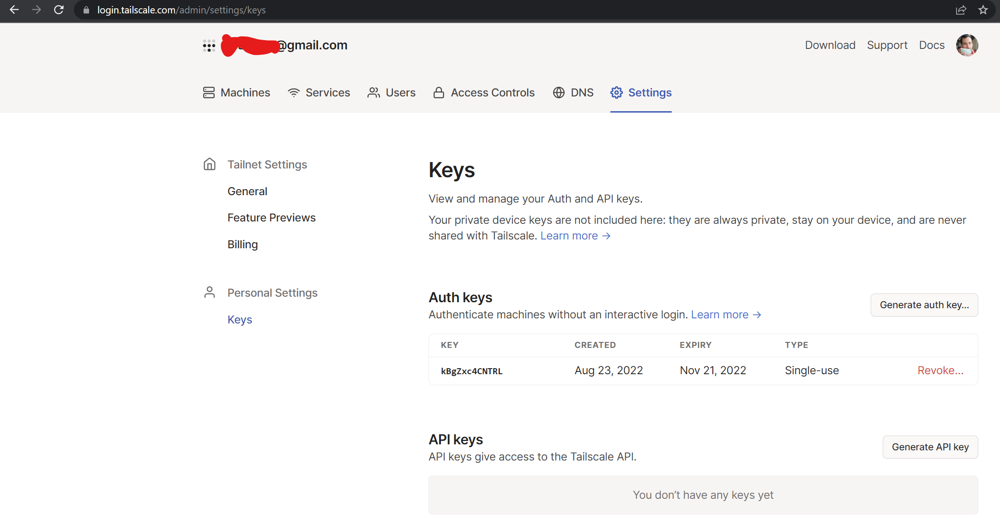
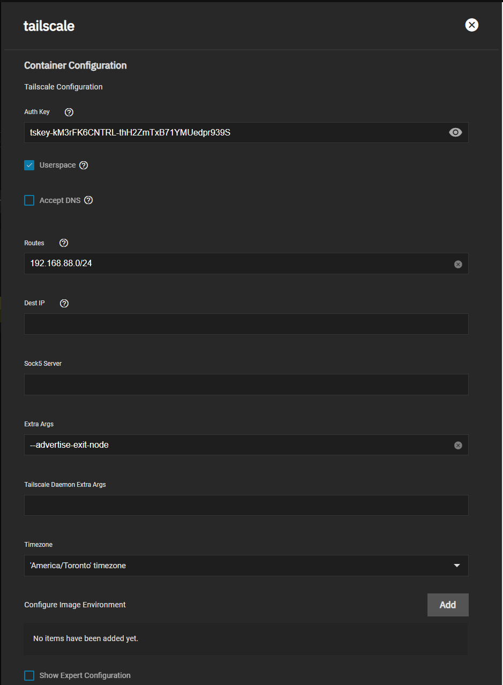
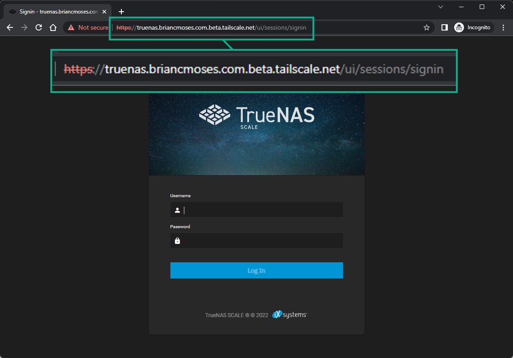

This is a quick how-to or setup-guide to use Tailscale using on your TrueNAS box.
This can be applied to other systems but this specific guide is SCALE specific with the prerequisites.

:::caution

This guide doesn't cover using Tailscale with individual applications. While there are methods to use Tailscale (as an app) with other individual apps this requires `Host-Networking` and beyond the scope of this guide and may not work for all apps. The suggested use in the future will be the Tailscale Add-On

:::

## Requirements

- Tailscale Account (Free accounts available at [Tailscale's Official website](https://www.tailscale.com))
- Tailscale Truecharts Chart

## Prerequisites (LAN access only)

For proper access to your local network (LAN), this chart requires two `sysctl` values set on your TrueNAS or system.
For TrueNAS SCALE the way to change these values are inside `System Settings` then `Advanced`.
On that screen you add the following two values:

- `net.ipv4.ip_forward`
- `net.ipv4.conf.all.src_valid_mark`

Set them to `1` and `Enabled`

Also prepare your Tailscale Auth Key for your setup, easy to generate on the page below

## Tailscale Chart Setup

### Application name

Ideally use `tailscale` but you can use any name here.

### Global Pod Options

This section is hidden by default for TrueNAS SCALE but if you wish to use `Host-Networking` or create an interface inside TrueNAS SCALE (`tailscale0`)

- Click `Expert - Pod Options`
- Click the checkbox for `Host-Networking` if it isn't enabled

### App Configuration

- `Auth Key`: The key you received from tailscale in prerequisites above
- `Userspace`: Now enabled by default, as it is _required_ when using local routes and as an exit node (see below). Userspace restricts clients to only accessing the GUI and Samba. This needs to be _unchecked_ if you need to give Tailscale full access to all the features inside TrueNAS SCALE (not just GUI/SMB, but RSYNC, PING and directly connect to other Tailscale IPs, etc). More info in the [Tailscale Userspace Guide](https://tailscale.com/kb/1112/userspace-networking/).
- `Accept DNS`: Enabling it will pass your Global Nameservers from Tailscale to your local install.
- `Routes`: Change to the routes you wish Tailscale to have access to on the devices it's connected, such as my LAN in the example. Required if you want to access APPS over Tailscale using TrueNASIP:Port from any Tailscale connected client.
- `Extra Args` passes arguments/flags to the `tailscale up` command.
- `Hostname` You can specify a specific hostname for use inside Tailscale (see image below). (Passes `--hostname HOSTNAME` to `Extra args`)
- `Advertise as exit node` This is used to pass traffic through tailscale like a private VPN. (Passes `--advertise-exit-node` to `Extra args`)

For more Extra Args and their usage please check the [Tailscale Knowledge Base](https://tailscale.com/kb/1080/cli/#up)
since we consider these advanced features and these may/not be compatible with everyone's exact setup.

TODO: Update image with the new fields

**Hostname example**

### Networking and Services

The default ports are fine for this chart, you shouldn't need to port forward or open ports on your router.

### Storage and Persistence

Highly recommended to leave it as `PVC (Simple)`

### Ingress

Shouldn't need to enable this.

### Security and Permissions

Should be left as is, unless you know what you are doing!

### Resources and Devices

You can set custom resources for CPU/RAM, but defaults should be work fine in most cases
Defaults are 4 vCores and 8G RAM.

### Addons

Shouldn't need to enable any.

## Support

- You can also reach us using [Discord](https://discord.gg/tVsPTHWTtr) for real-time feedback and support
- If you found a bug in our chart, open a Github [issue](https://github.com/truecharts/apps/issues/new/choose)

---

All Rights Reserved - The TrueCharts Project
