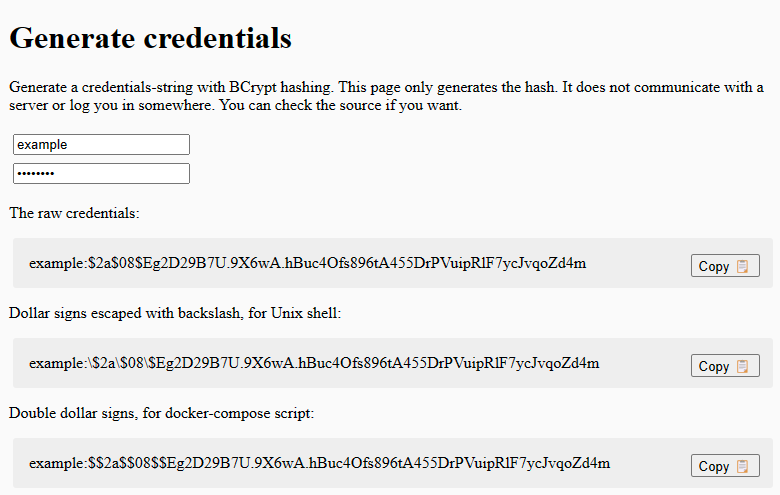

To Setup Credentials for Basic Authg proceed to <https://timetagger.app/cred> and enter the user name and password you wish to use

You may then copy the Last sectionfrom the output entited "Double dollar signs, for docker-compose scrip" and place it in to the Credential field for Basic Auth. this should set your user name and password

